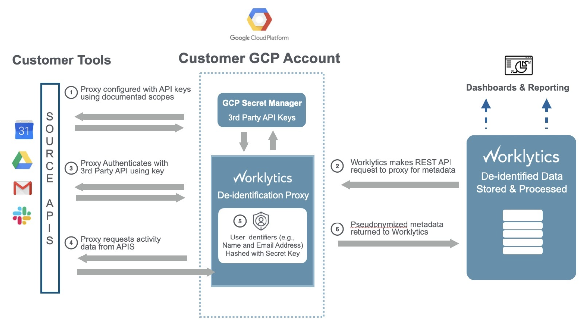

# psoxy
A serverless, pseudonymizing proxy to sit between Worklytics and the REST API of a 3rd-party data
source.

Psoxy replaces PII in your organization's data with hash tokens to enable Worklytics's analysis to
be performed on anonymized data which we cannot map back to any identifiable individual.


## Goals

### v1.0
  1. **serverless** - we strive to minimize the moving pieces required to run psoxy at scale, keeping
     your attack surface small and operational complexity low. Furthermore, we define
     infrastructure-as-code to ease setup.
  2. **transparent** - psoxy's source code will be available to customers, to facilitate code review
     and white box penetration testing.
  3. **simple** - psoxy's functionality will focus on performing secure authentication with the 3rd
     party API and then perform minimal transformation on the response (pseudonymization, field
     redcation). to ease code review and auditing of its behavior.

## Data Flow

A Psoxy instances reside on your premises (in the cloud) and act as an intermediary between
Worklytics and the data source you wish to connect.  In this role, the proxy performs the
authentication necessary to connect to the data source's API and then any required transformation
(such as pseudonymization or redaction) on the response.

Orchestration continues to be performed on the Worklytics-side.




## Getting Started

  1. contact support@worklytics.co to ensure your account is enabled for Psoxy
  2. create a [terraform](https://www.terraform.io/) configuration and apply it
     a. various modules are provided in [`infra/modules`](/infra/modules)
     b. an example is found in `dev-personal`
     c. contact Worklytics support if you need assistance
  3. create OAuth client / generate API key in each of your desired data sources (see below)
  4. set your API keys via Secret Manager (or use Terraform)
  5. create the Data Connection from Worklytics to your psoxy instance
      - authorize Worklytics to connect to your psoxy instance and, if necessary, provide authentication credentials.

## Supported Data Sources
Data source connectors will be marked with their stage of maturity:
  * *alpha* - preview, YMMV, still active development; only available to select pilot customers.
  * *beta* - available to all customers, but still under active development and we expect bugs in some environments.
  * *general availability* - excepted to be stable and reliable.

As of Sept 2021, the following sources can be connected via psoxy:
  * Google Workspace
    * Calendar *beta*
    * Chat *beta*
    * Directory *beta*
    * Drive *beta*
    * GMail *beta*
    * Meet *beta*
  * Slack
    * eDiscovery API *alpha*

## Development

Can run locally via IntelliJ + maven, using run config:
<<<<<<< HEAD
  - `psoxy [function:run...]` (located in `.idea/runConfigurations`)
=======
  - `psoxy - run gmail`  (located in `.idea/runConfigurations`)
>>>>>>> main

Or from command line:

```shell
cd java
<<<<<<< HEAD
mvn function:run -Drun.functionTarget=co.worklytics.psoxy.HelloWorld
=======
mvn function:run -Drun.functionTarget=co.worklytics.psoxy.Route
>>>>>>> main
```

By default, that serves the function from http://localhost:8080.


### GMail Example

1.) run `terraform init` and `terraform apply` from `infra/dev-personal` to provision environment

#### Local
2.) run locally via IntelliJ run config

3.) execute the following to verify your proxy is working OK

Health check (verifies that your client can reach and invoke the proxy at all; and that is has sensible config)
```shell
curl -iX GET \
http://localhost:8080/ \
-H "X-Psoxy-Health-Check: true"
```

```shell
export PSOXY_USER_TO_IMPERSONATE={{--identifier of GCP user to impersonate (eg, mailbox owner, Google ID or email)--}}
```

```shell
curl -X GET \
http://localhost:8080/gmail/v1/users/me/messages \
-H "X-Psoxy-User-To-Impersonate: $(echo $PSOXY_USER_TO_IMPERSONATE)"
```

Using a message id you grab from that:
```shell
curl -X GET \
http://localhost:8080/gmail/v1/users/me/messages/1743b19234726ef3f\?format=metadata \
-H "X-Psoxy-User-To-Impersonate: $(echo $PSOXY_USER_TO_IMPERSONATE)"
```

#### Cloud

1.) deploy to GCP using Terraform (see `infra/`). Follow steps in any TODO files it generates.

2.) Set your env vars: (these should be in a TODO file generated by terraform in prev step
```shell
export PSOXY_GCP_PROJECT={{--GCP project id that hosts your instance--}}
export PSOXY_GCP_REGION=us-central1 # change this to whatever the default is for you project
```

3.) grant yourself access (probably not needed if you have primitive role in project, like Owner or
Editor)
```shell
gcloud alpha functions add-iam-policy-binding psoxy-gmail --region=$PSOXY_GCP_REGION --member=user:$(gcloud config get-value core/account) --role=roles/cloudfunctions.invoker --project=$PSOXY_PROJECT_ID
```

alternatively, you can add Terraform resource for this to your Terraform config, and apply it again:
```shell
resource "google_cloudfunctions_function_iam_member" "member" {
  project        = "YOUR_GCP_PROJECT_ID_HERE"
  region         = "YOUR_GCP_REGION_OF_YOUR_CLOUD_FUNCTION_HERE" # eg, us-central1
  cloud_function = "psoxy-gmail" #TODO: change if you're doing something OTHER than gmail
  role           = "roles/cloudfunctions.invoker"
  member         = "user:YOUR_EMAIL_HERE"
}
```

Either way, if this function is for prod use, please remove these grants after you're finished 
testing.

4.) invocation examples

```shell
curl -X GET \
https://$PSOXY_GCP_REGION-$PSOXY_GCP_PROJECT.cloudfunctions.net/psoxy-gmail/gmail/v1/users/me/messages/17c3b1911726ef3f\?format=metadata \
-H "Authorization: Bearer $(gcloud auth print-identity-token)" \
-H "X-Psoxy-User-To-Impersonate: $(echo $PSOXY_USER_TO_IMPERSONATE)"
```

```shell
curl -X GET \
https://$PSOXY_GCP_REGION-$PSOXY_GCP_PROJECT.cloudfunctions.net/psoxy-google-chat/admin/reports/v1/activity/users/all/applications/chat \
-H "Authorization: Bearer $(gcloud auth print-identity-token)" \
-H "X-Psoxy-User-To-Impersonate: $(echo $PSOXY_USER_TO_IMPERSONATE)"
```
