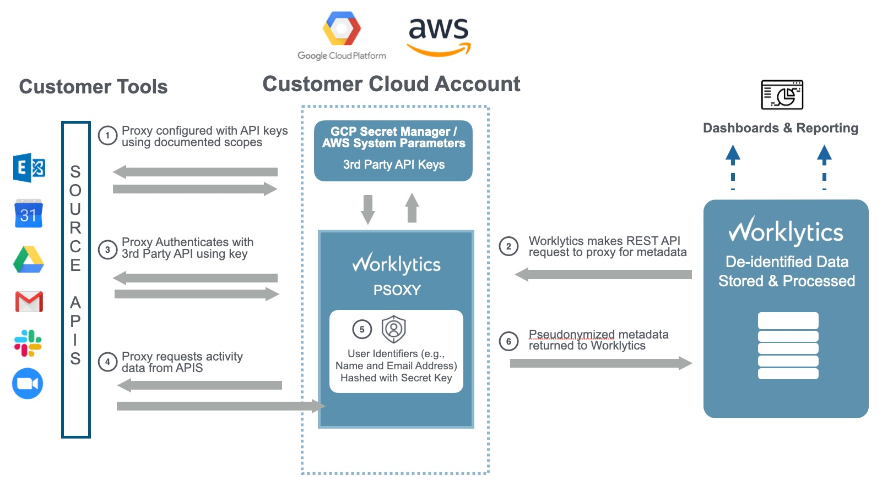

# psoxy
A serverless, pseudonymizing proxy to sit between Worklytics and the REST API of a 3rd-party data
source.

Psoxy replaces PII in your organization's data with hash tokens to enable Worklytics's analysis to
be performed on anonymized data which we cannot map back to any identifiable individual.

It is intended to be a simple, serverless, transparent solution to provide more granular access to
data source APIs.
  - **serverless** - we strive to minimize the moving pieces required to run psoxy at scale, keeping
     your attack surface small and operational complexity low. Furthermore, we define
     infrastructure-as-code to ease setup.
  - **transparent** - psoxy's source code is available to customers, to facilitate code review
     and white box penetration testing.
  - **simple** - psoxy's functionality will focus on performing secure authentication with the 3rd
     party API and then perform minimal transformation on the response (pseudonymization, field
     redcation). to ease code review and auditing of its behavior.

As of Dec 2021, psoxy instances may be hosted in [Google Cloud ](docs/gcp/development.md) or
[AWS](docs/aws/getting-started.md).

## Data Flow

A Psoxy instances reside on your premises (in the cloud) and act as an intermediary between
Worklytics and the data source you wish to connect.  In this role, the proxy performs the
authentication necessary to connect to the data source's API and then any required transformation
(such as pseudonymization or redaction) on the response.

Orchestration continues to be performed on the Worklytics-side.



## Getting Started - Customers

### Prereqs
As of Oct 2021, Psoxy is implemented with Java 11 and built via Maven. Infrastructure is provisioned
via Terraform, relying on Google Cloud and/or AWS command line tools.  You will need recent
versions of all of the following:

  - git
  - Java 11+ JDK variant
  - [Maven 3.6+](https://maven.apache.org/docs/history.html)
  - [terraform](https://www.terraform.io/) optional; if you don't use this, you'll need to configure
    your GCP/AWS project via the web console/CLI tools. Writing your own terraform config that
    re-uses our modules will simplify things greatly.

And, depending on your scenario, you may also need:
  - [AWS CLI](https://docs.aws.amazon.com/cli/latest/userguide/getting-started-install.html) is
    required to deploy your psoxy instances in AWS; and python 3.6+, pip, and awscurl to be able to
    test your proxy instances locally.
  - [Google Cloud Command Line tool](https://cloud.google.com/sdk/docs/install) Required to host
    your psoxy instances in GCP *OR* if you plan to connect Google Workspace as a data source. It
    should be configured for the GCP project that will host your psoxy instance(s) and/or your
    connectors.
  - [Azure CLI](https://docs.microsoft.com/en-us/cli/azure/install-azure-cli) Required to connect to
    Microsoft 365 sources.
  - [openssl](https://www.openssl.org/) If generating local certificates (see
    [`infra/modules/azure-local-cert`](infra/modules/azuread-local-cert))

### Setup

  1. Choose the cloud platform you'll deploy to, and follow its guide:
       - [AWS](docs/aws/getting-started.md)
       - [Google Cloud platform]

  2. Pick the location from which you will provision the psoxy instance. Some suggestions:

     - [Google Cloud Shell](https://cloud.google.com/shell/) - if you're using GCP or connecting to
       Google Workspace, this is a recommended option. It [includes the prereqs above](https://cloud.google.com/shell/docs/how-cloud-shell-works#tools) EXCEPT aws/azure CLIs.
     - Ubuntu Linux VM/Container - we provide some setup instructions covering [prereq installation](docs/prereqs-ubuntu.md)
       for Ubuntu variants of Linux, and specific authentication help for:
            - [EC2](docs/aws/getting-started.md)

  3. clone the public repo (or, alternatively, [create a private fork](docs/private-fork.md) and
     clone that; we recommend this if you're going to commit stuff you want to share privately with
     other members of your team).
```shell
git clone https://github.com/Worklytics/psoxy.git
```

  4. Pick an example for `infra/examples/` and copy it.
    - Eg `cp -r infra/examples/aws-msft-365 infra/examples/acme-com`.
    - Create a branch in your local clone (eg `git checkout -b acme-com`).
        - NOTE: do not push this branch back to the remote, unless you want your changes to be
          publicly visible. If you want to use `git` to manage your changes outside your local
          machine, create private fork (described above).
    - modify the `.gitignore` file in the directory so that git will manage your terraform state/
      variables, if you wish to commit these things to repo.

  5. create a [terraform](https://www.terraform.io/) configuration, setting up your environment,
     psoxy instances, and API keys/secrets for each connection
     a. various examples are provided in [`infra/examples`](/infra/examples)
     b. various modules are provided in [`infra/modules`](/infra/modules); these modules will either
        perform all the necessary setup, or create TODO files explaining what you must do outside
        Terraform

  6. init Terraform configuration and generate an initial plan
```shell
terraform init
terraform plan -out=tfplan.out
```

  7. review the plan and ensure it matches the infrastructure you expect:
```shell
terraform show tfplan.out
```

Edit your Terraform configuration to modify/remove resources as needed.

Use `terraform import` where needed for Terraform to re-use existing resources, rather than
recreate them (for example, to use GCP project that already exists).

  9. apply your configuration
```shell
terraform apply
```

  9. follow any `TODO` instructions produced by Terraform, such as:
     - build and deploy JAR (built from this repo) into your environment
     - provision API keys / make OAuth grants needed by each Data Connection
     - create the Data Connection from Worklytics to your psoxy instance (Terraform can provide
       `TODO` file with detailed steps for each)

  11. Various test commands are provided in local files, as the output of the Terraform; you may use
     these examples to validate the performance of the proxy. Please review the proxy behavior and
     adapt the rules as needed. Customers needing assistance adapting the proxy behavior for their
     needs can contact support@worklytics.co

## Releases

### v0.4.1 - beta
The `main` branch is current at 0.4.

Features:
  - **transiently reversible pseudonyms** - rules to support returning  'transiently' reversible
    pseudonyms client, which can be encrypted using key available to psoxy instances (and expected
    to rotate, such that reversible only until it is rotated).
  - **endpoint-based rules** - fully move to 'Rules 2.0', dropping support
    for 'Rules 1.0' format; and allow 'Rules 2.0' to be recursive (endpoints having endpoints

Breaking changes:
  - drop support for 'Rules 1.0' format
  - default pseudonym format will have hashes based only on canonical identifier + salt, not
    considering the 'scope' in which the identifier appears; and will be base64-urlencoded plain
    strings, rather than nested JSON.

### v0.3 - beta

This is the previous recommended release for all existing deployments OR
any new deployment for production use.
 - a `v0.3` branch is available on GitHub; this will get fixes/non-breaking changes as they're
   available.
 - tagged releases will be provided for anyone who wants a fixed version; latest is `v0.3.0-beta.6`

## Supported Data Sources
As of May 2022, the following sources can be connected to Worklytics via psoxy:

  * Asana
  * Google Workspace
    * Calendar
    * Chat
    * Directory
    * Drive
    * GMail
    * Meet
  * Microsoft 365
    * Active Directory
    * Calendar
    * Mail
  * Slack
    * eDiscovery API
  * Zoom


You can also use the command line tool to pseudonymize arbitrary CSV files (eg, exports from your
HRIS), in a manner consistent with how a psoxy instance will pseudonymize identifiers in a target
REST API. This is REQUIRED if you want SaaS accounts to be linked with HRIS data for analysis (eg,
Worklytics will match email set in HRIS with email set in SaaS tool's account - so these must be
pseudonymized using an equivalent algorithm and secret). See [`java/impl/cmd-line/`](/java/impl/cmd-line)
for details.


## Support

Psoxy is maintained by Worklytics, Co. Support as well as professional services to assist with
configuration and customization are available. Please contact
[sales@worklytics.co](mailto:sales@worklytics.co) for more information or visit
[www.worklytics.co](https://www.worklytics.co).
