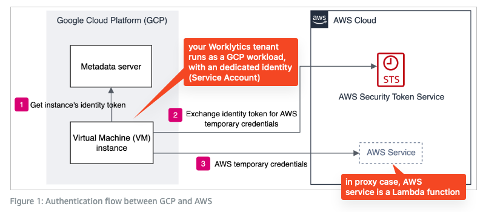

# Authentication and Authorization in AWS Deployments of Psoxy

This page provides an overview of how Psoxy authenticates and confirms authorization of clients (Worklytics tenants).

For general overview of how Psoxy is authorized to access data sources, and authenticates when making API calls to those sources, see [API Mode Authentication and Authorization](../authentication-authorization.md).

## Authentication

Each Worklytics tenant operates as a unique GCP service account within Google Cloud. GCP issues an identity token for this service account to processes running in the tenant, which the tenant then uses to authenticate against AWS.

This is [OIDC](https://docs.aws.amazon.com/IAM/latest/UserGuide/id_roles_providers_oidc.html) based identity federation (aka "web identity federation" or "workload identity federation").

No secrets or keys need to be exchanged between Worklytics and your AWS instance. The integrity of the authentication is provided by the signature of the identity token provided by GCP, which AWS verifies against Google's public certificates.

AWS provides an overview of the specific GCP Case: [Access AWS using a Google Cloud Platform native workload identity](https://aws.amazon.com/blogs/security/access-aws-using-a-google-cloud-platform-native-workload-identity/)

Annotating the diagram for the above case, with specific components for Worklytics-->Proxy case:



In the above, the AWS resource you're allowing access to is AWS IAM role, which your Worklytics tenant assumes and then can access S3 or invoke Lambda function.

## Authorization

Within your AWS account, you create an IAM role, with a role assumption policy that allows your Worklytics tenant's GCP Service Account (identified by a numeric ID you obtain from the Worklytics portal) to assume the role.

This assumption policy will have a statement similar to the following, where the value of the `aud` claim is the numeric ID of your Worklytics tenant's GCP Service Account:

```json
{
	"Effect": "Allow",
	"Principal": {
		"Federated": "accounts.google.com"
	},
	"Action": "sts:AssumeRoleWithWebIdentity",
	"Condition": {
		"StringEquals": {
			"accounts.google.com:aud": "12345678901234567890123456789"
		}
	}
}
```

Colloquially, this allows a web identity federated from `accounts.google.com` where Google has asserted the claim that `aud` == `12345678901234567890123456789` to assume the role.

Then you use this AWS IAM role as the principal in AWS IAM policies you define to authorize to invoke your proxy instances via their function URLs (API connectors) or to read from their sanitized output buckets (bulk data connectors)
