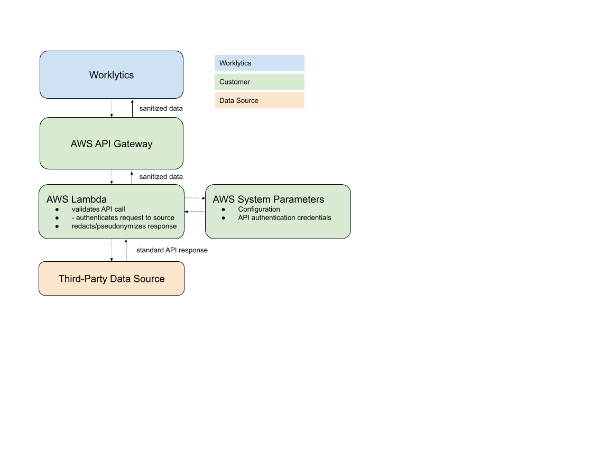

# AWS - Development

## Prereqs

Required:

- [AWS CLI](https://docs.aws.amazon.com/cli/latest/userguide/getting-started-install.html)

Optional:

- AWS SAM CLI ([macOS](https://docs.aws.amazon.com/serverless-application-model/latest/developerguide/serverless-sam-cli-install-mac.html)) for local testing, if desired
- [awscurl](https://github.com/okigan/awscurl) for direct testing of deployed AWS lambda from a terminal

## Build

Maven build produces a zip file.

1. Build core library
2. From `java/impl/aws/`:

```shell
mvn clean package
```

## Run Locally

Locally, you can test function's behavior from invocation on a JSON payload (but not how the API gateway will map HTTP requests to that JSON payload):

https://docs.aws.amazon.com/serverless-application-model/latest/developerguide/serverless-sam-cli-using-invoke.html

## Deploy to AWS

We recommend deploying your Psoxy code into AWS using the terraform modules found in [`infra/modules/`](../../infra/modules/] for AWS. These modules both provision the required AWS infrastructure, as well as deploying the built binaries for Psoxy as lambdas in the target account.

Example configurations using those modules can be found in [`infra/examples/](../../infra/examples).

You'll ultimately provision infrastructure represented in green in the following diagram:



See [`infra/modules/aws/`](../../infra/modules/aws/) for more information.
