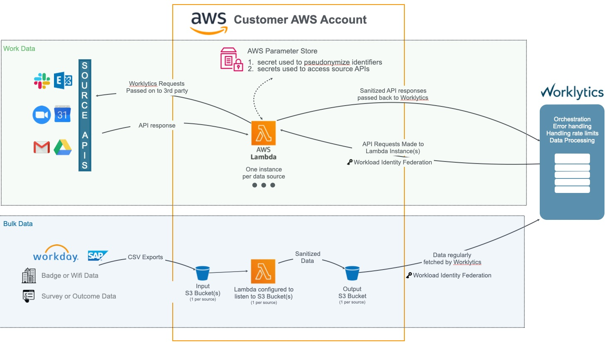

# AWS - Getting Started

## Overview

You'll provision the following to host Psoxy in AWS:

- [Lambda Functions](https://docs.aws.amazon.com/lambda/latest/dg/welcome.html)
- [IAM Roles and Policies](https://docs.aws.amazon.com/IAM/latest/UserGuide/introduction.html)
- [System Manager Parameter Store Parameters](https://docs.aws.amazon.com/systems-manager/latest/userguide/systems-manager-parameter-store.html)
- [CloudWatch Log Groups](https://docs.aws.amazon.com/AmazonCloudWatch/latest/monitoring/WhatIsCloudWatch.html)
- S3 buckets, if using the 'bulk' mode to sanitize file data (such as CSVs); [async API connectors](../configuration/async-api-data.md), or [webhook collection mode](../development/alpha-features/webhook-collectors.md). see [S3 docs](https://docs.aws.amazon.com/AmazonS3/latest/userguide/Welcome.html)
- [Cognito Pools and Identities](https://docs.aws.amazon.com/cognito/latest/developerguide/cognito-identity.html), if connecting to Microsoft 365 data sources
- [Simple Query Service (SQS) queues] (https://docs.aws.amazon.com/AWSSimpleQueueService/latest/SQSDeveloperGuide/welcome.html), if using [webhook collection mode](../development/alpha-features/webhook-collectors.md) *or* [async API connectors](../configuration/async-api-data.md)
- [KMS Keys and Aliases](https://docs.aws.amazon.com/kms/latest/developerguide/overview.html), if using [webhook collection mode](../../docs/development/alpha-features/webhook-collectors.md)
- [API Gateway](https://docs.aws.amazon.com/apigateway/latest/developerguide/welcome.html), if using [webhook collection mode](../../docs/development/alpha-features/webhook-collectors.md); or if desired for API connectors

The diagram below provides an architecture overview of the 'API' and 'Bulk' mode use-cases.



## Prerequisites

1. **An AWS Account in which to deploy Psoxy** We _strongly_ recommend you provision one specifically for use to host Psoxy, as this will create an implicit security boundary, reduce possible conflicts with other infra configured in the account, and simplify eventual cleanup.

   You will need the numeric AWS Account ID for this account, which you can find in the AWS Console.

   If your AWS organization enforces Service Control Policies, ensure that these are allow the AWS components required by Psoxy or exempt the AWS Account in which you will deploy Psoxy from these policies.

   If your organization uses any sort of security control enforcement mechanism, you may have disable/provide exceptions to those controls for you initial deployment. Then generally those controls can be implemented later by extending our examples. Our [protips](protips.md) page provides some guidance on how to extend the base examples to meet more extreme requirements.

2. **A sufficiently privileged AWS Role** You must have a IAM Role within the AWS account with sufficient privileges to (AWS managed policy examples linked):

   - create IAM roles + policies (eg [IAMFullAccess](https://us-east-1.console.aws.amazon.com/iam/home?region=us-east-1#/policies/arn:aws:iam::aws:policy/IAMFullAccess$serviceLevelSummary))
   - create and update Systems Manager Parameters (eg, [AmazonSSMFullAccess](https://us-east-1.console.aws.amazon.com/iam/home?region=us-east-1#/policies/arn:aws:iam::aws:policy/AmazonSSMFullAccess$serviceLevelSummary))
   - create and manage Lambdas (eg [AWSLambda_FullAccess](https://us-east-1.console.aws.amazon.com/iam/home?region=us-east-1#/policies/arn:aws:iam::aws:policy/AWSLambda_FullAccess$serviceLevelSummary))
   - create and manage S3 buckets (eg [AmazonS3FullAccess](https://us-east-1.console.aws.amazon.com/iam/home?region=us-east-1#/policies/arn:aws:iam::aws:policy/AmazonS3FullAccess$serviceLevelSummary))
   - create Cloud Watch Log groups (eg [CloudWatchFullAccess](https://us-east-1.console.aws.amazon.com/iam/home?region=us-east-1#/policies/arn:aws:iam::aws:policy/CloudWatchFullAccess$serviceLevelSummary))
   - create and manage SQS queues (eg [AmazonSQSFullAccess](https://us-east-1.console.aws.amazon.com/iam/home?region=us-east-1#/policies/arn:aws:iam::aws:policy/AmazonSQSFullAccess$serviceLevelSummary))

   (Yes, the use of AWS Managed Policies results in a role with many privileges; that's why we recommend you use a dedicated AWS account to host proxy which is NOT shared with any other use case)

   You will need the ARN of this role.

   Ensure that any [Permissions Boundary](https://docs.aws.amazon.com/IAM/latest/UserGuide/access_policies_boundaries.html) that may be applied to this role allow the above actions.

   If your organization uses [Service Control Policies](https://docs.aws.amazon.com/organizations/latest/userguide/orgs_manage_policies_scps.html), ensure that these allow the above actions.

   NOTE: if you're connecting to Microsoft 365 (Azure AD) data sources, you'll also need permissions to create AWS Cognito Identity Pools and add Identities to them, such as [arn:aws:iam::aws:policy/AmazonCognitoPowerUser](https://us-east-1.console.aws.amazon.com/iam/home?region=us-east-1#/policies/arn:aws:iam::aws:policy/AmazonCognitoPowerUser$serviceLevelSummary). Some AWS Organizations have [Service Control Policies](https://docs.aws.amazon.com/organizations/latest/userguide/orgs_manage_policies_scps.html) in place that deny this by default, even if you have an IAM role that allows it at an account level.

   NOTE: using AWS API Gateway (required for webhook collection), VPC, or Secrets Manager (not used by default in our examples) will require additional permissions beyond the above.

   See: [protips.md](protips.md) for guide to create a least-privileged iam policy for provisioning.

3. **An authenticated AWS CLI in your provisioning environment**. Your environment (eg, shell/etc from which you'll run terraform commands) must be authenticated as an identity that can assume that role. (see next section for tips on options for various environments you can use)

   Eg, if your Role is `arn:aws:iam::123456789012:role/PsoxyProvisioningRole`, the following should work:

```shell
aws sts assume-role --role-arn arn:aws:iam::123456789012:role/PsoxyProvisioningRole --role-session-name tf_session
```

    If not, use `aws sts get-caller-identity` to confirm how your CLI is authenticated.

## Provisioning Environment

To provision AWS infra, you'll need the `aws-cli` installed and authenticated on the environment where you'll run `terraform`.

Here are a few options:

### Your Local Machine or a VM/Container Outside AWS

1. [Generate an AWS Access Key](https://docs.aws.amazon.com/IAM/latest/UserGuide/id_credentials_access-keys.html) for your AWS User.
2. Run `aws configure` in a terminal on the machine you plan to use, and configure it with the key you generated in step one.

NOTE: this could even be a [GCP Cloud Shell](https://cloud.google.com/shell), which may simplify auth if your wish to connect your Psoxy instance to Google Workspace as a data source.

### EC2 Instance

If your organization prefers NOT to authorize the AWS CLI on individual laptops and/or outside AWS, provisioning Psoxy's required infra from an EC2 instance may be an option.

1. provision an EC2 instance (or request that your IT/dev ops team provision one for you). We recommend a micro instance with an 8GB disk, running `ubuntu` (not Amazon Linux; if you choose that or something else, you may need to adapt these instructions). Be sure to create a PEM key to access it via SSH (unless your AWS Organization/account provides some other ssh solution).
2. associate the Role above with your instance (see [https://docs.aws.amazon.com/IAM/latest/UserGuide/id_roles_use_switch-role-ec2.html](https://docs.aws.amazon.com/IAM/latest/UserGuide/id_roles_use_switch-role-ec2.html))
3. [connect to your instance](https://docs.aws.amazon.com/AWSEC2/latest/UserGuide/AccessingInstances.html?icmpid=docs_ec2_console),

```shell
# avoid ssh complaints about permissions on your key
chmod 400 psoxy-access-key.pem

ssh -i ~/psoxy-access-key.pem ubuntu@{PUBLIC_IPV4_DNS_OF_YOUR_EC2_INSTANCE}
```

Whichever environment you choose, follow general [prereq installation](../prereqs-ubuntu.md).

## Terraform State Backend

### S3

You'll also need a backend location for your Terraform state (such as an S3 bucket). It can be in any AWS account, as long as the AWS role that you'll use to run Terraform has read/write access to it.

See [https://developer.hashicorp.com/terraform/language/settings/backends/s3](https://developer.hashicorp.com/terraform/language/settings/backends/s3).

### Local File System

Alternatively, you may use a local file system, but this is not recommended for production use - as your Terraform state may contain secrets such as API keys, depending on the sources you connect.

See [https://developer.hashicorp.com/terraform/language/settings/backends/local](https://developer.hashicorp.com/terraform/language/settings/backends/local).

## Bootstrap

The module [psoxy-constants](../../infra/modules/psoxy-constants/) is a dependency-free module that provides lists of AWS managed policies, etc needed for bootstraping a AWS account in which your proxy instances will reside.

## Getting Started

Once you've fulfilled the prereqs, including having your terraform deployment environment, backend, and AWS account prepared, we suggest you use our AWS example template repo:

- [Worklytics/psoxy-example-aws](https://github.com/Worklytics/psoxy-example-aws)

Follow the 'Usage' instructions there to continue.
