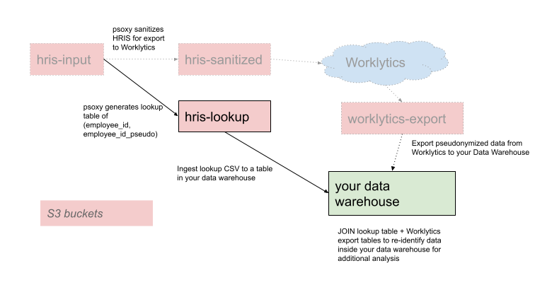

# Lookup Tables with AWS

If you use Psoxy to send pseudonymized data to Worklytics and later wish to re-identify the data that you export from Worklytics to your premises, you'll need a lookup table in your data warehouse to JOIN with that data.



Our `aws-host` Terraform module, as used in our [Psoxy AWS Example](https://github.com/Worklytics/psoxy-example-aws/tree/main), provides a variable `lookup_table_builders` to control generation of these lookup tables.

Populating this variable will generate another version of your HRIS data (aside from the one exposed to Worklytics) which you can then import back to your data warehouse.

To enable it, add the following to your `terraform.tfvars` file:

```hcl
lookup_table_builders = {
  "hris-lookup" = {
    input_connector_id = "hris",
    sanitized_accessor_role_names = [
      # ADD LIST OF NAMES OF YOUR AWS ROLES WHICH CAN READ LOOKUP TABLE
    ],
    rules = {
      pseudonym_format = "URL_SAFE_TOKEN"
      columnsToRedact = [
        "employee_email",
        "manager_id",
        "manager_email",
        "join_date",
        "leave_date"
      ]
      columnsToPseudonymize = [
        "employee_id", # primary key
      ]
      columnsToDuplicate = {
        "employee_id" = "employee_id_orig"
      }
      columnsToRename = {}
      columnsToInclude = null
    }
  }
}
```

In `sanitized_accessor_role_names`, add the name of whatever AWS role that the principal running ingestion of your lookup table from S3 to your data warehouse will assume. You can add additional role names as needed. Alternatively, you can use an IAM policy created outside of our Terraform module to grant access to the lookup table CSVs within the S3 bucket.

After you apply this configuration, the lookup table will be generated in an S3 bucket. The S3 bucket will be shown in the Terraform output:

```shell
Outputs:

lookup_tables = {
  "lookup-hris" = "psoxy-lookup-hris-20221025202138363600000001"
}
```

Use the bucket name shown in your output to build import pipeline to your data warehouse.

If your input file follows the [standard HRIS schema](https://docs.worklytics.co/knowledge-base/connectors/bulk-data/hris-snapshots) for Worklytics, it will have `SNAPSHOT,EMPLOYEE_ID,EMPLOYEE_EMAIL,JOIN_DATE,LEAVE_DATE,MANAGER_ID` columns, at minimum.

Every time a new hris snapshot is uploaded to the hris `-input` bucket, TWO copies of it will be created: a sanitized copy in the bucket accessible Worklytics, and the lookup variant in the lookup bucket referenced above (not accessible to Worklytics).

The lookup table CSV file will have the following columns: `EMPLOYEE_ID,EMPLOYEE_ID_ORIG`

If you load this into your Data Warehouse, you can JOIN it with the data you export from Worklytics.

Eg, assuming you've exported the [Worklytics Weekly aggregates data set](https://docs.worklytics.co/knowledge-base/data-export/weekly-aggregates) to your data warehouse, load the files from S3 bucket above into a table named `lookup_hris`.

Then the following query will give re-identified aggregate data:

```sql
SELECT
    acmecom_ANONYMIZED_AGGREGATES.* EXCEPT (employeeId),
    lookup_hris.employee_id_orig AS employeeId
FROM
    acmecom_ANONYMIZED_AGGREGATES JOIN lookup_hris
        ON acmecom_ANONYMIZED_AGGREGATES.employeeId = lookup_hris.employee_id
```

The `employeeId` column in the result set will be the original employee ID from your HRIS system.

### Security and Privacy Considerations

If your HRIS employee ID column is considered PII, then the lookup table and any re-identified data exports you use it to produce should be handled as Personal data, according to your policies, as these now reference readily identifiable Natural Persons.

If you wish limit re-identification to a subset of your data, you can use additional columns present in your HRIS csv to do so, for example:

```sql
WITH allowed_for_reidentification AS (
    SELECT
        *
    FROM
        lookup_hris
    WHERE
        department = 'Sales'
)
SELECT
    acmecom_ANONYMIZED_AGGREGATES.* EXCEPT (employeeId),
    allowed_for_reidentification.employee_id_orig AS employeeId
FROM
    acmecom_ANONYMIZED_AGGREGATES JOIN allowed_for_reidentification
        ON acmecom_ANONYMIZED_AGGREGATES.employeeId = allowed_for_reidentification.employee_id
```

### Advanced

Within the `lookup_table_builders` map, you can specify the following fields:
  - `input_connector_id` - usually `hris`; this corresponds the whatever bulk connector you want to build the lookup table for.
  - `rules` - this follows the rules structure for the bulk connector case. The example above is suited for HRIS data following the schema expected by Worklytics. If you modify this, be sure to review our documentation or contact support to ensure you don't break your lookup table.
