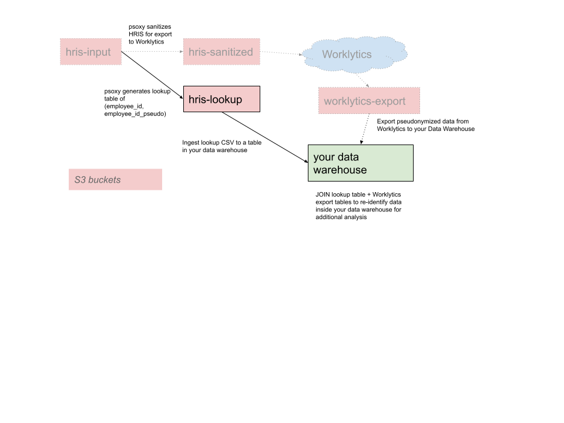

# Lookup Tables with AWS

If you use psoxy to send pseudonymized data to Worklytics and later wish to re-identify the data
that you export from Worklytics on your premises, you'll need a lookup table in your data warehouse
to JOIN to data exported from Worklytics.



In our various examples (see [`infra/examples`](../../infra/examples)), we provide a variable
`lookup_table_builder` that allows you to control generation of these lookup tables. Populating this
variable will generate another version of your HRIS data (aside from the one exposed to Worklytics)
which you can then import back to your data warehouse.

The S3 bucket in which this table, if any, will be shown as a Terraform output. eg

```shell
Outputs:

lookup_tables = {
  "lookup-hris" = "psoxy-lookup-hris-20221025202138363600000001"
}
```

Use the bucket name shown in your output to build import pipeline to your data warehouse.
