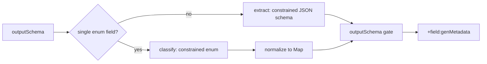

# genMetadata Augment (BETA)

> **Status:** BETA · Alpha feature · Design refined (cloud-only constrained generation)
> **Since:** v0.6.x
> **Relates to:** [augments.md](augments.md), [sentence-metadata-augment.md](sentence-metadata-augment.md), [remote-resources.md](../../configuration/remote-resources.md)

## Overview

**genMetadata** calls a cloud LLM to derive structured metadata from a source text field and attaches it as a sibling property: `+{sourceProperty}:genMetadata`.

**Product direction (refined):**

| Decision | Choice |
|----------|--------|
| Runtime | **Cloud only** — Amazon Bedrock (AWS) or Vertex AI Gemini (GCP) |
| Local / Jlama | **Abandoned** — no constrained decoding, poor JSON/enum reliability, heavy memory / `llm/*.zip` ops |
| How structure is enforced | **Provider constrained generation**, not prompt begging |
| First shipped shape | **Enum classification** (MS Copilot prompt categories) |
| Also shipped (PoC) | **Structured extraction** via JSON Schema (Zoom meeting transcript → speaking time by person) |

Wrong cloud on wrong platform → `augment-gen-unavailable`. Auth / quota / budget deny → omit augment + warning (response still succeeds).

## Two inference modes (driven by `outputSchema`)

Rules always declare `prompt` + `outputSchema`. The runtime **infers mode** from the schema (no separate `mode` field required for BETA):

| Mode | When | Model output | Proxy normalizes to |
|------|------|--------------|---------------------|
| **classify** | Schema is an object with a **single** required string property that has `enum` | Plain enum label (Vertex `text/x.enum`) or tiny constrained JSON object (Bedrock) | `{"<property>":"<label>"}` |
| **extract** | Any richer object / array schema | Constrained JSON matching the schema | Parsed object/array as-is (after schema gate) |

Downstream always sees JSON under `+…:genMetadata`. The model is not asked to free-form invent JSON.



### Mode: classify (enum)

**Use when:** closed vocabulary — Copilot prompt category, ticket type, sentiment bucket, etc.

**Prompt:** task semantics only; **do not** list JSON shape requirements. Enum values live in `outputSchema` (and are pushed into the provider constraint).

```text
Classify the input into exactly one category.
Use "Uncategorized" when substantive but unclear.
Use "Excluded" for greetings, thanks, or prompts too short to classify.
```

**Provider wiring:**

| Platform | Constraint |
|----------|------------|
| Vertex | `responseMimeType = text/x.enum` + `responseSchema = { type: STRING, enum: [...] }` → raw label |
| Bedrock | Converse structured output JSON Schema: one required string property with `enum`, `additionalProperties: false` |

**Java:** if response is a bare string (or quoted string) matching an enum value, wrap to `{ "category": "…" }`. If already a one-key object, validate and pass through.

### Mode: extract (structured object / array)

**Use when:** the result is not a single label — e.g. **meeting transcript → speaking time by participant**.

Example `outputSchema` (illustrative):

```yaml
type: object
required: [speakers]
additionalProperties: false
properties:
  speakers:
    type: array
    items:
      type: object
      required: [personId, secondsTalking]
      additionalProperties: false
      properties:
        personId:
          type: string
          description: Stable id or display name as it appears in the transcript
        secondsTalking:
          type: number
          minimum: 0
```

**Prompt:** describe the extraction task (how to attribute turns, what to ignore), not “return valid JSON”.

**Provider wiring:**

| Platform | Constraint |
|----------|------------|
| Vertex | `responseMimeType = application/json` + `responseSchema` from `outputSchema` |
| Bedrock | Converse `outputConfig.textFormat` / `json_schema` from `outputSchema` |

**Caveats for transcript-scale inputs:**

- genMetadata still runs **per matched `jsonPath` value** in an API (or bulk) payload — design rules so the source field is the transcript (or a chunk), not an entire multi-hour blob without bounds.
- Enforce `PSOXY_GEN_MAX_INPUT_CHARS` (and consider higher defaults for extract mode later). Chunking / map-reduce across turns is **out of scope for v1**; if transcripts exceed budget, omit with warning or pre-truncate with an explicit rule.
- Prefer numeric + id fields over free prose in the schema so constrained decoding stays tight. For Zoom transcript extract, use `personId` (from `users[].user_id`) and pseudonymize `$['+timeline:genMetadata'].speakers[*].personId` in transforms so speaker ids in the augment are not left in cleartext.

Same augment type covers both Copilot classification and Zoom transcript extract analytics; only `prompt` + `outputSchema` change.

## Rule configuration

| Field | Required | Description |
|-------|----------|-------------|
| `jsonPaths` | yes | Source values to process |
| `prompt` | yes | Task instruction (SHA’d); **no** JSON formatting instructions |
| `outputSchema` | yes | Shape + enums; drives classify vs extract and provider constraints |

No `model`, `backend`, or `maxTokens` in rules — those stay deployment config.

## Deployment configuration (env)

| Variable | Default | Purpose |
|----------|---------|---------|
| `PSOXY_GEN_BACKEND` | Terraform: `bedrock` (AWS) / `vertex` (GCP). Java defaults unset backend toward `bedrock`. | `bedrock` \| `vertex` only |
| `PSOXY_GEN_MODEL` | Haiku / Gemini Flash defaults | Cloud model id |
| `PSOXY_GEN_TIMEOUT_SECONDS` | `15` | Per-call timeout |
| `PSOXY_GEN_MAX_INPUT_CHARS` | `4096` | Truncate source (raise carefully for transcripts) |
| `PSOXY_GEN_MAX_TOKENS` | `256` (classify); consider higher for extract | Max generation tokens |
| `PSOXY_GEN_META_RETRIES` | `2` | Retries on parse/schema failure (less critical once constraints work) |
| `ENABLE_GEN_METADATA` | unset | Set by Terraform `enable_gen_metadata = true` |

Vertex uses the **same project/region as the Psoxy deployment** (`GOOGLE_CLOUD_PROJECT`, `GOOGLE_CLOUD_REGION` / `FUNCTION_REGION`). No `PSOXY_GEN_VERTEX_*` properties.

**Removed / abandoned:** `PSOXY_GEN_BACKEND=local`, Jlama, `JAVA_TOOL_OPTIONS` vector flags for genMetadata, remote `llm/*.zip` model archives, 4096 MB memory floor for genMetadata.

## Infrastructure (Terraform)

- `enable_gen_metadata = true` on API connectors; host `gen_metadata_backend` defaults to **bedrock** / **vertex**.
- **Reject** `local` (and cross-cloud) via variable validation / `check` blocks.
- Cloud memory defaults (no 4GB floor); Bedrock invoke IAM / `roles/aiplatform.user`; no genMetadata remote-resource upload TODOs.
- Cost caps: see below (daily/weekly product requirement).

### Cost caps — daily / weekly pacing

Worklytics cares about **weekly** aggregates. A monthly-only budget that allows burning the month in week 1 (then zero coverage) is unacceptable; a smaller uniform sample each week is better.

| Horizon | Role |
|---------|------|
| Daily / weekly hard stop | **Required** for sampling policy (app-layer ledger still deferred; AWS daily Budget is the best infra stop today) |
| Monthly GCP billing budget | Ops safety net only — **not** a sampling policy |

See prior notes: target app-layer `day` / `ISO week` ledger; until then prefer AWS daily Deny when cost-sensitive.

## Java architecture

```
GenMetadataProcessor
  → shape detect (classify | extract) from outputSchema
  → GenMetadataChatModelProvider (Bedrock | Vertex only)
       attaches provider constraints from schema
  → normalize (enum string → Map; JSON → Map/List)
  → outputSchema gate (safety net)
```

- Local/Jlama provider and dependencies removed; cloud providers only.
- Providers apply constraints on each request (or model builder) from `outputSchema` — prompt builder does not embed full schema JSON for classify mode (optional short hint for extract).
- Concurrent cloud calls use a semaphore; no model-load locks.

## MS Copilot PoC (classify)

Classifies `$..body.content` into one of 11 categories. `outputSchema.properties.category.enum` is the source of truth; prompt is short classification guidance only. See `MS_COPILOT_GEN_METADATA_AUGMENT` and `msft-copilot.yaml` / `msft-copilot_no-userIds.yaml`. Enabled via `enable_gen_metadata = true` on the Copilot connector specs.

## Zoom transcript PoC (extract)

Endpoint `/v2/meetings/{meetingId}/transcript` uses genMetadata on `$.timeline` with an extract schema `{speakers:[{personId, secondsTalking}]}`. Timeline user ids/emails are pseudonymized; `$['+timeline:genMetadata'].speakers[*].personId` is also pseudonymized so speaker ids in the augment are not left in cleartext. Unit tests omit the augment when no cloud backend is wired.

## Error handling

| Code | Meaning |
|------|---------|
| `augment-gen-unavailable` | Unsupported/missing backend, auth deny, budget IAM Deny |
| `augment-gen-inference-failed` | Call/parse failure |
| `augment-output-schema-mismatch` | Post-constraint gate failed (should be rare) |
| `augment-conflict-skipped` | Upstream `+` properties present |

## Migration from local Jlama PoC

1. Set host backend to `bedrock` / `vertex`; remove `local` from configs.
2. Stop uploading `llm/*.zip`; drop 4096 MB / Jlama JVM flags.
3. Simplify prompts; keep enums in `outputSchema`.
4. Provider constraints + enum normalization are implemented; Jlama provider / deps / local integration path are removed.

## Deferred

- App-layer daily/weekly spend ledger
- Transcript chunking / multi-call map-reduce for long meetings
- Rule-level model selection
- Cross-cloud backends
- Reintroducing any on-box LLM (explicitly rejected unless constrained decoding exists in-process)
