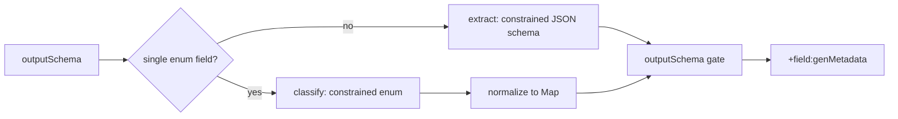

# genMetadata Augment (BETA)

> **Status:** BETA · Alpha feature · Design refined (cloud-only constrained generation)
> **Since:** v0.6.x
> **Relates to:** [augments.md](augments.md), [sentence-metadata-augment.md](sentence-metadata-augment.md), [remote-resources.md](../../configuration/remote-resources.md)

## Overview

**genMetadata** calls a cloud LLM to derive structured metadata from a matched source value and attaches it as:

- **Scalar / leaf match** (e.g. `$.title`, `$..body.content`): sibling `+{sourceProperty}:genMetadata` on the parent object.
- **Object match** (e.g. `$` or `$[*]` when each match is a JSON object): `+self:genMetadata` on that same object; the whole matched Map is the LLM corpus (after stripping any existing `+…` keys).

**Product direction (refined):**

| Decision | Choice |
|----------|--------|
| Runtime | **Cloud only** — Amazon Bedrock (AWS) or Vertex AI Gemini (GCP) |
| Local / Jlama | **Abandoned** — no constrained decoding, poor JSON/enum reliability, heavy memory / `llm/*.zip` ops |
| How structure is enforced | **Provider constrained generation**, not prompt begging |
| First shipped shape | **Enum classification** (MS Copilot prompt categories) |
| Also shipped (PoC) | **Structured extraction** via JSON Schema (Zoom meeting transcript → speaking time by person) |

Wrong cloud on wrong platform → `augment-gen-unavailable`. Auth / quota / budget deny → omit augment + warning (response still succeeds).

## Two inference modes (driven by `outputSchema`)

Rules always declare `prompt` + `outputSchema`. The runtime **infers mode** from the schema (no separate `mode` field required for BETA):

| Mode | When | Model output | Proxy normalizes to |
|------|------|--------------|---------------------|
| **classify** | Schema is an object with a **single** required string property that has `enum` | Constrained JSON object `{"<property>":"<label>"}` (both Vertex and Bedrock) | Same Map after parse / label recovery |
| **extract** | Any richer object / array schema | Constrained JSON matching the schema | Parsed object/array as-is (after schema gate) |

Downstream always sees JSON under `+…:genMetadata`. The model is not asked to free-form invent JSON.



### Mode: classify (enum)

**Use when:** closed vocabulary — Copilot prompt category, ticket type, sentiment bucket, etc.

**Prompt (task only):** classification guidance; do not contradict the runtime JSON contract. Enum values live in `outputSchema`.

```text
Classify the input into exactly one category.
Use "Uncategorized" when substantive but unclear.
Use "Excluded" for greetings, thanks, or prompts too short to classify.
```

**Runtime:** system + user messages always ask for `{"<property>":"<enum>"}`. Provider JSON schema constraint matches `outputSchema` (Vertex/Bedrock). Parser accepts clean JSON, fenced JSON, prose-prefixed JSON, bare labels, and (as fallback) an enum embedded in truncated/prose output. Schema mismatch retries (`METADATA_GEN_RETRIES`, default 2 attempts).

**Provider wiring:**

| Platform | Constraint |
|----------|------------|
| Vertex / Bedrock | JSON response format + object schema with one required string `enum` property |

**Java:** parse JSON → Map; if needed, wrap a bare/prose enum label to `{ "category": "…" }`, then validate.

### Mode: extract (structured object / array)

**Use when:** the result is not a single label — e.g. **meeting transcript → speaking time by participant**.

Example `outputSchema` (illustrative):

```yaml
type: object
required: [speakers]
additionalProperties: false
properties:
  speakers:
    type: array
    items:
      type: object
      required: [personId, secondsTalking]
      additionalProperties: false
      properties:
        personId:
          type: string
          description: Stable id or display name as it appears in the transcript
        secondsTalking:
          type: number
          minimum: 0
```

**Prompt:** describe the extraction task (how to attribute turns, what to ignore), not “return valid JSON”.

**Provider wiring:**

| Platform | Constraint |
|----------|------------|
| Vertex | `responseMimeType = application/json` + `responseSchema` from `outputSchema` |
| Bedrock | Converse `outputConfig.textFormat` / `json_schema` from `outputSchema` |

**Caveats for transcript-scale inputs:**

- genMetadata still runs **per matched `jsonPath` value** in an API (or bulk) payload — design rules so the source field is the transcript (or a chunk), not an entire multi-hour blob without bounds.
- Enforce `METADATA_GEN_MAX_INPUT_CHARS` (and consider higher defaults for extract mode later). Chunking / map-reduce across turns is **out of scope for v1**; if transcripts exceed budget, omit with warning or pre-truncate with an explicit rule.
- Prefer numeric + id fields over free prose in the schema so constrained decoding stays tight. For Zoom transcript extract, use `personId` (from `users[].user_id`) and pseudonymize `$['+timeline:genMetadata'].speakers[*].personId` in transforms so speaker ids in the augment are not left in cleartext.

Same augment type covers both Copilot classification and Zoom transcript extract analytics; only `prompt` + `outputSchema` change.

## Rule configuration

| Field | Required | Description |
|-------|----------|-------------|
| `jsonPaths` | yes | Source values to process. Use `$` / `$[*]` to classify whole objects (→ `+self:genMetadata`); use leaf paths for scalar text (→ `+title:genMetadata`, etc.). |
| `prompt` | yes | Task guidance only (categories, edge cases). Do **not** put conflicting format instructions here — Java always requests a JSON object and applies provider JSON constraints from `outputSchema`. |
| `outputSchema` | yes | Shape + enums; drives classify vs extract and provider constraints |

No `model`, `backend`, `maxTokens`, or `thinkingLevel` in rules — those stay deployment config.

### Object-level corpus (GitHub PR shape)

For APIs that return objects (or arrays of objects) where the classification corpus spans multiple fields (`title` + `body`), match the object itself:

```yaml
- pathTemplate: "/repos/{owner}/{repo}/pulls"
  augments:
    - !<genMetadata>
      jsonPaths: ["$[*]"]
      prompt: |
        Classify this GitHub pull request into exactly one category.
        Use title and body as the primary signal; ignore ids, urls, and user records.
      outputSchema:
        type: string
        enum: [Feature, Bugfix, Tech Debt, Docs, Infra, Uncategorized]
  transforms:
    - redact: ["$[*].title", "$[*].body"]
```

- One LLM call per matched object (same sequential limit as other augments).
- Serialization for Maps strips `+…` keys and prefers a stable order with `title` then `body` first, then remaining properties, so `METADATA_GEN_MAX_INPUT_CHARS` truncation still sees the text corpus when a large nested `user` object would otherwise sit between them in Jackson field order.
- **PII:** object-level matches may send nested user/email fields to the model. There is no `preAugmentTransforms` yet; accepted for this PoC — prefer prompts that tell the model to ignore ids/urls/user records, and redact source fields in `transforms` after augments.

## Deployment configuration (env)

| Variable | Default | Purpose |
|----------|---------|---------|
| `METADATA_GEN_BACKEND` | Terraform: `bedrock` (AWS) / `vertex` (GCP). Java defaults unset backend toward `bedrock`. | `bedrock` \| `vertex` only |
| `METADATA_GEN_MODEL` | Haiku / `gemini-3.5-flash-lite` defaults | Cloud model id |
| `METADATA_GEN_MODEL_REGION` | Vertex: `global` | Vertex publisher-model **location**. Default `global` (google-genai → `https://aiplatform.googleapis.com`). Ignored on AWS. |
| `METADATA_GEN_TIMEOUT_SECONDS` | `15` | Per-call timeout |
| `METADATA_GEN_MAX_INPUT_CHARS` | `4096` | Truncate source (raise carefully for transcripts) |
| `METADATA_GEN_MAX_TOKENS` | `1024` | Max generation tokens (Gemini 3.x **thinking shares this budget** with visible JSON; 256 was too tight under default thinking) |
| `METADATA_GEN_RETRIES` | `2` | Total attempts per augment when parse/schema fails (retry already included) |
| `METADATA_GEN_THINKING_LEVEL` | `minimal` (GCP Terraform default) | **Vertex only.** Gemini thinking level: `minimal` \| `low` \| `medium` \| `high` (case-insensitive). Ignored on Bedrock — Claude’s extended/adaptive thinking is a different API (`budget_tokens` / `effort`), not a drop-in for Gemini’s enum. |
| `ENABLE_GEN_METADATA` | unset | Set by Terraform `enable_gen_metadata = true` |

Vertex project comes from ADC / metadata (`ServiceOptions.getDefaultProjectId()`). Model location is **not** the function region. Default is `METADATA_GEN_MODEL=gemini-3.5-flash-lite` + `METADATA_GEN_MODEL_REGION=global`.

Vertex uses LangChain4j **google-genai** (not the legacy vertex-ai-gemini SDK). Thinking level is set from deployment env `METADATA_GEN_THINKING_LEVEL` (default `minimal` → API `MINIMAL`). Gemini 3.5 Flash otherwise defaults to `MEDIUM` thinking, which ate the old 256-token output cap and the 15s timeout (truncated `{"category": "`). Create logs include `thinkingLevel=` and `maxOutputTokens=`.

### Latency / model choice

Per-row Vertex calls are typically several seconds (network + model). A 100-row bulk file is **sequential** (one augment per row), so wall time ≈ rows × (attempts × latency). Failed parses double cost when retries fire. Prefer `METADATA_GEN_THINKING_LEVEL=minimal` (the default) for classify throughput; raise to `medium`/`high` only when quality needs deeper reasoning (and budget/timeout allow). Lite models default closer to minimal thinking but still benefit from the higher max-token default.

Default is Flash-Lite for classify throughput. Override to full Flash when quality matters more than p50 latency:

| Model | Relative speed (approx.) | Notes |
|-------|--------------------------|-------|
| `gemini-3.5-flash-lite` | Fastest 3.5-class Lite (~350 tok/s claimed) | **Default** — best for high-volume classify |
| `gemini-2.5-flash-lite` | Slower than 3.5 Flash-Lite | Still fine for cheap/low-latency classify |
| `gemini-3.5-flash` | Slower / heavier than Lite | Better quality; set `METADATA_GEN_MODEL=gemini-3.5-flash` when needed |

**Removed / abandoned:** `METADATA_GEN_BACKEND=local` / former `PSOXY_GEN_*` names, Jlama, `JAVA_TOOL_OPTIONS` vector flags for genMetadata, remote `llm/*.zip` model archives, 4096 MB memory floor for genMetadata.

## Infrastructure (Terraform)

- `enable_gen_metadata = true` on API connectors; host `gen_metadata_backend` defaults to **bedrock** / **vertex**.
- **Reject** `local` (and cross-cloud) via variable validation / `check` blocks.
- Cloud memory defaults (no 4GB floor); Bedrock invoke IAM / `roles/aiplatform.user`; no genMetadata remote-resource upload TODOs.
- Cost caps: see below (daily/weekly product requirement).

### Cost caps — daily / weekly pacing

Worklytics cares about **weekly** aggregates. A monthly-only budget that allows burning the month in week 1 (then zero coverage) is unacceptable; a smaller uniform sample each week is better.

| Horizon | Role |
|---------|------|
| Daily / weekly hard stop | **Required** for sampling policy (app-layer ledger still deferred; AWS daily Budget is the best infra stop today) |
| Monthly GCP billing budget | Ops safety net only — **not** a sampling policy |

See prior notes: target app-layer `day` / `ISO week` ledger; until then prefer AWS daily Deny when cost-sensitive.

## Java architecture

```
GenMetadataProcessor
  → shape detect (classify | extract) from outputSchema
  → GenMetadataChatModelProvider (Bedrock | Vertex only)
       attaches provider constraints from schema
  → normalize (enum string → Map; JSON → Map/List)
  → outputSchema gate (safety net)
```

- Local/Jlama provider and dependencies removed; cloud providers only.
- Providers apply constraints on each request (or model builder) from `outputSchema` — prompt builder does not embed full schema JSON for classify mode (optional short hint for extract).
- Concurrent cloud calls use a semaphore; no model-load locks.
- **Token usage:** each cloud call accumulates provider `input` / `output` token counts (when returned). At end of each bulk file, totals are logged once (`genMetadata file aggregate …`) and written on the sanitized object using the same `psoxy-*` keys as other bulk metadata:
  - `psoxy-gen-metadata-input-tokens`
  - `psoxy-gen-metadata-output-tokens`
  - `psoxy-gen-metadata-calls`

## MS Copilot PoC (classify)

Classifies `$..body.content` into one of 11 categories. `outputSchema.properties.category.enum` is the source of truth; prompt is short classification guidance only. See `MS_COPILOT_GEN_METADATA_AUGMENT` and `msft-copilot.yaml` / `msft-copilot_no-userIds.yaml`. Enabled via `enable_gen_metadata = true` on the Copilot connector specs.

## Zoom transcript PoC (extract)

Endpoint `/v2/meetings/{meetingId}/transcript` uses genMetadata on `$.timeline` with an extract schema `{speakers:[{personId, secondsTalking}]}`. Timeline user ids/emails are pseudonymized; `$['+timeline:genMetadata'].speakers[*].personId` is also pseudonymized so speaker ids in the augment are not left in cleartext. Unit tests omit the augment when no cloud backend is wired.

## Error handling

| Code | Meaning |
|------|---------|
| `augment-gen-unavailable` | Unsupported/missing backend, auth deny, budget IAM Deny |
| `augment-gen-inference-failed` | Call/parse failure |
| `augment-output-schema-mismatch` | Post-constraint gate failed (should be rare) |
| `augment-conflict-skipped` | Upstream `+` properties present |

## Migration from local Jlama PoC

1. Set host backend to `bedrock` / `vertex`; remove `local` from configs.
2. Stop uploading `llm/*.zip`; drop 4096 MB / Jlama JVM flags.
3. Simplify prompts; keep enums in `outputSchema`.
4. Provider constraints + enum normalization are implemented; Jlama provider / deps / local integration path are removed.

## Deferred

- App-layer daily/weekly spend ledger
- Transcript chunking / multi-call map-reduce for long meetings
- Rule-level model selection
- Cross-cloud backends
- Reintroducing any on-box LLM (explicitly rejected unless constrained decoding exists in-process)
