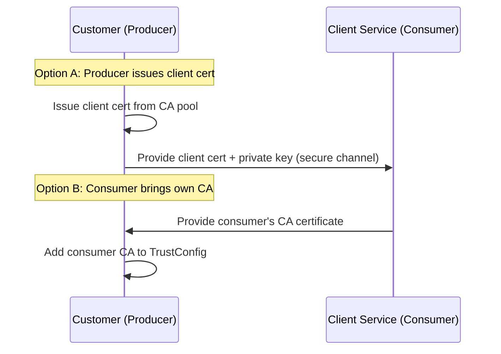
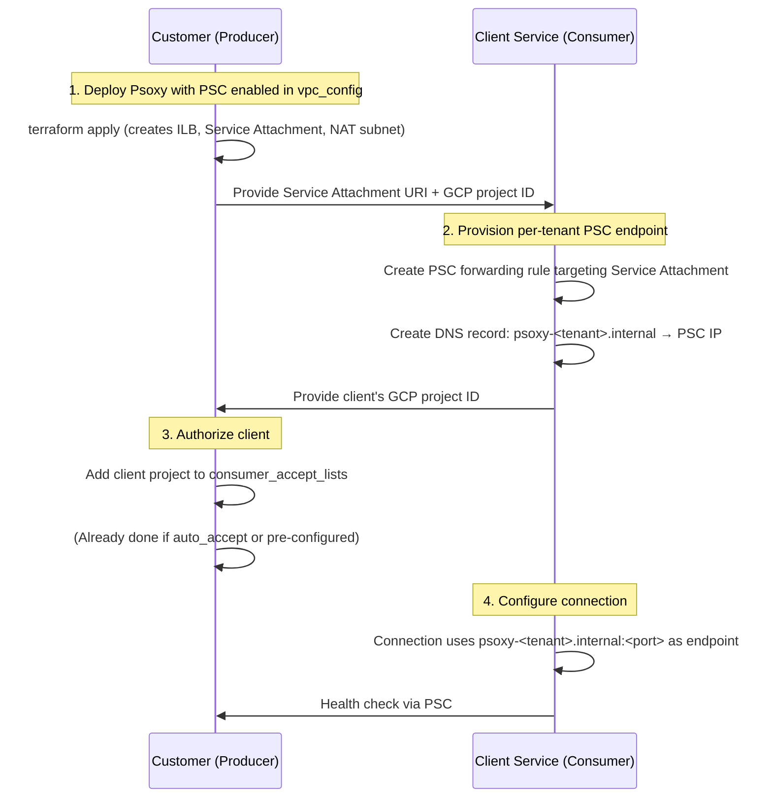

# GCP Network Connectivity Options for Psoxy

> **Status**: Draft / Design Spec
> **Last Updated**: 2026-04-08

## Overview

This document describes the available and planned network connectivity options between Psoxy proxy
instances (hosted in a customer's GCP project) and a client service that consumes the proxy's
output. It covers three architectures:

| Architecture | Transport | Authentication | Applicability |
|---|---|---|---|
| **TLS over Public Internet** (current) | Google-managed TLS | GCP IAM | All deployments |
| **mTLS over Public Internet** (enhanced) | Mutual TLS via External ALB | Client certificate + GCP IAM | Customers requiring transport-layer client auth |
| **Private Service Connect** (private) | GCP private backbone | GCP IAM | GCP-hosted clients needing private connectivity |

**Worklytics** is one such client service. As a GCP-hosted analytics platform, Worklytics can
leverage these options to reach customer Psoxy instances. The examples throughout this doc use
Worklytics as the concrete client, but the mTLS architecture generalizes to any client, and PSC
generalizes to any GCP-hosted consumer.

---

## Network Connectivity Architectures

### Current Network Connectivity Architecture: Secure Connection over Public Internet

Today, a client service connects to Psoxy via two paths, both secured with TLS and GCP IAM:

| Connector Type | How the Client Reaches Psoxy |
|---|---|
| **API (REST)** connectors | HTTPS request to the Cloud Function's public `*.run.app` URL. Authenticated via GCP IAM (`roles/run.invoker`) granted to the client's SA. |
| **Bulk** connectors | GCS `storage.objects.get/list` on the sanitized output bucket. Authenticated via GCS IAM (`roles/storage.objectViewer`) granted to the client's SA. |

Both paths travel over the public internet with TLS encryption and IAM authn/authz.

#### Enhancing Public Internet Options with IP Allowlisting

For public-internet connectivity (TLS and mTLS), customers can further restrict Cloud Function
ingress to only accept requests from **known, fixed IP addresses** of the client service.

Some client services (including Worklytics, as a paid feature) support dialing out from a
determined set of static egress IPs. When this is available, customers can configure
[Cloud Run ingress with Cloud Armor](https://cloud.google.com/run/docs/securing/cloud-armor) to
restrict access to only those IPs, adding a network-layer control even without PSC or VPC:

| Security Layer | TLS (current) | TLS + IP allowlist | mTLS + IP allowlist | PSC |
|---|---|---|---|---|
| Transport encryption | ✅ | ✅ | ✅ (mutual) | ✅ (private) |
| IAM authentication | ✅ | ✅ | ✅ | ✅ |
| IP-based ingress restriction | ❌ | ✅ | ✅ | ✅ (inherent) |
| Client certificate auth | ❌ | ❌ | ✅ | ❌ |

IP allowlisting is especially useful as a lightweight hardening step that requires no additional
infrastructure — just a Cloud Armor security policy attached to the backend service.

> **Note**: When the client service's egress IPs are known and stable, IP allowlisting can be
> combined with any of the other architectures (including mTLS) for maximum defense-in-depth.

### Alternative Network Connection Architecture: mTLS over Public Internet

mTLS enhances the current public-internet architecture by placing an **External Application Load
Balancer** in front of the Cloud Functions, configured to **require client certificates**. Traffic
still traverses the public internet, but the connection is mutually authenticated — the server
verifies the client's identity via certificate, and the client verifies the server's.

This provides **defense-in-depth**: even if a client's IAM credentials were compromised, requests
would fail without a valid client certificate. mTLS also satisfies compliance frameworks that
mandate transport-layer client authentication.

```
┌──────────────────────────────┐   public internet   ┌──────────────────────────────────┐
│   Client Service             │   (mTLS encrypted)  │   Customer Psoxy (Producer)      │
│                              │                     │                                  │
│  presents client cert ──────►├─────────────────────►│  External ALB (verifies client   │
│  verifies server cert ◄──────┤◄─────────────────────│   cert via TrustConfig)          │
│                              │                     │      ↓                           │
│                              │                     │  Serverless NEG → Cloud Function │
└──────────────────────────────┘                     └──────────────────────────────────┘
```

See [mTLS over Public Internet — Detail](#mtls-over-public-internet--detail) for full
architecture and Terraform resources.

### Alternative Network Connection Architecture: Private Service Connect

With PSC, both paths are replaced with **private endpoints** that stay entirely within GCP's
internal network. Authentication and authorization remain unchanged (IAM-based) — PSC is a
network-layer enhancement only.

```
┌──────────────────────────────────┐       PSC        ┌──────────────────────────────────┐
│   Client Service (Consumer)      │  ◄────────────►  │   Customer Psoxy (Producer)      │
│   e.g. Worklytics                │   private link   │                                  │
│                                  │                  │                                  │
│  ┌────────────────────────────┐  │                  │  ┌────────────────────────────┐  │
│  │ PSC Endpoint (REST)        │──┼──────────────────┼─►│ ILB → Serverless NEG       │  │
│  │ 10.x.y.z                  │  │                  │  │  → Cloud Functions (REST)  │  │
│  └────────────────────────────┘  │                  │  └────────────────────────────┘  │
│                                  │                  │                                  │
│  ┌────────────────────────────┐  │                  │  ┌────────────────────────────┐  │
│  │ PSC Endpoint (GCS APIs)    │──┼──────────────────┼─►│ GCS Buckets (sanitized)    │  │
│  │ 10.x.y.w (googleapis)     │  │                  │  │  via private Google APIs   │  │
│  └────────────────────────────┘  │                  │  └────────────────────────────┘  │
└──────────────────────────────────┘                  └──────────────────────────────────┘
```

See [Private Service Connect — Detail](#private-service-connect--detail) for full architecture.

---

## mTLS over Public Internet — Detail

mTLS can be applied to REST API connectors by placing an **External Application Load Balancer**
with a **ServerTlsPolicy** in front of the existing Cloud Functions. This does not require a VPC,
PSC, or any private networking — it adds certificate-based client authentication to the existing
public-internet path.

> **Note**: mTLS applies to **REST connectors only**. Bulk connectors use GCS client libraries
> which handle their own TLS with Google's endpoints; mTLS is not applicable to GCS access.

### Approach: Shared External ALB with Path-Based Routing

Like the PSC approach, a single ALB fronts all REST connectors using path-based routing by
function name. The difference is that this is an **external** ALB (publicly routable) with mTLS
enforced.

```
https://<customer-domain>/<function-name>/api/...
```

### DNS and Domain Requirements

The customer must provide a **publicly resolvable domain** for the ALB (e.g.,
`proxy.acme-corp.com`). This is required because:

1. **Google-managed server certificates** need DNS-based domain validation (ACME).
2. The client service uses this hostname to address the proxy.

The customer is responsible for DNS. The Terraform module will:
- Provision the ALB and obtain its external IP.
- Output the ALB IP address and the expected DNS record.
- Render a **TODO instruction file** (via `worklytics-psoxy-connection` module) specifying the
  A/CNAME record the customer must create in their DNS zone.

The module does **not** create DNS records — customers manage their own zones.

```hcl
# Example output rendered in the TODO file:
#
#   Create the following DNS record:
#     Type:  A
#     Name:  proxy.acme-corp.com
#     Value: <ALB external IP>
#
#   Or, if using a CNAME:
#     Type:  CNAME
#     Name:  proxy.acme-corp.com
#     Value: <ALB forwarding rule hostname>
```

### Producer Side (Customer) — Resource Stack

```
Cloud Functions (existing, one per connector)
    ↓
Serverless NEGs (one per function, SERVERLESS type → Cloud Run service)
    ↓
Backend Services (one per NEG)
    ↓
URL Map (path-based routing: /<function-name>/* → backend)
    ↓
Target HTTPS Proxy + Server Certificate + ServerTlsPolicy (mTLS)
    ↓
External Forwarding Rule (ALB frontend, public IP)
    ↓
TrustConfig (which client CAs are trusted)
    ↓
CA Pool + Certificate Authority (Certificate Authority Service)
```

**Terraform resources needed:**

| Resource | Purpose |
|---|---|
| `google_compute_network_endpoint_group` | One per connector. Serverless NEG targeting the Cloud Run service. |
| `google_compute_backend_service` | One per connector. Backend service referencing the NEG. |
| `google_compute_url_map` | URL map with path matchers routing `/<function-name>/*` → backend. |
| `google_privateca_ca_pool` | Private CA pool for issuing server and client certificates. |
| `google_privateca_certificate_authority` | CA within the pool. |
| `google_certificate_manager_trust_config` | Defines which CAs the ALB trusts for **client** certificate verification. |
| `google_network_security_server_tls_policy` | Configures mTLS: references TrustConfig, sets `mtls_policy` to `REQUIRE`. |
| `google_certificate_manager_certificate` | **Server certificate** for the ALB (Google-managed or CAS-issued). |
| `google_compute_target_https_proxy` | HTTPS proxy referencing URL map, server cert, and ServerTlsPolicy. |
| `google_compute_global_forwarding_rule` | External forwarding rule (public IP). |

**Terraform sketch (producer-side mTLS):**

```hcl
# Private CA for issuing certificates
resource "google_privateca_ca_pool" "this" {
  name     = "${var.environment_id_prefix}ca-pool"
  location = var.region
  tier     = "DEVOPS"  # DEVOPS tier is sufficient; ENTERPRISE adds HSM-backed keys
}

resource "google_privateca_certificate_authority" "this" {
  pool                     = google_privateca_ca_pool.this.name
  certificate_authority_id = "${var.environment_id_prefix}ca"
  location                 = var.region
  type                     = "SELF_SIGNED"

  config {
    subject_config {
      subject {
        organization = var.environment_id_prefix
        common_name  = "${var.environment_id_prefix} Internal CA"
      }
    }
    x509_config {
      ca_options { is_ca = true }
      key_usage {
        base_key_usage { cert_sign = true }
        extended_key_usage {
          server_auth = true
          client_auth = true
        }
      }
    }
  }

  key_spec {
    algorithm = "EC_P256_SHA256"
  }
}

# Trust config: tells the ALB which CAs to trust for client certs
resource "google_certificate_manager_trust_config" "this" {
  name     = "${var.environment_id_prefix}trust"
  location = "global"  # global for external ALB

  trust_stores {
    trust_anchors {
      pem_certificate = google_privateca_certificate_authority.this.pem_ca_certificates[0]
    }
  }
}

# Server TLS policy: enables mTLS on the ALB
resource "google_network_security_server_tls_policy" "mtls" {
  name     = "${var.environment_id_prefix}mtls"
  location = "global"  # global for external ALB

  mtls_policy {
    client_validation_mode         = "REJECT_INVALID"
    client_validation_trust_config = google_certificate_manager_trust_config.this.id
  }
}

# Google-managed server cert (requires customer to create DNS record for domain validation)
resource "google_certificate_manager_certificate" "server" {
  name = "${var.environment_id_prefix}server-cert"
  managed {
    domains = [var.mtls_domain]  # e.g., "proxy.acme-corp.com"
  }
}

resource "google_certificate_manager_certificate_map" "this" {
  name = "${var.environment_id_prefix}cert-map"
}

resource "google_certificate_manager_certificate_map_entry" "this" {
  name         = "${var.environment_id_prefix}cert-entry"
  map          = google_certificate_manager_certificate_map.this.name
  certificates = [google_certificate_manager_certificate.server.id]
  hostname     = var.mtls_domain
}

# HTTPS proxy with mTLS policy
resource "google_compute_target_https_proxy" "mtls" {
  name              = "${var.environment_id_prefix}mtls-proxy"
  url_map           = google_compute_url_map.this.id
  certificate_map   = "//certificatemanager.googleapis.com/${google_certificate_manager_certificate_map.this.id}"
  server_tls_policy = google_network_security_server_tls_policy.mtls.id
}

# Public IP + forwarding rule
resource "google_compute_global_forwarding_rule" "mtls" {
  name                  = "${var.environment_id_prefix}mtls-fr"
  target                = google_compute_target_https_proxy.mtls.id
  port_range            = "443"
  load_balancing_scheme = "EXTERNAL_MANAGED"
}
```

### Consumer Side (Client Service) — Requirements for mTLS

The client service must present a valid client certificate when connecting:

| Requirement | Detail |
|---|---|
| **Client certificate** | Must be signed by a CA trusted by the producer's TrustConfig. |
| **Certificate provisioning** | The producer either: (a) issues a client cert from their CA pool and provides it to the consumer, or (b) the consumer provides their own CA cert to the producer for addition to the TrustConfig. |
| **Client-side TLS config** | The client's HTTP library must be configured to present the client cert + key on every request. |
| **Server cert trust** | If the server cert is Google-managed (publicly trusted CA), no extra trust config is needed. If CAS-issued (private CA), the client needs the CA root cert. |

**Certificate exchange during onboarding:**



### Authentication with mTLS

With mTLS, there are **two layers of authentication**:

1. **Certificate-based** (at the ALB): The ALB verifies the client certificate before forwarding.
2. **IAM-based** (at Cloud Run): `roles/run.invoker` is still enforced. The client SA must be
   authorized on each Cloud Run service.

Both must pass for a request to succeed.

### Integration with `gcp-host`

mTLS would be configured via a separate flag, independent of PSC:

```hcl
variable "mtls_config" {
  type = object({
    domain                   = string        # Customer's public domain for the ALB (e.g., "proxy.acme-corp.com")
    consumer_accept_cas      = list(string)  # PEM-encoded CA certs to trust for client certs
  })
  description = <<-EOT
    Configuration for mTLS over public internet. If null, mTLS is not enabled.
    The customer must own the domain and create a DNS A record pointing to the ALB IP
    after provisioning. The module outputs the required DNS record details.
  EOT
  default     = null
}
```

When `mtls_config` is set, the module creates the external ALB, serverless NEGs, CA pool,
TrustConfig, and ServerTlsPolicy. Cloud Functions remain on `ALLOW_ALL` ingress — the ALB
provides the additional auth layer.

---

## Private Service Connect — Detail

### Two Distinct Private Paths

#### Path 1: REST API Connectors (Cloud Functions → PSC Service Attachment)

REST connectors expose Cloud Functions v2 (Cloud Run-backed) as HTTP endpoints. Since Cloud Run is
serverless and doesn't sit in the customer's VPC directly, PSC requires fronting the functions with
an **Internal Application Load Balancer (ILB)** and **Serverless NEGs**, then publishing a
**Service Attachment**.

##### Approach: Shared ILB with Path-Based Routing

A single ILB fronts all REST connectors in a given Psoxy deployment. A URL map routes requests by
path prefix — each connector is addressed by its function name (instance ID) as a path segment:

```
http://<psc-endpoint>/<function-name>/api/...
```

For example, if the Psoxy deployment has connectors `gcal` and `gdirectory`:
- `/<env-prefix>gcal/api/calendar/v3/...` → Serverless NEG for the `gcal` Cloud Function
- `/<env-prefix>gdirectory/api/admin/directory/v1/...` → Serverless NEG for the `gdirectory` Cloud Function

This minimizes the number of PSC resources (one Service Attachment, one ILB) while cleanly routing
to each connector.

##### Producer Side (Customer's Psoxy Project) — Resource Stack

```
Cloud Functions (existing, one per connector)
    ↓
Serverless NEGs (one per function, SERVERLESS type → Cloud Run service)
    ↓
Regional Backend Services (one per NEG)
    ↓
Regional URL Map (path-based routing: /<function-name>/* → backend)
    ↓
Regional Target HTTP Proxy (no TLS — see note below)
    ↓
Internal Forwarding Rule (ILB frontend)
    ↓
PSC NAT Subnet (purpose = PRIVATE_SERVICE_CONNECT, /29 minimum)
    ↓
Service Attachment (consumer_accept_lists → client project)
```

**Terraform resources needed:**

| Resource | Purpose |
|---|---|
| `google_compute_subnetwork` (NAT) | Dedicated subnet with `purpose = "PRIVATE_SERVICE_CONNECT"` for PSC NAT. At least `/29`. |
| `google_compute_subnetwork` (proxy-only) | Proxy-only subnet required by the Regional ILB (`purpose = "REGIONAL_MANAGED_PROXY"`). |
| `google_compute_region_network_endpoint_group` | One per connector. Serverless NEG targeting the Cloud Run service backing each function. |
| `google_compute_region_backend_service` | One per connector. Backend service referencing the corresponding serverless NEG. |
| `google_compute_region_url_map` | Single URL map with path matchers routing `/<function-name>/*` → the correct backend service. |
| `google_compute_region_target_http_proxy` | HTTP proxy (no TLS at ILB — see [TLS section](#tls--why-http-on-the-ilb)). |
| `google_compute_forwarding_rule` | Internal forwarding rule (the ILB frontend). |
| `google_compute_service_attachment` | The PSC Service Attachment. Uses `consumer_accept_lists` to authorize client consumer projects. |

##### TLS — Why HTTP on the ILB

The ILB frontend uses **HTTP (not HTTPS)** — no TLS certificate is needed at the ILB layer. This
is safe because:

1. **PSC traffic never leaves Google's network.** The path from the consumer's PSC endpoint to the
   producer's ILB is entirely within GCP's private backbone.
2. **The backend is already TLS-encrypted.** Serverless NEGs connect to Cloud Run over HTTPS
   internally — Google handles this transparently.
3. **Certificates add complexity** for an internal-only path that doesn't warrant it.

The effective encryption model is:

```
Client → [PSC private path] → ILB (HTTP) → [Google-internal HTTPS] → Cloud Run
          ^^^^^^^^^^^^^^^^^^                 ^^^^^^^^^^^^^^^^^^^^^^^^
          GCP private network                Google-managed TLS
```

##### Authentication

IAM-based authn (`roles/run.invoker`) still applies — PSC doesn't replace auth, only the network
path. The client SA still needs `roles/run.invoker` on each Cloud Run service.

##### Consumer Side (Client Service) — Per-Tenant Resources

For each Psoxy deployment a client connects to via PSC:

| Resource | Purpose |
|---|---|
| `google_compute_address` | Reserve an internal IP in the client's VPC for this PSC endpoint. |
| `google_compute_forwarding_rule` | PSC endpoint: `target = <service_attachment_self_link>`. |
| Private DNS record | Maps a per-tenant hostname (e.g., `psoxy-<tenant-id>.internal.clientservice.co`) to the reserved IP. This is how the client's backend resolves the proxy host. |

**What the client service needs from the customer:**
- The **Service Attachment URI** (`projects/<project>/regions/<region>/serviceAttachments/<name>`).
- The customer must add the **client's GCP project** to the `consumer_accept_lists` on the
  Service Attachment.

> **Region note**: The consumer's PSC endpoint must be in the **same region** as the producer's
> Service Attachment. Since GCP VPCs are global with regional subnets, the consumer simply creates
> a subnet in the matching region — this doesn't constrain the consumer's VPC to be single-region.

---

#### Path 2: Bulk Connectors (GCS Buckets → PSC for Google APIs)

For bulk connectors, the client reads sanitized data from GCS buckets. GCS is a Google-managed
service, so PSC works differently — instead of a custom Service Attachment, the client uses
**PSC for Google APIs** to create a private endpoint that routes `storage.googleapis.com` traffic
through the Google internal network.

##### Approach: PSC for Google APIs (Consumer-Side Only)

This is the simpler approach. The **customer doesn't need to change anything** on their
infrastructure for GCS buckets. All changes happen on the client service side.

**Client service side:**

| Resource | Purpose |
|---|---|
| `google_compute_global_address` | Reserve a global internal IP for the PSC endpoint. |
| `google_compute_global_forwarding_rule` | PSC endpoint: `target = "all-apis"` or `"vpc-sc"`. Routes Google API traffic privately. |
| `google_dns_managed_zone` | Private DNS zone for `googleapis.com` (or `storage.googleapis.com` specifically). |
| `google_dns_record_set` | A record pointing `storage.googleapis.com` → PSC endpoint IP. |

> **Note**: This is a **shared, one-time setup** in the client's VPC — not per-tenant. All GCS
> traffic from the VPC routes privately once configured.

**Customer side:** No changes needed. The existing IAM grants (e.g., `roles/storage.objectViewer`
for the client SA) still apply.

##### Optional: VPC Service Controls (Enhanced)

If the customer also uses **VPC Service Controls**, they can create a service perimeter around their
GCS buckets and restrict access to only come through the PSC path. This is an additional hardening
step, orthogonal to PSC itself, and can be documented as an optional advanced configuration.

---

## Onboarding / Connection Flow

### Step-by-Step



### What the Customer Provides to the Client Service

| Setting | Description | Example |
|---|---|---|
| `psc_service_attachment_uri` | Self-link of the Service Attachment for REST connectors | `projects/acme-psoxy/regions/us-central1/serviceAttachments/psoxy-rest-psc` |
| `gcp_project_id` | Customer's GCP project (for the client to provide in the accept list request) | `acme-psoxy-prod` |
| `gcp_region` | Region where PSC resources are deployed | `us-central1` |

### What the Client Service Provides to the Customer

| Setting | Description | Example |
|---|---|---|
| `consumer_project_id` | Client's GCP project that will create the PSC endpoint | `client-service-prod-us` |
| `connection_limit` | Suggested connection limit for the accept list | `10` |

---

## Terraform Module Design

### Prerequisites

PSC requires `vpc_config` to be set on `gcp-host`. The VPC and subnets are passed in following
the existing composition pattern — the PSC module does **not** create its own VPC.

### Extending `vpc_config`

Rather than a separate `psc_config` variable, PSC is enabled via a flag within the existing
`vpc_config` block:

```hcl
# In gcp-host/variables.tf — updated vpc_config

variable "vpc_config" {
  type = object({
    network              = string           # VPC network name or self-link
    subnet               = string           # Subnet for Serverless VPC Access connector
    serverless_connector = optional(string) # Pre-existing connector, if any

    # PSC configuration
    private_service_connect = optional(object({
      psc_nat_subnet_cidr      = optional(string, "10.100.0.0/29")
      proxy_only_subnet_cidr   = optional(string, "10.100.1.0/24")
      consumer_accept_projects = map(object({
        project_id       = string
        connection_limit = optional(number, 10)
      }))
    }))
  })

  description = <<-EOT
    VPC configuration for the Psoxy deployment. Required for PSC.

    When `private_service_connect` is set:
    - An Internal Load Balancer + Service Attachment is created for REST connectors.
    - Cloud Functions are set to `ingress_settings = "ALLOW_INTERNAL_ONLY"`.
    - The `servicenetworking.googleapis.com` API is enabled in the project.
  EOT
  default     = null
}
```

When `vpc_config.private_service_connect` is non-null:
- **`ingress_settings`** on all Cloud Functions flips to `ALLOW_INTERNAL_ONLY`.
- The `gcp-psc-producer` module is invoked to create the ILB, NEGs, URL map, and Service Attachment.
- `servicenetworking.googleapis.com` API is conditionally enabled.

### New Module: `gcp-psc-producer`

A new module to be used within `gcp-host` that creates the PSC producer-side infrastructure.

#### Inputs

```hcl
variable "project_id" {
  type        = string
  description = "GCP project hosting the Psoxy deployment."
}

variable "region" {
  type        = string
  description = "Region for PSC resources. Must match the Cloud Functions region."
}

variable "network" {
  type        = string
  description = "VPC network self-link or name. Required for ILB and PSC."
}

variable "psc_nat_subnet_cidr" {
  type        = string
  description = "CIDR range for the PSC NAT subnet (minimum /29)."
  default     = "10.100.0.0/29"
}

variable "proxy_only_subnet_cidr" {
  type        = string
  description = "CIDR range for the proxy-only subnet (required by Regional ILB)."
  default     = "10.100.1.0/24"
}

variable "cloud_run_services" {
  type = map(object({
    name = string  # Cloud Run service name (= Cloud Function name)
  }))
  description = "Map of connector instance_id → Cloud Run service to expose via PSC."
}

variable "consumer_accept_projects" {
  type = map(object({
    project_id       = string
    connection_limit = optional(number, 10)
  }))
  description = "Map of consumer label → project allowed to connect via PSC."
}

variable "environment_id_prefix" {
  type    = string
  default = ""
}
```

#### Outputs

```hcl
output "service_attachment_uri" {
  description = "The URI of the PSC Service Attachment for REST connectors."
  value       = google_compute_service_attachment.psoxy.self_link
}

output "ilb_ip_address" {
  description = "Internal IP of the ILB fronting the Cloud Functions."
  value       = google_compute_forwarding_rule.ilb.ip_address
}

output "psc_connection_info" {
  description = "Information needed by the consumer to establish the PSC connection."
  value = {
    service_attachment_uri = google_compute_service_attachment.psoxy.self_link
    region                 = var.region
    project_id             = var.project_id
  }
}
```

### Integration with `gcp-host`

```hcl
# In gcp-host/main.tf

locals {
  psc_enabled = try(var.vpc_config.private_service_connect, null) != null
}

# Conditional invocation
module "psc" {
  source = "../../modules/gcp-psc-producer"
  count  = local.psc_enabled ? 1 : 0

  project_id             = var.gcp_project_id
  region                 = var.gcp_region
  network                = var.vpc_config.network
  psc_nat_subnet_cidr    = var.vpc_config.private_service_connect.psc_nat_subnet_cidr
  proxy_only_subnet_cidr = var.vpc_config.private_service_connect.proxy_only_subnet_cidr
  environment_id_prefix  = local.environment_id_prefix
  consumer_accept_projects = var.vpc_config.private_service_connect.consumer_accept_projects

  cloud_run_services = {
    for k, v in module.api_connector :
    k => { name = v.cloud_function_name }
  }
}
```

The `ingress_settings` for Cloud Functions would be set based on the PSC flag:

```hcl
# In gcp-psoxy-rest/main.tf (and gcp-psoxy-bulk, gcp-webhook-collector)

ingress_settings = var.psc_enabled ? "ALLOW_INTERNAL_ONLY" : "ALLOW_ALL"
```

### Connection Module Changes

The `worklytics-psoxy-connection-generic` module would need to support outputting the
`psc_service_attachment_uri` as a setting:

```hcl
# In the example root module, when PSC is enabled:
settings_to_provide = merge(
  try({
    "Psoxy Base URL" = each.value.endpoint_url
  }, {}),
  local.psc_enabled ? {
    "PSC Service Attachment" = module.psc[0].service_attachment_uri
  } : {},
  # ...
)
```

---

## Client-Service-Side Architecture (Per-Tenant Gateway)

On the client service side (e.g., Worklytics), for each customer/tenant that enables PSC, a
**per-tenant PSC endpoint** is provisioned that acts as a private gateway to that tenant's Psoxy
deployment.

### Per-Tenant Resources

```hcl
# For each tenant with PSC enabled:

resource "google_compute_address" "tenant_psc_ip" {
  name         = "psc-${tenant_id}"
  address_type = "INTERNAL"
  subnetwork   = var.psc_consumer_subnet  # must be in same region as producer's Service Attachment
  region       = var.region
}

resource "google_compute_forwarding_rule" "tenant_psc_endpoint" {
  name                  = "psc-${tenant_id}"
  region                = var.region
  network               = var.client_vpc
  subnetwork            = var.psc_consumer_subnet
  ip_address            = google_compute_address.tenant_psc_ip.id
  target                = var.tenant_service_attachment_uri  # provided by customer
  load_balancing_scheme = ""
}

# DNS: so the client backend can address this tenant's proxy
resource "google_dns_record_set" "tenant_psc" {
  name         = "psoxy-${tenant_id}.internal.clientservice.co."
  managed_zone = var.internal_dns_zone
  type         = "A"
  ttl          = 300
  rrdatas      = [google_compute_address.tenant_psc_ip.address]
}
```

### How the Client Uses the Endpoint

When the client service needs to call a tenant's REST connector:

1. **Without PSC**: `GET https://<cloud-function-url>.run.app/api/...`
2. **With PSC**: `GET http://psoxy-<tenant-id>.internal.clientservice.co/<function-name>/api/...`

The connection configuration stores the PSC endpoint hostname and uses the function-name path
segment for routing. For bulk connectors, no per-tenant endpoint is needed — the shared
PSC-for-Google-APIs endpoint handles all GCS traffic.

### Worklytics-Specific Notes

For Worklytics as client:
- Per-tenant DNS might follow `psoxy-<tenant-id>.internal.worklytics.co`.
- The Worklytics connection object would store the PSC endpoint hostname as an alternative to
  (or replacement for) the public Cloud Function URL.
- Bulk connector access (GCS) would be handled by a shared PSC-for-Google-APIs endpoint in the
  Worklytics VPC (one-time setup, not per-tenant).

---

## GCS Bucket Access (Bulk Connectors) — Detail

For bulk connectors, the existing architecture works well with PSC for Google APIs:

1. **Client VPC** has a PSC endpoint for `all-apis` (or `storage.googleapis.com` specifically).
2. DNS in the client VPC resolves `storage.googleapis.com` → PSC endpoint IP.
3. Client SA uses standard GCS client libraries to read from the customer's sanitized bucket.
4. Traffic flows: Client VPC → PSC endpoint → Google's internal network → GCS.

**No customer-side changes are needed** for GCS. The only prerequisite is that the client
VPC has the PSC-for-Google-APIs endpoint configured (a one-time setup).

---

## Security Considerations

| Concern | Mitigation |
|---|---|
| **General** | |
| Neither mTLS nor PSC replaces AuthN/AuthZ | IAM (`roles/run.invoker`, `roles/storage.objectViewer`) still enforced. Both options are network-layer enhancements. |
| Shared ALB/ILB exposes multiple connectors | URL-map routing ensures each path goes to the correct function. IAM on each function still enforced per-connector. |
| **Public internet options (TLS and mTLS)** | |
| Unrestricted ingress by default | Cloud Functions accept requests from any IP. Mitigated by: (a) IAM on every function, (b) optionally adding Cloud Armor IP allowlisting when the client's egress IPs are known and fixed. |
| Client egress IP allowlisting | If the client service supports fixed egress IPs (e.g., Worklytics as a paid feature), customers can attach a Cloud Armor security policy to restrict ingress to only those IPs. This is a lightweight, high-value hardening step. |
| Certificate lifecycle (mTLS) | Certificates expire and must be rotated. Use CAS auto-renewal or Terraform lifecycle rules. Revocation via CRLs in the TrustConfig. |
| Client cert compromise (mTLS) | Compromised client cert should be revoked via CRL. Defense-in-depth: IAM is still enforced at Cloud Run. |
| DNS management (mTLS) | Customer must own and manage the ALB domain. DNS records are the customer's responsibility; the module outputs the required record details. |
| **PSC-specific** | |
| Consumer project must be explicitly authorized | `consumer_accept_lists` on the Service Attachment. Customer controls who can connect. |
| DNS spoofing within client VPC | Private DNS zones are authoritative within the VPC; standard GCP DNS security applies. |
| NAT subnet IP exhaustion | PSC NAT subnet should be sized for expected connection count. `/29` gives 8 IPs, sufficient for typical deployments. |
| HTTP on ILB (no TLS at frontend) | Acceptable because PSC traffic never leaves GCP's private network and the ILB→Cloud Run hop uses Google-managed HTTPS internally. |

---

## Webhook Collectors and PSC Lockdown

Webhook collectors receive **inbound** webhooks from external systems (not from the client service).
The client service only reads the webhook collector's **output buckets** (the bulk/GCS path), which
is covered by PSC for Google APIs with no customer-side changes.

> [!WARNING]
> If a customer enables PSC and the resulting `ALLOW_INTERNAL_ONLY` ingress lockdown, **webhook
> collectors will also be restricted to internal-only ingress**. This means external webhook sources
> will be unable to reach the collector endpoints over the public internet.
>
> Customers who use both PSC and webhook collectors must independently solve inbound connectivity
> for their webhook sources. Options include:
> - A separate public-facing load balancer or API gateway routing to the webhook collector
> - VPN / Interconnect from the webhook source
> - Keeping webhook collectors on `ALLOW_ALL` while restricting only REST/bulk connectors
>   (would require per-function ingress control, which may need module changes)
>
> This is a customer-specific concern and should be documented as a known limitation.

---

## Open Questions

1. **Client-side automation**: Should we provide a Terraform module or just documentation for
   what the consumer needs to provision per-tenant? (For Worklytics this is internal infra, not
   customer-facing.)

2. **Per-function ingress control**: If some customers need webhook collectors to remain publicly
   accessible while locking down REST/bulk connectors via PSC, we'd need per-function
   `ingress_settings` rather than a deployment-wide flag. Is this a likely scenario, or can we
   defer it?

---

## Appendix: Required GCP APIs (Producer Side)

APIs are conditionally enabled based on which connectivity option is configured:

```hcl
# Conditionally enabled when mTLS is configured
resource "google_project_service" "mtls_apis" {
  for_each = local.mtls_enabled ? toset([
    "compute.googleapis.com",              # already enabled by gcp module
    "privateca.googleapis.com",            # Certificate Authority Service
    "certificatemanager.googleapis.com",   # TrustConfig, certificate management
    "networksecurity.googleapis.com",      # ServerTlsPolicy
  ]) : toset([])

  service                    = each.key
  project                    = var.project_id
  disable_dependent_services = false
  disable_on_destroy         = false
}

# Conditionally enabled when PSC is configured
resource "google_project_service" "psc_apis" {
  for_each = local.psc_enabled ? toset([
    "compute.googleapis.com",              # already enabled by gcp module
    "servicenetworking.googleapis.com",    # for PSC
  ]) : toset([])

  service                    = each.key
  project                    = var.project_id
  disable_dependent_services = false
  disable_on_destroy         = false
}
```

> **Note**: `dns.googleapis.com` is **not** needed on the customer/producer side. Private DNS for
> the PSC endpoints is managed by the consumer (client service) in their own VPC.

## Appendix: Ingress Settings Matrix

| Scenario | `ingress_settings` | Reachable Via |
|---|---|---|
| Current (no VPC, no PSC, no mTLS) | `ALLOW_ALL` | Public internet |
| mTLS enabled (no VPC/PSC) | `ALLOW_ALL` | Public internet (via ALB) + direct |
| VPC configured, no PSC | `ALLOW_ALL` | Public internet, VPC |
| PSC enabled (`vpc_config.private_service_connect` set) | `ALLOW_INTERNAL_ONLY` | VPC, PSC only |
| PSC + VPC-SC | `ALLOW_INTERNAL_ONLY` + VPC Service Controls | PSC only (most restrictive) |

## Appendix: Architecture Comparison

| Aspect | TLS (current) | mTLS (enhanced) | PSC (private) |
|---|---|---|---|
| **Network path** | Public internet | Public internet | GCP private backbone |
| **Transport encryption** | Google-managed TLS | Mutual TLS (client + server certs) | PSC private + Cloud Run TLS |
| **Client authentication** | IAM only | Client certificate + IAM | IAM only |
| **VPC required (producer)** | No | No | Yes |
| **VPC required (consumer)** | No | No | Yes (GCP-hosted) |
| **Terraform complexity** | 0 new resources | ~12 resources | ~10 resources |
| **Operational overhead** | None | Certificate lifecycle | PSC endpoint management |
| **Can combine with PSC** | — | Yes (mTLS on the ILB) | — |
| **Bulk connector support** | Automatic (GCS) | N/A (GCS handles own TLS) | PSC for Google APIs |
