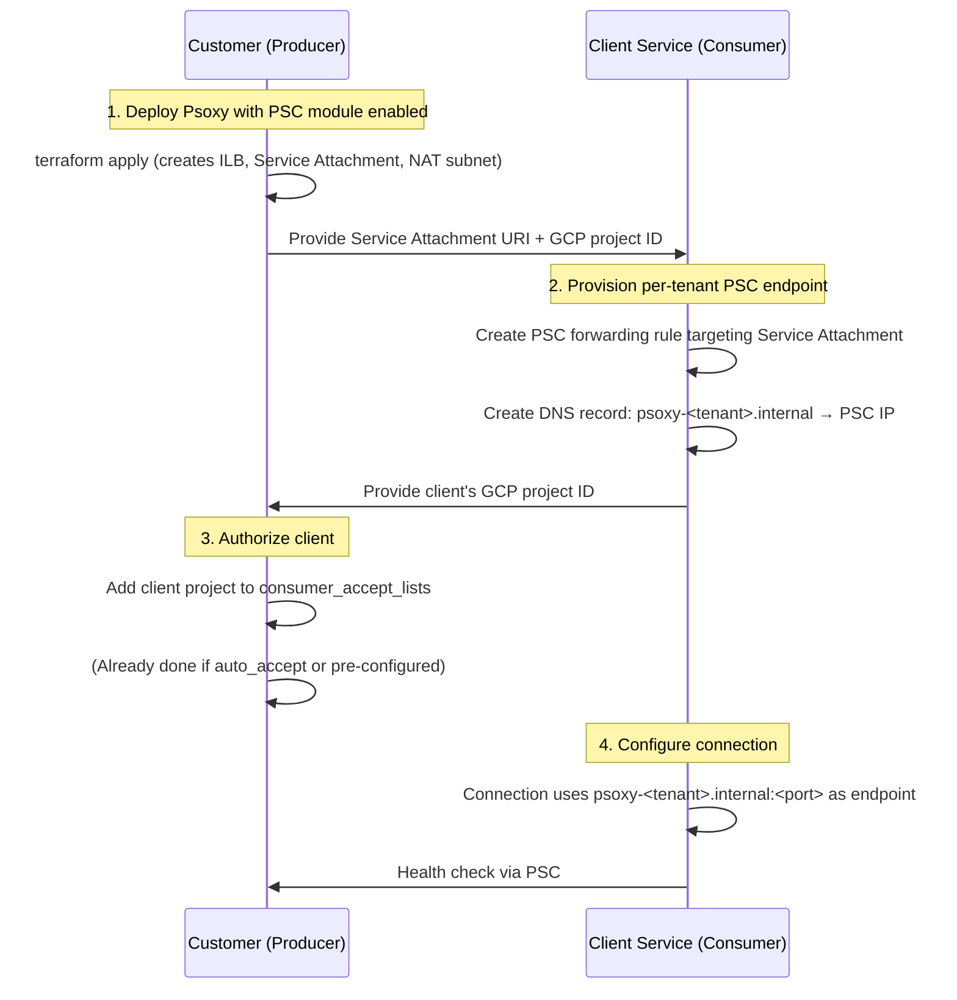

# GCP Private Service Connect for Psoxy

> **Status**: Draft / Design Spec
> **Last Updated**: 2026-04-07

## Overview

This document describes how to enable **GCP Private Service Connect (PSC)** as an alternative
network connectivity option between Psoxy proxy instances (hosted in a customer's GCP project) and
a GCP-hosted client service that consumes the proxy's output.

PSC allows all data transfer to occur over Google's private network backbone — never traversing
the public internet — while preserving the existing IAM-based authentication and authorization
model.

### Applicability

Any GCP-hosted service that needs to consume Psoxy data can use PSC, provided:

1. The client service runs within a GCP VPC.
2. The client service's GCP project can be authorized on the producer's Service Attachment.

**Worklytics** is one such client service. As a GCP-hosted analytics platform, Worklytics can
leverage PSC to privately reach customer Psoxy instances. The examples throughout this doc use
Worklytics as the concrete client, but the architecture generalizes to any GCP-hosted consumer.

---

## Network Connectivity Architectures

### Current Network Connectivity Architecture: Secure Connection over Public Internet

Today, a client service connects to Psoxy via two paths, both secured with TLS and GCP IAM:

| Connector Type | How the Client Reaches Psoxy |
|---|---|
| **API (REST)** connectors | HTTPS request to the Cloud Function's public `*.run.app` URL. Authenticated via GCP IAM (`roles/run.invoker`) granted to the client's SA. |
| **Bulk** connectors | GCS `storage.objects.get/list` on the sanitized output bucket. Authenticated via GCS IAM (`roles/storage.objectViewer`) granted to the client's SA. |

Both paths travel over the public internet with TLS encryption and IAM authn/authz.

### Alternative Network Connection Architecture: Private Service Connect

With PSC, both paths are replaced with **private endpoints** that stay entirely within GCP's
internal network. Authentication and authorization remain unchanged (IAM-based) — PSC is a
network-layer enhancement only.

```
┌──────────────────────────────────┐       PSC        ┌──────────────────────────────────┐
│   Client Service (Consumer)      │  ◄────────────►  │   Customer Psoxy (Producer)      │
│   e.g. Worklytics                │   private link   │                                  │
│                                  │                  │                                  │
│  ┌────────────────────────────┐  │                  │  ┌────────────────────────────┐  │
│  │ PSC Endpoint (REST)        │──┼──────────────────┼─►│ ILB → Serverless NEG       │  │
│  │ 10.x.y.z                  │  │                  │  │  → Cloud Functions (REST)  │  │
│  └────────────────────────────┘  │                  │  └────────────────────────────┘  │
│                                  │                  │                                  │
│  ┌────────────────────────────┐  │                  │  ┌────────────────────────────┐  │
│  │ PSC Endpoint (GCS APIs)    │──┼──────────────────┼─►│ GCS Buckets (sanitized)    │  │
│  │ 10.x.y.w (googleapis)     │  │                  │  │  via private Google APIs   │  │
│  └────────────────────────────┘  │                  │  └────────────────────────────┘  │
└──────────────────────────────────┘                  └──────────────────────────────────┘
```

---

## Two Distinct Private Paths

### Path 1: REST API Connectors (Cloud Functions → PSC Service Attachment)

REST connectors expose Cloud Functions v2 (Cloud Run-backed) as HTTP endpoints. Since Cloud Run is
serverless and doesn't sit in the customer's VPC directly, PSC requires fronting the functions with
an **Internal Application Load Balancer (ILB)** and **Serverless NEGs**, then publishing a
**Service Attachment**.

#### Approach: Shared ILB with Path-Based Routing

A single ILB fronts all REST connectors in a given Psoxy deployment. A URL map routes requests by
path prefix — each connector is addressed by its function name (instance ID) as a path segment:

```
https://<psc-endpoint>/<function-name>/api/...
```

For example, if the Psoxy deployment has connectors `gcal` and `gdirectory`:
- `/<env-prefix>gcal/api/calendar/v3/...` → Serverless NEG for the `gcal` Cloud Function
- `/<env-prefix>gdirectory/api/admin/directory/v1/...` → Serverless NEG for the `gdirectory` Cloud Function

This minimizes the number of PSC resources (one Service Attachment, one ILB) while cleanly routing
to each connector.

#### Producer Side (Customer's Psoxy Project) — Resource Stack

```
Cloud Functions (existing, one per connector)
    ↓
Serverless NEGs (one per function, SERVERLESS type → Cloud Run service)
    ↓
Regional Backend Services (one per NEG)
    ↓
Regional URL Map (path-based routing: /<function-name>/* → backend)
    ↓
Regional Target HTTPS Proxy + Certificate (via Certificate Manager)
    ↓
Internal Forwarding Rule (ILB frontend)
    ↓
PSC NAT Subnet (purpose = PRIVATE_SERVICE_CONNECT, /29 minimum)
    ↓
Service Attachment (consumer_accept_lists → client project)
```

**Terraform resources needed:**

| Resource | Purpose |
|---|---|
| `google_compute_subnetwork` (NAT) | Dedicated subnet with `purpose = "PRIVATE_SERVICE_CONNECT"` for PSC NAT. At least `/29`. |
| `google_compute_subnetwork` (proxy-only) | Proxy-only subnet required by the Regional ILB (`purpose = "REGIONAL_MANAGED_PROXY"`). |
| `google_compute_region_network_endpoint_group` | One per connector. Serverless NEG targeting the Cloud Run service backing each function. |
| `google_compute_region_backend_service` | One per connector. Backend service referencing the corresponding serverless NEG. |
| `google_compute_region_url_map` | Single URL map with path matchers routing `/<function-name>/*` → the correct backend service. |
| `google_certificate_manager_certificate` | Google-managed certificate via Certificate Manager (DNS authorization). See [TLS section](#tls-termination). |
| `google_compute_region_target_https_proxy` | HTTPS proxy referencing the certificate and URL map. |
| `google_compute_forwarding_rule` | Internal forwarding rule (the ILB frontend). |
| `google_compute_service_attachment` | The PSC Service Attachment. Uses `consumer_accept_lists` to authorize client consumer projects. |

#### TLS Termination

The ILB should terminate TLS so clients connect via HTTPS to the PSC endpoint. **Google-managed
certificates are supported for regional internal ALBs** via [Certificate Manager](https://cloud.google.com/certificate-manager/docs)
(not the legacy Compute Engine managed certs).

Terraform resources for TLS:

```hcl
# DNS authorization for the certificate domain
resource "google_certificate_manager_dns_authorization" "psc" {
  name   = "${var.environment_id_prefix}psc-dns-auth"
  domain = var.psc_domain  # e.g., "psoxy.acme-corp.internal"
}

# Google-managed certificate
resource "google_certificate_manager_certificate" "psc" {
  name = "${var.environment_id_prefix}psc-cert"
  managed {
    domains            = [var.psc_domain]
    dns_authorizations = [google_certificate_manager_dns_authorization.psc.id]
  }
}
```

> **Note**: For internal-only use cases, a self-signed or CA Service-issued certificate may be
> simpler if the client service can trust it. Google-managed certs via DNS authorization require
> the domain to be publicly resolvable for ACME validation.

#### Authentication

IAM-based authn (`roles/run.invoker`) still applies — PSC doesn't replace auth, only the network
path. The client SA still needs `roles/run.invoker` on each Cloud Run service.

#### Consumer Side (Client Service) — Per-Tenant Resources

For each Psoxy deployment a client connects to via PSC:

| Resource | Purpose |
|---|---|
| `google_compute_address` | Reserve an internal IP in the client's VPC for this PSC endpoint. |
| `google_compute_forwarding_rule` | PSC endpoint: `target = <service_attachment_self_link>`. |
| Private DNS record | Maps a per-tenant hostname (e.g., `psoxy-<tenant-id>.internal.clientservice.co`) to the reserved IP. This is how the client's backend resolves the proxy host. |

**What the client service needs from the customer:**
- The **Service Attachment URI** (`projects/<project>/regions/<region>/serviceAttachments/<name>`).
- The customer must add the **client's GCP project** to the `consumer_accept_lists` on the
  Service Attachment.

---

### Path 2: Bulk Connectors (GCS Buckets → PSC for Google APIs)

For bulk connectors, the client reads sanitized data from GCS buckets. GCS is a Google-managed
service, so PSC works differently — instead of a custom Service Attachment, the client uses
**PSC for Google APIs** to create a private endpoint that routes `storage.googleapis.com` traffic
through the Google internal network.

#### Approach: PSC for Google APIs (Consumer-Side Only)

This is the simpler approach. The **customer doesn't need to change anything** on their
infrastructure for GCS buckets. All changes happen on the client service side.

**Client service side:**

| Resource | Purpose |
|---|---|
| `google_compute_global_address` | Reserve a global internal IP for the PSC endpoint. |
| `google_compute_global_forwarding_rule` | PSC endpoint: `target = "all-apis"` or `"vpc-sc"`. Routes Google API traffic privately. |
| `google_dns_managed_zone` | Private DNS zone for `googleapis.com` (or `storage.googleapis.com` specifically). |
| `google_dns_record_set` | A record pointing `storage.googleapis.com` → PSC endpoint IP. |

> **Note**: This is a **shared, one-time setup** in the client's VPC — not per-tenant. All GCS
> traffic from the VPC routes privately once configured.

**Customer side:** No changes needed. The existing IAM grants (e.g., `roles/storage.objectViewer`
for the client SA) still apply.

#### Optional: VPC Service Controls (Enhanced)

If the customer also uses **VPC Service Controls**, they can create a service perimeter around their
GCS buckets and restrict access to only come through the PSC path. This is an additional hardening
step, orthogonal to PSC itself, and can be documented as an optional advanced configuration.

---

## Onboarding / Connection Flow

### Step-by-Step



### What the Customer Provides to the Client Service

| Setting | Description | Example |
|---|---|---|
| `psc_service_attachment_uri` | Self-link of the Service Attachment for REST connectors | `projects/acme-psoxy/regions/us-central1/serviceAttachments/psoxy-rest-psc` |
| `gcp_project_id` | Customer's GCP project (for the client to provide in the accept list request) | `acme-psoxy-prod` |
| `gcp_region` | Region where PSC resources are deployed | `us-central1` |

### What the Client Service Provides to the Customer

| Setting | Description | Example |
|---|---|---|
| `consumer_project_id` | Client's GCP project that will create the PSC endpoint | `client-service-prod-us` |
| `connection_limit` | Suggested connection limit for the accept list | `10` |

---

## Terraform Module Design

### New Module: `gcp-psc-producer`

A new module to be used alongside or within `gcp-host` that creates the PSC producer-side
infrastructure.

#### Inputs

```hcl
variable "project_id" {
  type        = string
  description = "GCP project hosting the Psoxy deployment."
}

variable "region" {
  type        = string
  description = "Region for PSC resources. Must match the Cloud Functions region."
}

variable "network" {
  type        = string
  description = "VPC network self-link or name. Required for ILB and PSC."
}

variable "psc_nat_subnet_cidr" {
  type        = string
  description = "CIDR range for the PSC NAT subnet (minimum /29)."
  default     = "10.100.0.0/29"
}

variable "proxy_only_subnet_cidr" {
  type        = string
  description = "CIDR range for the proxy-only subnet (required by Regional ILB)."
  default     = "10.100.1.0/24"
}

variable "cloud_run_services" {
  type = map(object({
    name = string  # Cloud Run service name (= Cloud Function name)
  }))
  description = "Map of connector instance_id → Cloud Run service to expose via PSC."
}

variable "consumer_accept_projects" {
  type = map(object({
    project_id       = string
    connection_limit = optional(number, 10)
  }))
  description = "Map of consumer label → project allowed to connect via PSC."
}

variable "environment_id_prefix" {
  type    = string
  default = ""
}
```

#### Outputs

```hcl
output "service_attachment_uri" {
  description = "The URI of the PSC Service Attachment for REST connectors."
  value       = google_compute_service_attachment.psoxy.self_link
}

output "ilb_ip_address" {
  description = "Internal IP of the ILB fronting the Cloud Functions."
  value       = google_compute_forwarding_rule.ilb.ip_address
}

output "psc_connection_info" {
  description = "Information needed by the consumer to establish the PSC connection."
  value = {
    service_attachment_uri = google_compute_service_attachment.psoxy.self_link
    region                 = var.region
    project_id             = var.project_id
  }
}
```

### Integration with `gcp-host`

The new module would be invoked conditionally when PSC is enabled:

```hcl
# In gcp-host/main.tf (or gcp-host/variables.tf)

variable "psc_config" {
  type = object({
    enabled                  = bool
    network                  = string           # VPC network
    psc_nat_subnet_cidr      = optional(string, "10.100.0.0/29")
    proxy_only_subnet_cidr   = optional(string, "10.100.1.0/24")
    consumer_accept_projects = map(object({
      project_id       = string
      connection_limit = optional(number, 10)
    }))
  })
  description = "Configuration for Private Service Connect. If null, PSC is not enabled."
  default     = null
}

# Conditional invocation
module "psc" {
  source = "../../modules/gcp-psc-producer"
  count  = var.psc_config != null ? 1 : 0

  project_id                = var.gcp_project_id
  region                    = var.gcp_region
  network                   = var.psc_config.network
  psc_nat_subnet_cidr       = var.psc_config.psc_nat_subnet_cidr
  proxy_only_subnet_cidr    = var.psc_config.proxy_only_subnet_cidr
  environment_id_prefix     = local.environment_id_prefix
  consumer_accept_projects  = var.psc_config.consumer_accept_projects

  cloud_run_services = {
    for k, v in module.api_connector :
    k => { name = v.cloud_function_name }
  }
}
```

### Connection Module Changes

The `worklytics-psoxy-connection-generic` module would need to support outputting the
`psc_service_attachment_uri` as a setting:

```hcl
# In the example root module, when PSC is enabled:
settings_to_provide = merge(
  try({
    "Psoxy Base URL" = each.value.endpoint_url
  }, {}),
  var.psc_config != null ? {
    "PSC Service Attachment" = module.psc[0].service_attachment_uri
  } : {},
  # ...
)
```

---

## Client-Service-Side Architecture (Per-Tenant Gateway)

On the client service side (e.g., Worklytics), for each customer/tenant that enables PSC, a
**per-tenant PSC endpoint** is provisioned that acts as a private gateway to that tenant's Psoxy
deployment.

### Per-Tenant Resources

```hcl
# For each tenant with PSC enabled:

resource "google_compute_address" "tenant_psc_ip" {
  name         = "psc-${tenant_id}"
  address_type = "INTERNAL"
  subnetwork   = var.psc_consumer_subnet
  region       = var.region
}

resource "google_compute_forwarding_rule" "tenant_psc_endpoint" {
  name                  = "psc-${tenant_id}"
  region                = var.region
  network               = var.client_vpc
  subnetwork            = var.psc_consumer_subnet
  ip_address            = google_compute_address.tenant_psc_ip.id
  target                = var.tenant_service_attachment_uri  # provided by customer
  load_balancing_scheme = ""
}

# DNS: so the client backend can address this tenant's proxy
resource "google_dns_record_set" "tenant_psc" {
  name         = "psoxy-${tenant_id}.internal.clientservice.co."
  managed_zone = var.internal_dns_zone
  type         = "A"
  ttl          = 300
  rrdatas      = [google_compute_address.tenant_psc_ip.address]
}
```

### How the Client Uses the Endpoint

When the client service needs to call a tenant's REST connector:

1. **Without PSC**: `GET https://<cloud-function-url>.run.app/api/...`
2. **With PSC**: `GET https://psoxy-<tenant-id>.internal.clientservice.co/<function-name>/api/...`

The connection configuration stores the PSC endpoint hostname and uses the function-name path
segment for routing. For bulk connectors, no per-tenant endpoint is needed — the shared
PSC-for-Google-APIs endpoint handles all GCS traffic.

### Worklytics-Specific Notes

For Worklytics as client:
- Per-tenant DNS might follow `psoxy-<tenant-id>.internal.worklytics.co`.
- The Worklytics connection object would store the PSC endpoint hostname as an alternative to
  (or replacement for) the public Cloud Function URL.
- Bulk connector access (GCS) would be handled by a shared PSC-for-Google-APIs endpoint in the
  Worklytics VPC (one-time setup, not per-tenant).

---

## GCS Bucket Access (Bulk Connectors) — Detail

For bulk connectors, the existing architecture works well with PSC for Google APIs:

1. **Client VPC** has a PSC endpoint for `all-apis` (or `storage.googleapis.com` specifically).
2. DNS in the client VPC resolves `storage.googleapis.com` → PSC endpoint IP.
3. Client SA uses standard GCS client libraries to read from the customer's sanitized bucket.
4. Traffic flows: Client VPC → PSC endpoint → Google's internal network → GCS.

**No customer-side changes are needed** for GCS. The only prerequisite is that the client
VPC has the PSC-for-Google-APIs endpoint configured (a one-time setup).

---

## Security Considerations

| Concern | Mitigation |
|---|---|
| PSC doesn't replace AuthN/AuthZ | IAM (`roles/run.invoker`, `roles/storage.objectViewer`) still enforced. PSC is network-layer only. |
| Consumer project must be explicitly authorized | `consumer_accept_lists` on the Service Attachment. Customer controls who can connect. |
| Shared ILB exposes multiple connectors | URL-map routing ensures each path goes to the correct function. IAM on each function still enforced per-connector. |
| DNS spoofing within client VPC | Private DNS zones are authoritative within the VPC; standard GCP DNS security applies. |
| NAT subnet IP exhaustion | PSC NAT subnet should be sized for expected connection count. `/29` gives 8 IPs, sufficient for typical deployments. |

---

## Open Questions

1. **VPC requirement on producer side**: Today, `gcp-host` can work without a VPC (functions use
   public ingress). PSC requires a VPC + subnets. Should enabling PSC imply `vpc_config` is
   required, or should the PSC module create its own minimal VPC?

2. **Region alignment**: PSC Service Attachments are regional. If a customer deploys functions in
   `us-central1` but the client's consumer VPC is in `us-east1`, do we need cross-region
   considerations? (PSC endpoints and service attachments must be in the same region.)

3. **TLS certificate domain strategy**: For Google-managed certs via Certificate Manager, we need
   DNS authorization — what domain should be used? Options:
   - A customer-owned domain (e.g., `psoxy.acme-corp.internal`)
   - A Worklytics-provided subdomain (e.g., `<tenant>.psc.worklytics.co`)
   - A self-signed cert (simplest, but requires client to trust it)

4. **Existing `ingress_settings`**: REST connectors currently use `ingress_settings = "ALLOW_ALL"`.
   With PSC, should we switch to `ALLOW_INTERNAL_ONLY`? This would mean the function is ONLY
   reachable via VPC/PSC, not via the public URL. Probably desired for PSC tenants but is a
   breaking change for testing workflows.

5. **Client-side automation**: Should we provide a Terraform module or just documentation for
   what the consumer needs to provision per-tenant? (For Worklytics this is internal infra, not
   customer-facing.)

6. **Webhook collectors**: Webhook collectors receive inbound webhooks from external systems
   (not the client). They probably don't need PSC. But the client reads their output buckets
   (bulk path), which is covered by the GCS PSC approach. Confirm this is sufficient.

---

## Appendix: Required GCP APIs

The following additional APIs must be enabled in the customer's project for PSC:

```hcl
resource "google_project_service" "psc_apis" {
  for_each = toset([
    "compute.googleapis.com",              # already enabled by gcp module
    "certificatemanager.googleapis.com",   # for Google-managed TLS certs
    "dns.googleapis.com",                  # only if customer also sets up private DNS
    "servicenetworking.googleapis.com",    # for PSC
  ])

  service = each.key
  project = var.project_id
}
```

## Appendix: Ingress Settings Matrix

| Scenario | `ingress_settings` | Reachable Via |
|---|---|---|
| Current (no PSC) | `ALLOW_ALL` | Public internet, VPC |
| PSC enabled (dual) | `ALLOW_ALL` | Public internet, VPC, PSC |
| PSC only (hardened) | `ALLOW_INTERNAL_ONLY` | VPC, PSC only |
| PSC + VPC-SC | `ALLOW_INTERNAL_ONLY` + VPC Service Controls | PSC only (most restrictive) |
