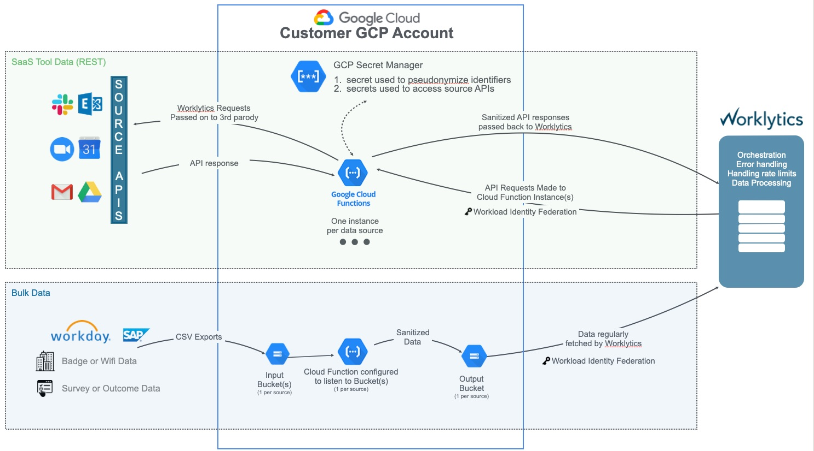

# Getting Started - GCP

## Overview

You'll provision infrastructure that ultimately looks as follows:

This includes:

- Cloud Functions
- Service Accounts
- Secret Manager Secrets, to hold pseudonymization salt, encryption keys, and data source API keys
- Cloud Storage Buckets (GCS), if using psoxy to sanitize bulk file data, such as CSVs

NOTE: if you're connecting to Google Workspace as a data source, you'll also need to provision
Service Account Keys and activate Google Workspace APIs.

## Prerequisites

- a Google Project

  - we recommend a _dedicated_ GCP project for your deployment, to provide an implicit security
    boundary around your infrastructure as well as simplify monitoring/cleanup

- a GCP (Google) user or Service Account with permissions to provision Service Accounts, Secrets,
  Storage Buckets, Cloud Functions, and enable APIs within that project. eg:

  - [Cloud Functions Developer](https://cloud.google.com/iam/docs/understanding-roles#cloudfunctions.developer) -
    proxy instances are deployed as GCP cloud functions
  - [Cloud Run Developer](https://cloud.google.com/iam/docs/understanding-roles#cloudrun.developer) - cloud
    function deployment requires Cloud Run Developer role
  - [Cloud Storage Admin](https://cloud.google.com/iam/docs/understanding-roles#storage.admin) -
    processing of bulk data (such as HRIS exports) uses GCS buckets
  - [IAM Role Admin](https://cloud.google.com/iam/docs/understanding-roles#iam.roles.admin) - create
    custom roles for the proxy, to follow principle of least privilege
  - [Secret Manager Admin](https://cloud.google.com/iam/docs/understanding-roles#secretmanager.admin) -
    your API keys and pseudonymization salt is stored in Secret Manager
  - [Service Account Admin](https://cloud.google.com/iam/docs/understanding-roles#iam.serviceAccountAdmin) -
    admin Service Accounts that personify Cloud Functions or are used as Google Workspace API
    connections
  - [Service Usage Admin](https://cloud.google.com/iam/docs/understanding-roles#serviceusage.serviceUsageAdmin) -
    you will need to enable various GCP APIs

- the following APIs enabled in the project: (via
  [GCP Console](https://console.cloud.google.com/projectselector2/apis/dashboard))

  - [IAM Service Account Credentials API](https://console.cloud.google.com/apis/library/iamcredentials.googleapis.com)
    (`iamcredentials.googleapis.com`) - generally needed to support authenticating Terraform. May
    not be needed if you're running `terraform` within a GCP environment.
  - [Service Usage API](https://console.cloud.google.com/apis/library/serviceusage.googleapis.com)
    (`serviceusage.googleapis.com`)

- additional APIs enabled in the project: (using the `Service Usage API` above, our Terraform will
  _attempt_ to enable these, but as there is sometimes a few minutes delay in activation and in some
  cases they are required to read your existing infra prior to apply, you may experience errors. To
  pre-empt those, we suggest ensuring the following are enabled:
   - [Artifact Registry API](https://console.cloud.google.com/apis/library/artifactregistry.googleapis.com)
    (`artifactregistry.googleapis.com`)
   - [Cloud Build API](https://console.cloud.google.com/apis/library/cloudbuild.googleapis.com)
     (`cloudbuild.googleapis.com`)
  - [Cloud Functions API](https://console.cloud.google.com/apis/library/cloudfunctions.googleapis.com)
    (`cloudfunctions.googleapis.com`)
  - [Cloud Resource Manager API](https://console.cloud.google.com/apis/library/cloudresourcemanager.googleapis.com)
    (`cloudresourcemanager.googleapis.com`)
  - [Compute Engine API](https://console.cloud.google.com/apis/library/compute.googleapis.com)
    (`compute.googleapis.com`)
  - [Eventarc API](https://console.cloud.google.com/apis/library/eventarc.googleapis.com)
    (`eventarc.googleapis.com`)
  - [IAM API](https://console.cloud.google.com/apis/library/iam.googleapis.com)
    (`iam.googleapis.com`)
  - [Pub/Sub API](https://console.cloud.google.com/apis/library/pubsub.googleapis.com)
    (`pubsub.googleapis.com`)
  - [Secret Manager API](https://console.cloud.google.com/apis/library/secretmanager.googleapis.com)
    (`secretmanager.googleapis.com`)
  - [Storage API](https://console.cloud.google.com/apis/library/storage-api.googleapis.com)
    (`storage-api.googleapis.com`)

### Terraform State Backend

You'll also need a secure backend location for your Terraform state (such as a GCS or S3 bucket). It
need not be in the same host platform/project/account to which you are deploying the proxy, as long
as the Google/AWS user you are authenticated as when running Terraform has permissions to access it.

Some options:

- GCS : https://developer.hashicorp.com/terraform/language/settings/backends/gcs
- S3 : https://developer.hashicorp.com/terraform/language/settings/backends/s3

Alternatively, you may use a local file system, but this is not recommended for production use - as
your Terraform state may contain secrets such as API keys, depending on the sources you connect.

See: https://developer.hashicorp.com/terraform/language/settings/backends/local

## Bootstrap

For some help in bootstraping a GCP environment, see also:
[infra/modules/gcp-bootstrap/README.md](../../infra/modules/gcp-bootstrap/README.md)

The module [psoxy-constants](../../infra/modules/psoxy-constants) is a dependency-free module that
provides lists of GCP roles, etc needed for bootstraping a GCP project in which your proxy instances
will reside.

## Example

The https://github.com/Worklytics/psoxy-example-gcp repo provides an example configuration for
hosting proxy instances in GCP. You use that template, following it's `Usage` docs to get started.

## Security Considerations

- the 'Service Account' approach described in the prerequisites is preferable to giving a Google
  user account IAM roles to administer your infrastructure directly. You can pass this Service
  Account's email address to Terraform by setting the `gcp_terraform_sa_account_email`. Your
  machine/environments CLI must be authenticated as GCP entity which can impersonate this Service
  Account, and likely create tokens as it (`Service Account Token Creator` role).
- using a _dedicated_ GCP project is superior to using a shared project, as it provides an implicit
  security boundary around your infrastructure as well as simplifying monitoring/cleanup. The IAM
  roles specified in the prerequisites must be granted at the project level, so any non-Proxy
  infrastructure within the GCP project that hosts your proxy instances will be accessible to the
  user / service account who's managing the proxy infrastructure.
