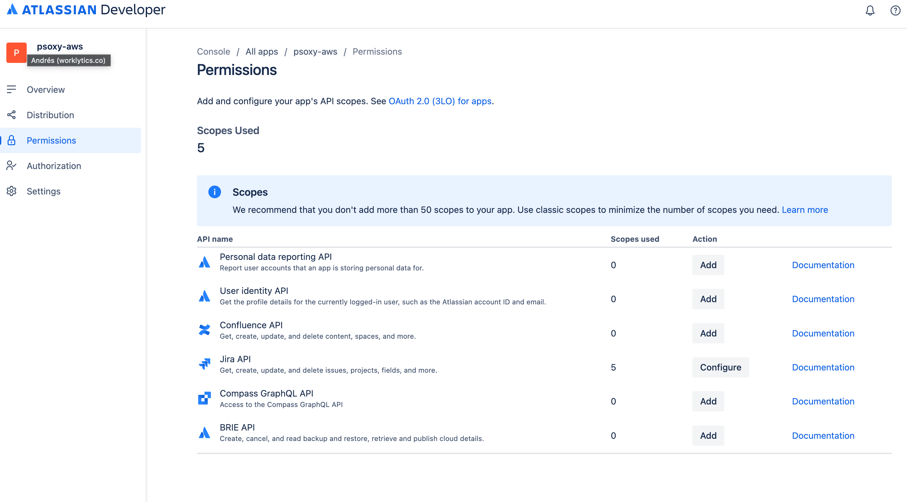
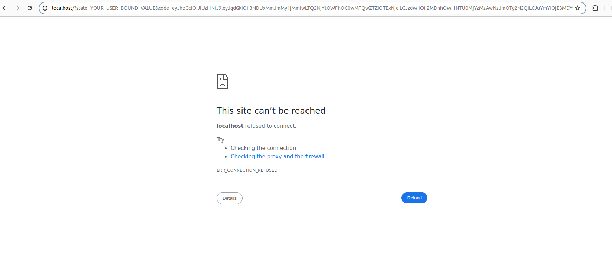

# Jira Cloud

NOTE: This is for the Cloud-hosted version of Jira; for the self-hosted version, see [Jira Server](jira-server.md).

NOTE: These instructions are derived from [worklytics-connector-specs](../../../infra/modules/worklytics-connector-specs/main.tf); refer to that for definitive information.

## Prerequisites

Jira Cloud through Psoxy uses Jira OAuth 2.0 (3LO) with following classical scopes:
- `read:jira-user`: for getting [users](https://developer.atlassian.com/cloud/jira/platform/rest/v3/api-group-users/#api-rest-api-3-users-search-get)
- `read:jira-work`: for getting information about [issue](https://developer.atlassian.com/cloud/jira/platform/rest/v3/api-group-issues/#api-rest-api-3-issue-issueidorkey-get), [issue search](https://developer.atlassian.com/cloud/jira/platform/rest/v3/api-group-issue-search/#api-rest-api-3-search-jql-get), [changelogs](https://developer.atlassian.com/cloud/jira/platform/rest/v3/api-group-issues/#api-rest-api-3-issue-issueidorkey-changelog-get), [comments](https://developer.atlassian.com/cloud/jira/platform/rest/v3/api-group-issue-comments/#api-rest-api-3-issue-issueidorkey-comment-get), [projects](https://developer.atlassian.com/cloud/jira/platform/rest/v3/api-group-projects/#api-rest-api-3-project-search-get) and [worklogs](https://developer.atlassian.com/cloud/jira/platform/rest/v3/api-group-issue-worklogs/#api-rest-api-3-issue-issueidorkey-worklog-get)

And following granular scopes:
- `read:user:jira`: for retrieving [group members](https://developer.atlassian.com/cloud/jira/platform/rest/v3/api-group-groups/#api-rest-api-3-group-member-get)
- `read:group:jira`: for retrieving [groups](https://developer.atlassian.com/cloud/jira/platform/rest/v3/api-group-groups/#api-rest-api-3-group-bulk-get) and [group members](https://developer.atlassian.com/cloud/jira/platform/rest/v3/api-group-groups/#api-rest-api-3-group-member-get)
- `read:avatar:jira`: for retrieving [group members](https://developer.atlassian.com/cloud/jira/platform/rest/v3/api-group-groups/#api-rest-api-3-group-member-get)

You will need a web browser and a terminal with `curl` available (such as macOS terminal, Linux, an AWS Cloud Shell, [Windows Subsystem for Linux](https://learn.microsoft.com/en-us/windows/wsl/install), etc)

## Setup Instructions

1. Go to [https://developer.atlassian.com/console/myapps/](https://developer.atlassian.com/console/myapps/) and click on "Create" and choose "OAuth 2.0 Integration"
2. Then click "Authorization" and "Add" on `OAuth 2.0 (3L0)`, adding `http://localhost` as callback URI. It can be any URL that matches the URL format and it is required to be populated, but the proxy instance workflow will not use it.

   

3. Now navigate to "Permissions" and click on "Add" for `Jira API`. Once added, click on "Configure". Add following scopes as part of "Classic Scopes", first clicking on `Edit Scopes` and then selecting them:
   - `read:jira-user`
   - `read:jira-work`

   

   And these from "Granular Scopes":
   - `read:group:jira`
   - `read:avatar:jira`
   - `read:user:jira`

  


   After adding all the scopes, you should have 5 permissions for `Jira API`:

  

4. Once Configured, go to "Settings" and copy the "Client Id" and "Secret". You will use these to obtain an OAuth `refresh_token`.

5. Build an OAuth authorization endpoint URL by copying the value for "Client Id" obtained in the previous step into the URL below. Then open the result in a web browser:

`https://auth.atlassian.com/authorize?audience=api.atlassian.com&client_id=<CLIENT ID>&scope=offline_access%20read:group:jira%20read:avatar:jira%20read:user:jira%20read:jira-user%20read:jira-work&redirect_uri=http://localhost&state=YOUR_USER_BOUND_VALUE&response_type=code&prompt=consent`

     NOTES:
     - That URL can be obtained from "Authorization" and clicking on `Configure` for  "OAuth 2.0 (3LO)" page.
     - If after pasting the URL you see an error page (like an issue with identity provider) please check:
       1 - The `clientId` is correct
       2 - The `redirect_uri` is the same as the one configured in the "OAuth 2.0 (3LO)" page

6. Choose a site in your Jira workspace to allow access for this application and click "Accept". As the callback does not exist, you will see an error. But in the URL of your browser you will see something like this as URL:

   `http://localhost/?state=YOUR_USER_BOUND_VALUE&code=eyJhbGc...`

   Copy the value of the `code` parameter from that URI. It is the "authorization code" required for next step.

   

   **NOTE** This "Authorization Code" is single-use; if it expires or is used, you will need to obtain a new code by again pasting the authorization URL in the browser.
7. Now, replace the values in following URL and run it from command line in your terminal. Replace `YOUR_AUTHENTICATION_CODE`, `YOUR_CLIENT_ID` and `YOUR_CLIENT_SECRET` in the placeholders:

```shell
curl --request POST --url 'https://auth.atlassian.com/oauth/token' --header 'Content-Type: application/json' --data '{"grant_type": "authorization_code","client_id": "YOUR_CLIENT_ID","client_secret": "YOUR_CLIENT_SECRET", "code": "YOUR_AUTHENTICATION_CODE", "redirect_uri": "http://localhost"}'
```


8. After running that command, if successful you will see a
   [JSON response](https://developer.atlassian.com/cloud/jira/platform/oauth-2-3lo-apps/#2--exchange-authorization-code-for-access-token)
   like this:

```json
{
	"access_token": "some short live access token",
	"expires_in": 3600,
	"token_type": "Bearer",
	"refresh_token": "some long live token we are going to use",
	"scope": "read:jira-work offline_access read:jira-user"
}
```
9. Set the following variables in AWS System Manager parameters store / GCP Cloud Secrets (if default implementation):
   - `PSOXY_JIRA_CLOUD_REFRESH_TOKEN` secret variable with value of `refresh_token` received in previous response
   - `PSOXY_JIRA_CLOUD_CLIENT_ID` with `Client Id` value.
   - `PSOXY_JIRA_CLOUD_CLIENT_SECRET` with `Client Secret` value.
10. Obtain the "Cloud ID" of your Jira instance. Use the following command, with the `access_token` obtained in the previous step in place of `<ACCESS_TOKEN>` below:

`curl --header 'Authorization: Bearer <ACCESS_TOKEN>' --url 'https://api.atlassian.com/oauth/token/accessible-resources'`

And its response will be something like:

```json
[
	{
		"id": "SOME UUID",
		"url": "https://your-site.atlassian.net",
		"name": "your-site-name",
		"scopes": ["read:jira-user", "read:jira-work"],
		"avatarUrl": "https://site-admin-avatar-cdn.prod.public.atl-paas.net/avatars/240/rocket.png"
	}
]
```

In your Terraform configuration's `terraform.tfvars` file, set the `jira_cloud_id` variable to the `id` value from the JSON response. This will ensure that all **test URLs** are generated with the correct value, targeting a valid Jira Cloud instance.

NOTE: A "token family" includes the initial access/refresh tokens generated above as well as all subsequent access/refresh tokens that Jira returns to any future token refresh requests. By default, Jira enforces a maximum lifetime of 1 year for each **token family**. So you MUST repeat steps 5-9 at least annually or your proxy instance will stop working when the token family expires.
