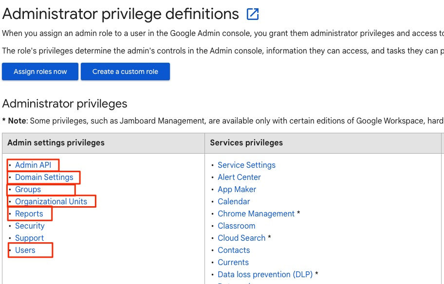
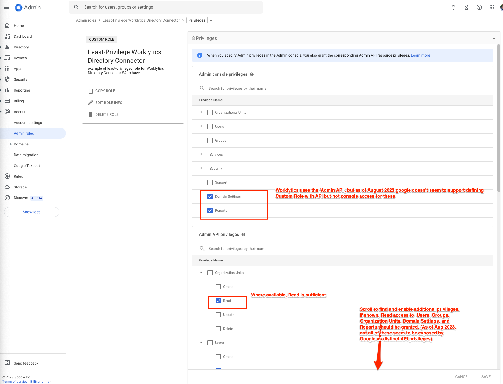

# Google Workspace&trade;

Google Workspace&trade; sources can be setup via Terraform, using modules found in our GitHub repo.

As of August 2023, we suggest you use one of our template repos, eg:

- [`aws`](https://github.com/Worklytics/psoxy-example-aws)
- [`gcp`](https://github.com/Worklytics/psoxy-example-gcp)

Within those, the `google-workspace.tf` and `google-workspace-variables.tf` files specify the terraform configuration to use Google Workspace&trade; sources.

## Available connectors

- [calendar](calendar/README.md) (Google Calendar&trade;)
- [directory](directory/README.md) (Google Workspace&trade; Directory)
- [gdrive](gdrive/README.md) (Google Drive&trade;)
- [gemini-in-workspace-apps](gemini-in-workspace-apps/README.md)
- [gemini-usage-bulk](gemini-usage-bulk/README.md)
- [gmail](gmail/README.md) (Gmail&trade;)
- [google-chat](google-chat/README.md) (Google Chat&trade;)
- [meet](meet/README.md) (Google Meet&trade;)

## Required Permissions

You (the user running Terraform) must have the following roles (or some of the permissions within them) in the GCP project in which you will provision the OAuth clients that will be used to connect to your Google Workspace&trade; data:

| Role                                                                                                          | Reason                                                                                         |
| ------------------------------------------------------------------------------------------------------------- | ---------------------------------------------------------------------------------------------- |
| [Service Account Creator](https://cloud.google.com/iam/docs/understanding-roles#iam.serviceAccountCreator)    | create Service Accounts to be used as API clients                                              |
| [Service Account Key Admin](https://cloud.google.com/iam/docs/understanding-roles#iam.serviceAccountKeyAdmin) | to access Google Workspace&trade; API, proxy _must_ be authenticated by a key that you need to create |
| [Service Usage Admin](https://cloud.google.com/iam/docs/understanding-roles#serviceusage.serviceUsageAdmin)   | you will need to enable the Google Workspace&trade; APIs in your GCP Project                          |

As these are very permissive roles, we recommend that you use a _dedicated_ GCP project so that these roles are scoped just to the Service Accounts used for this deployment. If you used a shared GCP project, these roles would give you access to create keys for ALL the service accounts in the project, for example - which is not good practice.

Additionally, a Google Workspace&trade; Admin will need to make a Domain-wide Delegation grant to the Oauth Clients you create. This is done via the Google Workspace&trade; Admin console. In default setup, this requires [Super Admin](https://support.google.com/a/answer/2405986?hl=en&fl=1) role, but your organization may have a Custom Role with sufficient privileges.

## Google Workspace&trade; User for Connection

We also recommend you create a dedicated Google Workspace&trade; user for Psoxy to use when connecting to your Google Workspace&trade; Admin API, with the specific permissions needed. This avoids the connection being tied to a personal account and helps with auditing and security.

This is not to be confused with a GCP Service Account. Rather, this is a regular Google Workspace&trade; user account, but intended to be assigned to a service rather than a human user. Your proxy instance will impersonate this user when accessing the [Google Admin Directory](https://developers.google.com/admin-sdk/directory/v1/guides) and [Reports](https://developers.google.com/admin-sdk/reports/v1/guides) APIs. (Google requires thatthese be accessed via impersonation of a Google user account, rather than directly using a GCP service account).

We recommend naming the account `svc-worklytics@{your-domain.com}`.

If you have already created a sufficiently privileged service account user for a different Google Workspace&trade; connection, you can re-use that one.

Assign the account a sufficiently privileged role. At minimum, the role must have the following privileges, _read-only_:

- Admin API
- Domain Settings
- Groups
- Organizational Units
- Reports (required only if you are connecting to the Audit Logs, used for Google Chat&trade;, Google Meet&trade;, etc)
- Users

Those refer to [Google's documentation](https://support.google.com/a/answer/1219251?fl=1&sjid=8026519161455224599-NA), as shown below (as of Aug 2023); you can refer there for more details about these privileges.



The email address of the account you created will be used when creating the data connection to the Google Directory in the Worklytics&trade; portal. Provide it as the value of the 'Google Account to Use for Connection' setting when they create the connection.

### Custom Role

If you choose not to use a predefined role that covers the above, you can define a [Custom Role](https://support.google.com/a/answer/2406043?fl=1).

Using a Custom Role, with 'Read' access to each of the required Admin API privileges is good practice, but least-privilege is also enforced in TWO additional ways:

- the Proxy API rules restrict the API endpoints that Worklytics&trade; can access, as well as the HTTP methods that may be used. This enforces read-only access, limited to the required data types (and actually even more granular that what Workspace Admin privileges and OAuth Scopes support).
- the Oauth Scopes granted to the API client via Domain-wide delegation. Each OAuth Client used by Worklytics&trade; is granted only read-only scopes, least-permissive for the data types required. eg `https://www.googleapis.com/auth/admin.directory.users.readonly`.

So a least-privileged custom role is essentially a 3rd layer of enforcement.

In the Google Workspace&trade; Admin Console as of August 2023, creating a 'Custom Role' for this user will look something like the following:



**YMMV** - Google's UI changes frequently and varies by Google Workspace&trade; edition, so you may see more or fewer options than shown above. Please scroll the list of privileges to ensure you grant READ access to API for all required data.

## General Authentication Overview

Google Workspace&trade; APIs use OAuth 2.0 for authentication and authorization. You create an Oauth 2.0 client in Google Cloud Platform and a credential (service account key), which you store in as a secret in your Proxy instance.

When the proxy connects to Google, it first authenticates with Google API using this secret (a service account key) by signing a request for a short-lived access token. Google returns this access token, which the proxy then uses for subsequent requests to Google's APIS until the token expires.

The service account key can be rotated at any time, and the terraform configuration examples we provide can be configured to do this for you if applied regularly.

More information: https://developers.google.com/workspace/guides/auth-overview

To initially authorize each connector, a sufficiently privileged Google Workspace&trade; Admin must make a Domain-wide Delegation grant to the Oauth Client you create, by pasting its numeric ID and a CSV of the required OAuth Scopes into the Google Workspace&trade; Admin console. This is a one-time setup step.

If you use the provided Terraform modules (namely, `google-workspace-dwd-connection`), a TODO file with detailed instructions will be created for you, including the actual numeric ID and scopes required.

Note that while Domain-wide Delegation is a broad grant of data access, the implementation of it in proxy is mitigated in several ways because the GCP Service Account resides in your own GCP project, and remains under your organizes control - unlike the most common Domain-wide Delegation scenarios which have been the subject of criticism by security researchers. In particular:

- you may directly verify the numeric ID of the service account in the GCP web console, or via the GCP CLI; you don't need to take our word for it.
- you may monitor and log the use of each service account and its key as you see fit.
- you can ensure there is never more than one active key for each service account, and rotate keys at any time.
- the key is only used from infrastructure (GCP CLoud Function or Lambda) in your environment; you should be able to reconcile logs and usage between your GCP and AWS environments should you desire to ensure there has been no malicious use of the key.

### Provisioning API clients without Terraform

While not recommended, it is possible to set up Google API clients without Terraform, via the GCP web console.

1. Create or choose the GCP project in which to create the OAuth Clients.
2. Activate relevant API(s) in the project.
3. Create a Service Account in the project; this will be the OAuth Client.
4. Get the numeric ID of the service account. Use this plus the oauth scopes to make domain-wide delegation grants via the Google Workspace admin console.

Then follow the steps in the next section to create the keys for the Oauth Clients.

NOTE: if you are creating connections to multiple Google Workspace&trade; sources, you can use a single OAuth client and share it between all the proxy instances. You just need to authorize the entire superset of Oauth scopes required by those connnections for the OAuth Client via the Google Workspace&trade; Admin console.

### Provisioning API Keys without Terraform

If your organization's policies don't allow GCP service account keys to be managed via Terraform (or you lack the perms to do so), you can still use our Terraform modules to create the clients, and just add the following to your `terraform.tfvars` to disable provisioning of the keys:

```hcl
google_workspace_provision_keys = false
```

Then you can create the keys manually, and store them in your secrets manager of choice.

For each API client you need to:

1. Create a JSON key for the service account (via GCP console or CLI)
2. Base64-encode the key; eg `cat service-account.json | base64 | pbcopy`
3. store it as a secret named should be something like `PSOXY_GDIRECTORY_SERVICE_ACCOUNT_KEY`. Our Terraform modules should still create an instance of the secret in your host environment, just filled with a placeholder value.

For GCP Secrets manager, you can do (3) via CLI as follows:
`pbpaste | gcloud secrets versions add PSOXY_GCAL_SERVICE_ACCOUNT_KEY --data-file=- --project=YOUR_PROJECT_ID`

For AWS Systems Manager Parameter Store, you can do (3) via CLI as follows:
`pbpaste | aws ssm put-parameter --name PSOXY_GCAL_SERVICE_ACCOUNT_KEY --type SecureString --value - --region us-east1`

(NOTE: please refer to aws/gcloud docs for exact versions of commands above; YMMV, as this is not our recommended approach for managing keys)

If you are sharing a single OAuth client between multiple proxy instances, you just repeat step (3) for EACH client. (eg, store N copies of the key, all with the same value)

Whenever you want to rotate the key (which GCP recommends at least every 90 days), you must repeat the steps in this section (no need to create Service Account again; just create a new key for it and put the new version into Secrets Manager).

## Domain-wide Delegation Alternative

If you remain uncomfortable with Domain-wide Delegation, a private Google Marketplace App is a possible, if tedious and harder to maintain, alternative. Here are some trade-offs:

Pros:

- Google Workspace&trade; Admins may perform a single Marketplace installation, instead of multiple DWD grants via the admin console
- "install" from the Google Workspace&trade; Marketplace is less error-prone/exploitable than copy-paste a  numeric service account ID
- visual confirmation of the oauth scopes being granted by the install
- ability to "install" for an Org Unit, rather than the entire domain

Cons:

- you must use a dedicated GCP project for the Marketplace App; "installation" of a Google Marketplace App grants all the service accounts in the project access to the listed oauth scopes. You must understand the OAuth grant is to the project, not a specific service account.
- you must enable additional APIs in the GCP project (marketplace SDK).
- as of Dec 2023, Marketplace Apps cannot be completely managed by Terraform resources; so there are more out-of-band steps that someone must complete by hand to create the App; and a simple `terraform destroy` will not remove the associated infrastructure. In contrast, `terraform destroy` in the DWD approach will result in revocation of the access grants when the service account is deleted.
- You must monitor how many service accounts exist in the project and ensure only the expected ons  are created. Note that all Google Workspace&trade; API access, as of Dec 2023, requires the service account to authenticate with a key; so any SA without a key provisioned cannot access your data.


## Troubleshooting

Google Workspace&trade; API errors/error codes are NOT exhaustively documented by Google, nor do they appear to be viewed as under the scope of API contract. So YMMV; below are some of our notes on errors we've seen in the past, and ideas on root causes of each in case you see them in the future.


### `"error": "invalid_grant"`
A couple possible cause of `invalid_grant` errors being returned by Google Workspace&trade; APIs.  The error_description / HTTP response codes can provide additional clues.

#### 400
```
com.google.auth.oauth2.GoogleAuthException: Error getting access token for service account: 400 Bad Request POST https://oauth2.googleapis.com/token { "error": "invalid_grant", "error_description": "java.security.SignatureException: Invalid signature for token
```

This indicates that the service account key (stored as a secret in your proxy instance) has been disabled/destroyed. Ensure that 1) a service account key is set on the service account for the connection, and 2) 

#### 401
If response code seen in your logs from google is a 401, check that Google Workspace&trade; Admin has done DWD grant, as described above.

#### 403
If response code seen in your logs from Google is a 403, check that Google Workspace&trade; Admin has done DWD grant, as described above, **with the proper list of OAuth scopes**. Confirm that the list in the grant as shown in the Google Workspace&trade; Admin console MATCHES what is configured on the `OAUTH_SCOPES` environment variable of your proxy instance.  

---
Google Workspace&trade; and related marks are trademarks of Google LLC.


Worklytics&trade; is a trademark of Worklytics, Corp.
