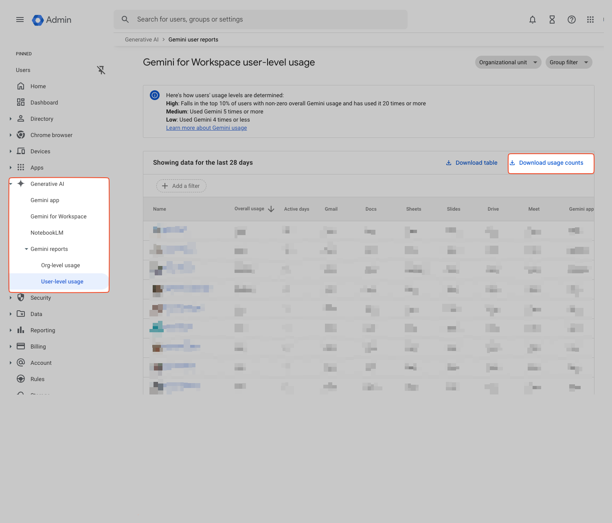

# Gemini Usage

Worklytics supports the import of Gemini Usage reports to analyze AI adoption in your organization.

As of Feb 2025, these reports must be downloaded periodically by a sufficiently privileged user from the Google Workspace Admin Console.
The reports cover ~4 weeks of history; we recommend downloading them at least weekly to provide granular insights into AI adoption.

More information:
https://support.google.com/a/answer/14564320

The CSV report file must then be uploaded to a proxy `-input` bucket for your connector, which will then be processed by the pseudonymization proxy to prepare it
for import to Worklytics.


## Data Inventory
As of Feb 2025, the report includes the following fields, providing per-user usage counts during the report period (28 days):

| Field Name    | Description                                           |
|---------------|-------------------------------------------------------|
| Email         | The email address of the user                         |
| Overall usage | Sum of all Gemini usage across Google Workspace apps  |
| Active days   | The number of days when user used Gemini              |
| Gmail         | Count of instances of Gemini usage in Gmail           |
| Docs          | Count of instances of Gemini usage in Docs            |
| Sheets        | Count of instances of Gemini usage in Sheets          |
| Slides        | Count of instances of Gemini usage in Slides          |
| Drive         | Count of instances of Gemini usage in Drive           |
| Meet          | Count of instances of Gemini usage in Meet            |
| Gemini app    | Count of instances of Gemini usage in the Gemini app  |


## Instructions to Connect

  1. Add `gemini-usage` to your list of `custom_bulk_connector_rules` in your `terraform.tfvars` file for your proxy configuration then `terraform apply`.
  2. Review your terraform plan/output; find the `-input` bucket name for your connector.
  3. Download the Gemini Usage report from the Google Workspace Admin Console (or ask a sufficiently privileged Google Workspace admin to do so). see `TODO 1 - gemini-usage` file that your `terraform apply` generated.
  4. Upload the usage report to the `-input` bucket (via AWS/GCP console, using `gsutil`/`s3` CLI, etc).
  5. Create the a `Bulk Import - Psoxy` connection in Worklytics with `gemini-bulk` as parser; see `TODO 3 - gemini-usage` file that your `terraform apply` generated.
  6. Repeat steps 3-4 as needed, to provide granular insights into AI adoption in your organization.  We recommend weekly uploads.

```hcl
custom_bulk_connector_rules = {
    "gemini-usage-bulk" = {
        source_kind               = "gemini-for-workspace",
        worklytics_connector_id   = "bulk-import-psoxy"
        worklytics_connector_name = "Bulk Import - Psoxy"
        display_name              = "Gemini Usage Bulk Import"
        rules = {
            columnsToPseudonymize = [
                "Email"
            ]
        }
        settings_to_provide = {
            "Parser" = "gemini-bulk"
        }
    }
}
```
```


