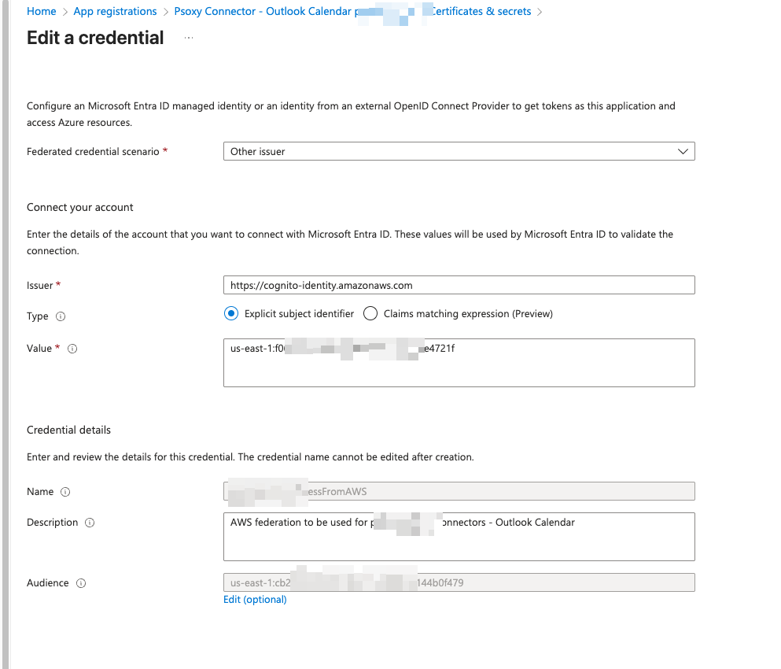
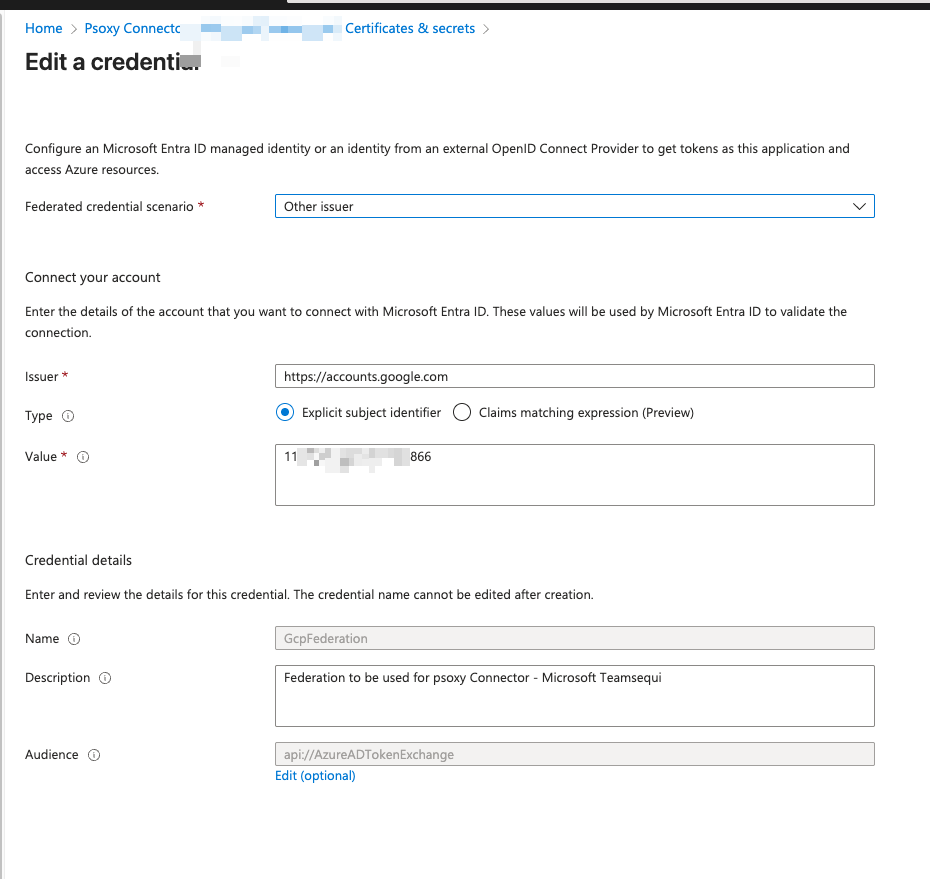

# Microsoft 365

## Setup

Connecting to Microsoft 365 data requires:

1. creating one _Microsoft Entra ID_ (former Azure Active Directory, AAD) application per Microsoft 365 data source (eg,
   `msft-entra-id`, `outlook-mail`, `outlook-cal`, etc).
2. configuring an authentication mechanism to permit each proxy instance to authenticate with the
   Microsoft Graph API. (since Sept 2022, the supported approach is
   [federated identity credentials](https://learn.microsoft.com/en-us/graph/api/resources/federatedidentitycredentials-overview?view=graph-rest-1.0))
3. granting
   [admin consent](https://learn.microsoft.com/en-us/entra/identity/enterprise-apps/grant-admin-consent?pivots=ms-graph#prerequisites)
   to each Entra ID enterprise application to specific scopes of Microsoft 365 data the connection
   requires.

Steps (1) and (2) are handled by the `terraform` examples. To perform them, the machine running
`terraform` must be authenticated with [Azure CLI](https://learn.microsoft.com/en-us/cli/azure/) as
a Microsoft Entra ID user with, at minimum, the following role in your Microsoft 365 tenant:

- [Cloud Application Administrator](https://learn.microsoft.com/en-us/azure/active-directory/roles/permissions-reference#cloud-application-administrator)
  to create/update/delete Entra ID applications and its settings during Terraform apply command.

Please note that this role is the least-privileged role sufficient for this task (creating a Microsoft Entra ID
Application), per Microsoft's documentation. See
[Least privileged roles by task in Microsoft Entra ID](https://learn.microsoft.com/en-us/entra/identity/role-based-access-control/delegate-by-task#enterprise-applications).

This role is needed _ONLY_ for the initial `terraform apply` . After each Entra ID enterprise
application is created, the user will be set as the `owner` of that application, providing ongoing
access to read and update the application's settings. At that point, the general role can be
removed.

Step (3) is performed via the Microsoft Entra ID web console through an user with administrator permissions.
Running the `terraform` examples for steps (1)/(2) will generate a document with specific
instructions for this administrator. This administrator must have, at minimum, the following role in
your Microsoft 365 tenant:

- [Privileged Role Administrator](https://learn.microsoft.com/en-us/entra/identity/role-based-access-control/permissions-reference#privileged-role-administrator)
  to Consent to application permissions to Microsoft Graph

Again, this is the least-privileged role sufficient for this task, per Microsoft's documentation.
See
[Least privileged roles by task in Microsoft Entra ID](https://learn.microsoft.com/en-us/entra/identity/role-based-access-control/delegate-by-task#enterprise-applications).

## Security

### Authentication

Psoxy uses
[Federated Identity Credentials](https://docs.microsoft.com/en-us/graph/api/resources/federatedidentitycredential?view=graph-rest-1.0)
to authenticate with the Microsoft Graph API. This approach avoids the need for any secrets to be
exchanged between your Psoxy instances and your Microsoft 365 tenant. Rather, each API request from
the proxy to Microsoft Graph API is signed by an identity credential generated in your host cloud
platform. You configure your Entra ID application for each connection to trust this identity
credential as identifying the application, and Microsoft trusts your host cloud platform (AWS/GCP)
as an external identity provider of those credentials.

Neither your proxy instances nor Worklytics ever hold any API key or certificate for your Microsoft
365 tenant.

See [Microsoft Workload Identity Federation](https://learn.microsoft.com/en-us/entra/workload-id/workload-identity-federation)
docs for details. Specifically, the relevant scenario is workload running in either GCP or AWS (your
proxy host platform)


The video below explains the general idea for identity federation for Entra ID-gated resources more
generally, of which your Graph API is an example:



### Authorization and Scopes

The following Scopes are required for each connector. Note that they are all READ-only scopes.

Connectors are independent, so you can choose to connect to only one or a subset of the connectors.
For example, pilot/PoC deployments typically use only the `Calendar` connector initially.

| Source&nbsp;&nbsp;&nbsp;&nbsp;&nbsp;&nbsp;&nbsp;&nbsp;&nbsp;&nbsp;&nbsp;&nbsp;&nbsp;&nbsp;&nbsp;&nbsp; | Examples &nbsp;&nbsp;                                                                                                                                                                                                                  | Application Scopes                                                                                                                                                                                                                                                                                                                                                                                                                                                                                                                                                                                                                                                                                                                                            |
|--------------------------------------------------------------------------------------------------------|----------------------------------------------------------------------------------------------------------------------------------------------------------------------------------------------------------------------------------------|---------------------------------------------------------------------------------------------------------------------------------------------------------------------------------------------------------------------------------------------------------------------------------------------------------------------------------------------------------------------------------------------------------------------------------------------------------------------------------------------------------------------------------------------------------------------------------------------------------------------------------------------------------------------------------------------------------------------------------------------------------------|
| Entra ID                                                                                               | [data](https://github.com/Worklytics/psoxy/tree/main/docs/sources/microsoft-365/directory/example-api-responses) - [rules](https://github.com/Worklytics/psoxy/tree/main/docs/sources/microsoft-365/directory/directory.yaml)          | [`User.Read.All`](https://learn.microsoft.com/en-us/graph/permissions-reference#userreadall) [`Group.Read.All`](https://learn.microsoft.com/en-us/graph/permissions-reference#groupreadall) [`MailboxSettings.Read`](https://learn.microsoft.com/en-us/graph/permissions-reference#mailboxsettingsread)                                                                                                                                                                                                                                                                                                                                                                                                                                                       |
| Calendar                                                                                               | [data](https://github.com/Worklytics/psoxy/tree/main/docs/sources/microsoft-365/outlook-cal/example-api-responses) - [rules](https://github.com/Worklytics/psoxy/tree/main/docs/sources/microsoft-365/outlook-cal/outlook-cal.yaml)    | [`User.Read.All`](https://learn.microsoft.com/en-us/graph/permissions-reference#userreadall) [`Group.Read.All`](https://learn.microsoft.com/en-us/graph/permissions-reference#groupreadall) [`Calendars.Read`](https://learn.microsoft.com/en-us/graph/permissions-reference#calendarsread) [`MailboxSettings.Read`](https://learn.microsoft.com/en-us/graph/permissions-reference#mailboxsettingsread)                                                                                                                                                                                                                                                                                                                                                       |
| Mail                                                                                                   | [data](https://github.com/Worklytics/psoxy/tree/main/docs/sources/microsoft-365/outlook-mail/example-api-responses) - [rules](https://github.com/Worklytics/psoxy/tree/main/docs/sources/microsoft-365/outlook-mail/outlook-mail.yaml) | [`User.Read.All`](https://learn.microsoft.com/en-us/graph/permissions-reference#userreadall) [`Group.Read.All`](https://learn.microsoft.com/en-us/graph/permissions-reference#groupreadall) [`Mail.ReadBasic.All`](https://learn.microsoft.com/en-us/graph/permissions-reference#mailreadbasicall) [`MailboxSettings.Read`](https://learn.microsoft.com/en-us/graph/permissions-reference#mailboxsettingsread)                                                                                                                                                                                                                                                                                                                                                |
| Teams (**__beta__**)                                                                                   | [data](https://github.com/Worklytics/psoxy/tree/main/docs/sources/microsoft-365/msft-teams/example-api-responses) - [rules](https://github.com/Worklytics/psoxy/tree/main/docs/sources/microsoft-365/msft-teams/msft-teams.yaml)       | [`User.Read.All`](https://learn.microsoft.com/en-us/graph/permissions-reference#userreadall) [`Team.ReadBasic.All`](https://learn.microsoft.com/en-us/graph/permissions-reference#teamreadbasicall) [`Channel.ReadBasic.All`](https://learn.microsoft.com/en-us/graph/permissions-reference#channelreadbasicall) [`Chat.Read.All`](https://learn.microsoft.com/en-us/graph/permissions-reference#chatreadall) [`ChannelMessage.Read.All`](https://learn.microsoft.com/en-us/graph/permissions-reference#channelmessagereadall) [`CallRecords.Read.All`](https://learn.microsoft.com/en-us/graph/permissions-reference#channelmessagereadall) [`OnlineMeetings.Read.All`](https://learn.microsoft.com/en-us/graph/permissions-reference#onlinemeetingsreadall) |
| Copilot (**__alpha__**)                                                                                | [data](https://github.com/Worklytics/psoxy/tree/main/docs/sources/microsoft-365/msft-copilot/example-api-responses) - [rules](https://github.com/Worklytics/psoxy/tree/main/docs/sources/microsoft-365/msft-copilot/msft-copilot.yaml) | [`User.Read.All`](https://learn.microsoft.com/en-us/graph/permissions-reference#userreadall) [`AiEnterpriseInteraction.Read.All`](https://learn.microsoft.com/en-us/graph/permissions-reference#aienterpriseinteractionreadall)                                                                                                                                                                                                                                                                                                                                                                                                                                                                                                                               |

NOTE: the above scopes are copied from
[infra/modules/worklytics-connector-specs](../../../infra/modules/worklytics-connector-specs). They
are accurate as of 2023-04-12. Please refer to that module for a definitive list.

NOTE: that `Mail.ReadBasic` affords only access to email metadata, not content/attachments.

NOTE: These are all 'Application' scopes, allowing the proxy itself data access as an application,
rather than on behalf of a specific authenticated end-user ('Delegated' scopes). For that reason, all apps
will require to do the [admin consent](https://learn.microsoft.com/en-us/entra/identity/enterprise-apps/grant-admin-consent?pivots=portal) of these permissions. Please
ask to someone with at least the `Privileged Role Administrator` role to do this.

### Single Entra ID Application for Multiple Connections

Our [AWS example](https://github.com/Worklytics/psoxy-example-aws/tree/main) supports using a SINGLE Entra ID application for multiple connections,
instead of one for each. This could ease management, but requires that you determine the superset of scopes needed across all connectors you wish to use and create
the Entra ID application with those scopes via the MSFT CLI or portal.

If you lack the `Cloud Application Administrator` role, you can ask someone in your organization with that rule to create the Application for you.

Then you obtain the `Object ID` of the Entra ID application you created, and set it as the value of `msft_connector_app_object_id`
in your `terraform.tfvars` file. See:

https://github.com/Worklytics/psoxy-example-aws/blob/main/msft-365-variables.tf

### Configure Workload Identity Federation (OIDC) Authentication via Entra ID

*Unsupported, alpha approach; YMMV; using our Terraform is recommended approach*

If you're managing your Microsoft 365 connectors OUTSIDE of our provided terraform modules, you will have to configure authentication yourself.

1. Navigate to Microsoft Entra admin center --> App Registrations; find each connector.

2. Under "Manage", select "Certificates & Secrets" --> "Federated Credentials" --> "Add Credential" --> "Other Issuer"

3. Fill in the `Issuer` and `Value` fields (leave Type as `Explicit subject identifier`). For `Value`, use the `Subject` value from your OIDC configuration. Name and Description can be whatever you want.


AWS: 
- **Issuer:** `"https://cognito-identity.amazonaws.com"`
- **Subject:** `identity_id` of the Cognito within your pool
- **Audience:** `pool_id` of your AWS Cognito Identity pool (despite Entra ID console suggesting `api://AzureADTokenExchange`)



GCP:
- **Issuer:** `"https://accounts.google.com"`
- **Subject:** numeric ID of the GCP service account
- **Audience:** `"api://AzureADTokenExchange"`. This value should match the `aud` JWT claim when retrieving the [Idtoken](https://docs.cloud.google.com/compute/docs/instances/verifying-instance-identity#request_signature) on the GCP side. We recommend to use `api://AzureADTokenExchange` by default as explained in [Entra ID documentation](https://learn.microsoft.com/en-us/entra/workload-id/workload-identity-federation-considerations)



## Troubleshooting

### Lack of 'Cloud Application Administrator' role

If you do not have the 'Cloud Application Administrator' role, someone with that or an alternative
role that can create Entra ID applications can create one application per connection and set you as
an owner of each.

You can then `import` these into your Terraform configuration.

First, try `terraform plan | grep 'azuread_application'` to get the Terraform addresses for each
application that your configuration will create.

Second, ask your Microsoft admin to create an application for each of those, set you as the owner,
and send you the `Object ID` for each.

Third, use `terraform import <address> <object-id>` to import each application into your Terraform
state.

At that point, you can run `terraform apply` and it should be able to _update_ the applications with
the settings necessary for the proxy to connect to Microsoft Graph API. After that apply, you will
still need a Microsoft 365 admin to perform the admin consent step for each application.

See
https://registry.terraform.io/providers/hashicorp/azuread/latest/docs/resources/application#import
for details.


#### Error `unauthorized_client`

Root Cause : Using `Object ID` of Entra ID application instead of its `Application ID`/`Client ID`.

Here's the JSON, which should be visible in the logs of the Psoxy instance if not directly returned to the console by the test tool:
```json
{
  "error": "unauthorized_client",
  "error_description": "AADSTS700016: Application with identifier 'eb8330dd-d9f2-40ad-a3e8-bda6858c7076' was not found in the directory 'Worklytics, Co'. This can happen if the application has not been installed by the administrator of the tenant or consented to by any user in the tenant. You may have sent your authentication request to the wrong tenant. Trace ID: 5337845d-a896-4e8a-a6a3-93ca72470e00 Correlation ID: 954f8baa-0ccd-4928-a567-9ac648aa0236 Timestamp: 2026-02-03 22:20:10Z",
  "error_codes": [
           700016
      ],
  "timestamp": "2026-02-03 22:20:10Z",
  "trace_id": "5337845d-a896-4e8a-a6a3-93ca72470e00",
  "correlation_id": "954f8baa-0ccd-4928-a567-9ac648aa0236",
  "error_uri": "https://login.microsoftonline.com/error?code=700016"
}
```

### Identity not found error

If you see an error like this:

```
{
   "error":{
      "code":"Authorization_IdentityNotFound",
      "innerError":{
         ...
      },
      "message":"The identity of the calling application could not be established."
   }
}
```

Please ensure that admin consent has been granted to the application in the Azure AD console.
If there is a new error after doing the admin like this:

```json
 {
  "error": {
    "code": "Authorization_RequestDenied",
    "message": "Insufficient privileges to complete the operation.",
    "innerError": {
      ...
    }
  }
}

```

Please re-deploy the Psoxy instance again, as it is an error related on an invalid cached token before the admin consent
has been done.


### 400 Bad Request
Root Cause: **MSFT tenant id wrong**

You might see a `400 bad request` response from the local nodejs test tool, and some message about the proxy failing the parse the request.

This is because the request went to the wrong tenant, such that the Client ID the token request was sent for doesn't exist in that tenant. Microsoft returns a 400 response code for this case.


### Certificate creation via Terraform **DEPRECATED**

**DEPRECATED** - will be removed in v0.5; this is not recommended approach, for a variety of
reasons, since Microsoft released support for
[federated credentials](https://learn.microsoft.com/en-us/graph/api/resources/federatedidentitycredentials-overview?view=graph-rest-1.0)
in ~Sept 2022. See our module `azuread-federated-credentials` for preferred alternative.

Psoxy's terraform modules create certificates on your machine, and deploy these to Azure and the
keys to your AWS/GCP host environment. This all works via APIs.

Sometimes Azure is a bit finicky about certificate validity dates, and you get an error message like
this:

```
│ Error: Adding certificate for application with object ID "350c0b06-10d4-4908-8708-d5e549544bd0"
│
│   with module.msft-connection-auth["azure-ad"].azuread_application_certificate.certificate,
│   on ../../modules/azuread-local-cert/main.tf line 27, in resource "azuread_application_certificate" "certificate":
│   27: resource "azuread_application_certificate" "certificate" {
│
│ ApplicationsClient.BaseClient.Patch(): unexpected status 400 with OData
│ error: KeyCredentialsInvalidEndDate: Key credential end date is invalid.
╵
```

Just running `terraform apply` again (and maybe again) usually fixes it. Likely it's something with
with Azure's clock relative to your machine, plus whatever flight time is required between cert
generation and it being PUT to Azure.