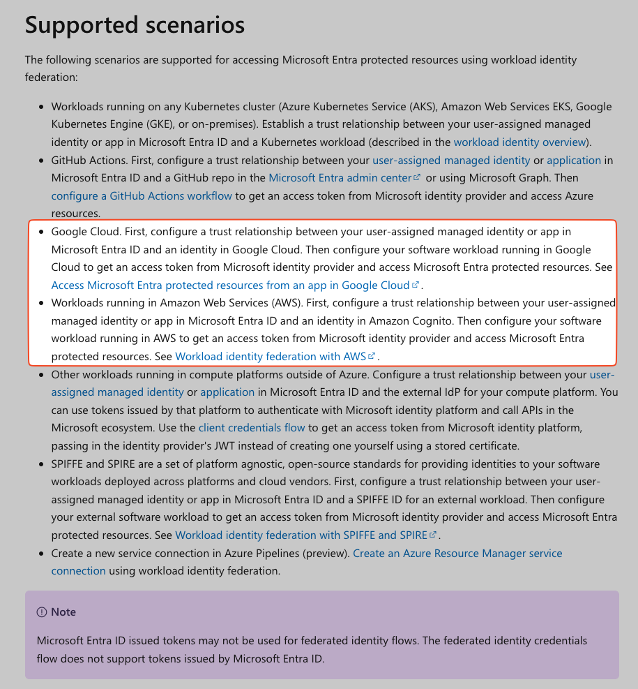

# Microsoft 365

## Setup

Connecting to Microsoft 365 data requires:

1. creating one _Microsoft Entra ID_ (former Azure Active Directory, AAD) application per Microsoft 365 data source (eg,
   `msft-entra-id`, `outlook-mail`, `outlook-cal`, etc).
2. configuring an authentication mechanism to permit each proxy instance to authenticate with the
   Microsoft Graph API. (since Sept 2022, the supported approach is
   [federated identity credentials](https://learn.microsoft.com/en-us/graph/api/resources/federatedidentitycredentials-overview?view=graph-rest-1.0))
3. granting
   [admin consent](https://learn.microsoft.com/en-us/entra/identity/enterprise-apps/grant-admin-consent?pivots=ms-graph#prerequisites)
   to each Entra ID enterprise application to specific scopes of Microsoft 365 data the connection
   requires.

Steps (1) and (2) are handled by the `terraform` examples. To perform them, the machine running
`terraform` must be authenticated with [Azure CLI](https://learn.microsoft.com/en-us/cli/azure/) as
a Microsoft Entra ID user with, at minimum, the following role in your Microsoft 365 tenant:

- [Cloud Application Administrator](https://learn.microsoft.com/en-us/azure/active-directory/roles/permissions-reference#cloud-application-administrator)
  to create/update/delete Entra ID applications and its settings during Terraform apply command.

Please note that this role is the least-privileged role sufficient for this task (creating a Microsoft Entra ID
Application), per Microsoft's documentation. See
[Least privileged roles by task in Microsoft Entra ID](https://learn.microsoft.com/en-us/entra/identity/role-based-access-control/delegate-by-task#enterprise-applications).

This role is needed _ONLY_ for the initial `terraform apply` . After each Azure AD enterprise
application is created, the user will be set as the `owner` of that application, providing ongoing
access to read and update the application's settings. At that point, the general role can be
removed.

Step (3) is performed via the Microsoft Entra ID web console through an user with administrator permissions.
Running the `terraform` examples for steps (1)/(2) will generate a document with specific
instructions for this administrator. This administrator must have, at minimum, the following role in
your Microsoft 365 tenant:

- [Privileged Role Administrator](https://learn.microsoft.com/en-us/entra/identity/role-based-access-control/permissions-reference#privileged-role-administrator)
  to Consent to application permissions to Microsoft Graph

Again, this is the least-privileged role sufficient for this task, per Microsoft's documentation.
See
[Least privileged roles by task in Microsoft Entra ID](https://learn.microsoft.com/en-us/entra/identity/role-based-access-control/delegate-by-task#enterprise-applications).

## Security

### Authentication

Psoxy uses
[Federated Identity Credentials](https://docs.microsoft.com/en-us/graph/api/resources/federatedidentitycredential?view=graph-rest-1.0)
to authenticate with the Microsoft Graph API. This approach avoids the need for any secrets to be
exchanged between your Psoxy instances and your Microsoft 365 tenant. Rather, each API request from
the proxy to Microsoft Graph API is signed by an identity credential generated in your host cloud
platform. You configure your Azure AD application for each connection to trust this identity
credential as identifying the application, and Microsoft trusts your host cloud platform (AWS/GCP)
as an external identity provider of those credentials.

Neither your proxy instances nor Worklytics ever hold any API key or certificate for your Microsoft
365 tenant.

See [Microsoft Workload Identity Federation](https://learn.microsoft.com/en-us/entra/workload-id/workload-identity-federation)
docs for details. Specifically, the relevant scenario is workload running in either GCP or AWS (your
proxy host platform)



The video below explains the general idea for identity federation for Azure AD-gated resources more
generally, of which your Graph API is an example:



### Authorization and Scopes

The following Scopes are required for each connector. Note that they are all READ-only scopes.

| Source&nbsp;&nbsp;&nbsp;&nbsp;&nbsp;&nbsp;&nbsp;&nbsp;&nbsp;&nbsp;&nbsp;&nbsp;&nbsp;&nbsp;&nbsp;&nbsp; | Examples &nbsp;&nbsp;                                                                                                        | Application Scopes                                                                                                                                                                                                                                                                                                                                                                                                                                                                                                                                                                                                                                                                                                                                          |
|--------------------------------------------------------------------------------------------------------|--------------------------------------------------------------------------------------------------------------------------------------------|-------------------------------------------------------------------------------------------------------------------------------------------------------------------------------------------------------------------------------------------------------------------------------------------------------------------------------------------------------------------------------------------------------------------------------------------------------------------------------------------------------------------------------------------------------------------------------------------------------------------------------------------------------------------------------------------------------------------------------------------------------------|
| Entra ID                                                                                               | [data](https://github.com/Worklytics/psoxy/tree/main/docs/sources/microsoft-365/directory/example-api-responses) - [rules](https://github.com/Worklytics/psoxy/tree/main/docs/sources/microsoft-365/directory/directory.yaml)          | [`User.Read.All`](https://learn.microsoft.com/en-us/graph/permissions-reference#userreadall) [`Group.Read.All`](https://learn.microsoft.com/en-us/graph/permissions-reference#groupreadall) [`MailboxSettings.Read`](https://learn.microsoft.com/en-us/graph/permissions-reference#mailboxsettingsread)                                                                                                                                                                                                                                                                                                                                                                                                                                                                                                                                                                  |
| Calendar                                                                                               | [data](https://github.com/Worklytics/psoxy/tree/main/docs/sources/microsoft-365/outlook-cal/example-api-responses) - [rules](https://github.com/Worklytics/psoxy/tree/main/docs/sources/microsoft-365/outlook-cal/outlook-cal.yaml)    | [`User.Read.All`](https://learn.microsoft.com/en-us/graph/permissions-reference#userreadall) [`Group.Read.All`](https://learn.microsoft.com/en-us/graph/permissions-reference#groupreadall) [`Calendars.Read`](https://learn.microsoft.com/en-us/graph/permissions-reference#calendarsread) [`MailboxSettings.Read`](https://learn.microsoft.com/en-us/graph/permissions-reference#mailboxsettingsread)                                                                                                                                                                                                                                     |
| Mail                                                                                                   | [data](https://github.com/Worklytics/psoxy/tree/main/docs/sources/microsoft-365/outlook-mail/example-api-responses) - [rules](https://github.com/Worklytics/psoxy/tree/main/docs/sources/microsoft-365/outlook-mail/outlook-mail.yaml) | [`User.Read.All`](https://learn.microsoft.com/en-us/graph/permissions-reference#userreadall) [`Group.Read.All`](https://learn.microsoft.com/en-us/graph/permissions-reference#groupreadall) [`Mail.ReadBasic.All`](https://learn.microsoft.com/en-us/graph/permissions-reference#mailreadbasicall) [`MailboxSettings.Read`](https://learn.microsoft.com/en-us/graph/permissions-reference#mailboxsettingsread)                                                                                                                                                                                                                                                                                                                                              |
| Teams (**__beta__**)                                                                                   | [data](https://github.com/Worklytics/psoxy/tree/main/docs/sources/microsoft-365/msft-teams/example-api-responses) - [rules](https://github.com/Worklytics/psoxy/tree/main/docs/sources/microsoft-365/msft-teams/msft-teams.yaml)| [`User.Read.All`](https://learn.microsoft.com/en-us/graph/permissions-reference#userreadall) [`Team.ReadBasic.All`](https://learn.microsoft.com/en-us/graph/permissions-reference#teamreadbasicall) [`Channel.ReadBasic.All`](https://learn.microsoft.com/en-us/graph/permissions-reference#channelreadbasicall) [`Chat.Read.All`](https://learn.microsoft.com/en-us/graph/permissions-reference#chatreadall) [`ChannelMessage.Read.All`](https://learn.microsoft.com/en-us/graph/permissions-reference#channelmessagereadall) [`CallRecords.Read.All`](https://learn.microsoft.com/en-us/graph/permissions-reference#channelmessagereadall) [`OnlineMeetings.Read.All`](https://learn.microsoft.com/en-us/graph/permissions-reference#onlinemeetingsreadall) |

NOTE: the above scopes are copied from
[infra/modules/worklytics-connector-specs](../../../infra/modules/worklytics-connector-specs). They
are accurate as of 2023-04-12. Please refer to that module for a definitive list.

NOTE: that `Mail.ReadBasic` affords only access to email metadata, not content/attachments.

NOTE: These are all 'Application' scopes, allowing the proxy itself data access as an application,
rather than on behalf of a specific authenticated end-user ('Delegated' scopes).

## Online Meetings support (Only for Teams connector)

Besides of having `OnlineMeetings.Read.All` and `OnlineMeetingArtifact.Read.All` scope defined in
the application, you need to allow a new role and a policy on the application created for reading
OnlineMeetings. You will need Powershell for this.

Please follow the steps below:

1. Ensure the user you are going to use for running the commands has the "Teams Administrator" role.
   You can add the role in the
   [Microsoft 365 Admin Center](https://learn.microsoft.com/en-us/microsoft-365/admin/add-users/assign-admin-roles?view=o365-worldwide#assign-a-user-to-an-admin-role-from-active-users)

**NOTE**: It can be assigned through Entra Id portal in Azure portal OR in Entra Admin center
https://admin.microsoft.com/AdminPortal/Home. It is possible that even login with an admin account
in Entra Admin Center the Teams role is not available to assign to any user; if so, please do it
through Azure Portal (Entra Id -> Users -> Assign roles)

2. Install
   [PowerShell Teams](https://learn.microsoft.com/en-us/microsoftteams/teams-powershell-install)
   module.
3. Run the following commands in Powershell terminal:

```shell
Connect-MicrosoftTeams
```

And use the user with the "Teams Administrator" for login it.

4. Follow steps on
   [Configure application access to online meetings or virtual events](https://learn.microsoft.com/en-us/graph/cloud-communication-online-meeting-application-access-policy):

- Add a policy for the application created for the connector, providing its `application id`
- Grant the policy to the whole tenant (NOT to any specific application or user)

**Issues**:

- If you receive "access denied" is because no admin role for Teams has been detected. Please close
  and reopen the Powershell terminal after assigning the role.
- Commands have been tested over a Powershell (7.4.0) terminal in Windows, installed from Microsoft
  Store and with Teams Module (5.8.0). It might not work on a different environment

## Troubleshooting

### Lack of 'Cloud Application Administrator' role

If you do not have the 'Cloud Application Administrator' role, someone with that or an alternative
role that can create Azure AD applications can create one application per connection and set you as
an owner of each.

You can then `import` these into your Terraform configuration.

First, try `terraform plan | grep 'azuread_application'` to get the Terraform addresses for each
application that your configuration will create.

Second, ask your Microsoft admin to create an application for each of those, set you as the owner,
and send you the `Object ID` for each.

Third, use `terraform import <address> <object-id>` to import each application into your Terraform
state.

At that point, you can run `terraform apply` and it should be able to _update_ the applications with
the settings necessary for the proxy to connect to Microsoft Graph API. After that apply, you will
still need a Microsoft 365 admin to perform the admin consent step for each application.

See
https://registry.terraform.io/providers/hashicorp/azuread/latest/docs/resources/application#import
for details.

### Certificate creation via Terraform **DEPRECATED**

**DEPRECATED** - will be removed in v0.5; this is not recommended approach, for a variety of
reasons, since Microsoft released support for
[federated credentials](https://learn.microsoft.com/en-us/graph/api/resources/federatedidentitycredentials-overview?view=graph-rest-1.0)
in ~Sept 2022. See our module `azuread-federated-credentials` for preferred alternative.

Psoxy's terraform modules create certificates on your machine, and deploy these to Azure and the
keys to your AWS/GCP host environment. This all works via APIs.

Sometimes Azure is a bit finicky about certificate validity dates, and you get an error message like
this:

```
│ Error: Adding certificate for application with object ID "350c0b06-10d4-4908-8708-d5e549544bd0"
│
│   with module.msft-connection-auth["azure-ad"].azuread_application_certificate.certificate,
│   on ../../modules/azuread-local-cert/main.tf line 27, in resource "azuread_application_certificate" "certificate":
│   27: resource "azuread_application_certificate" "certificate" {
│
│ ApplicationsClient.BaseClient.Patch(): unexpected status 400 with OData
│ error: KeyCredentialsInvalidEndDate: Key credential end date is invalid.
╵
```

Just running `terraform apply` again (and maybe again) usually fixes it. Likely it's something with
with Azure's clock relative to your machine, plus whatever flight time is required between cert
generation and it being PUT to Azure.
