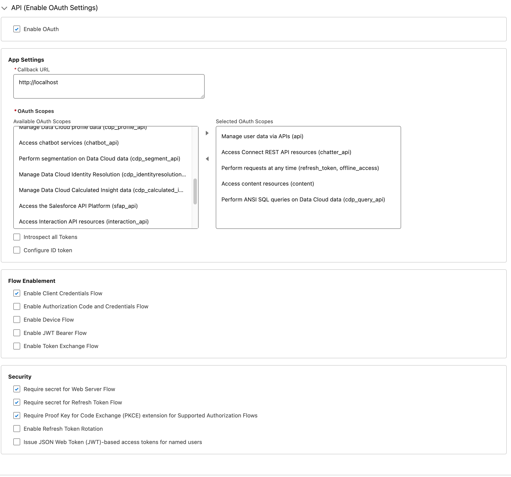
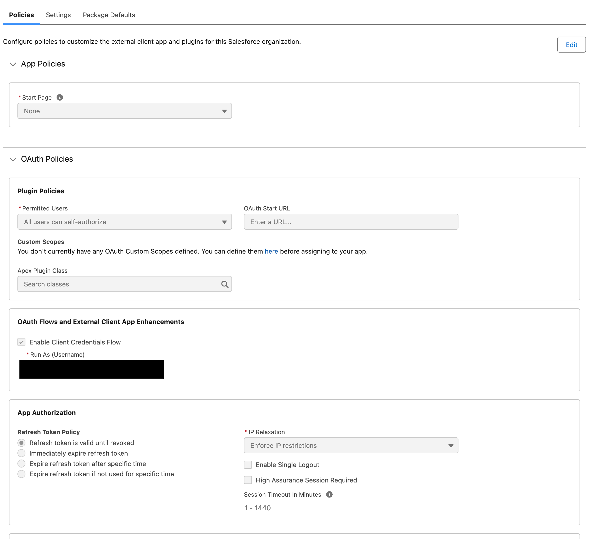
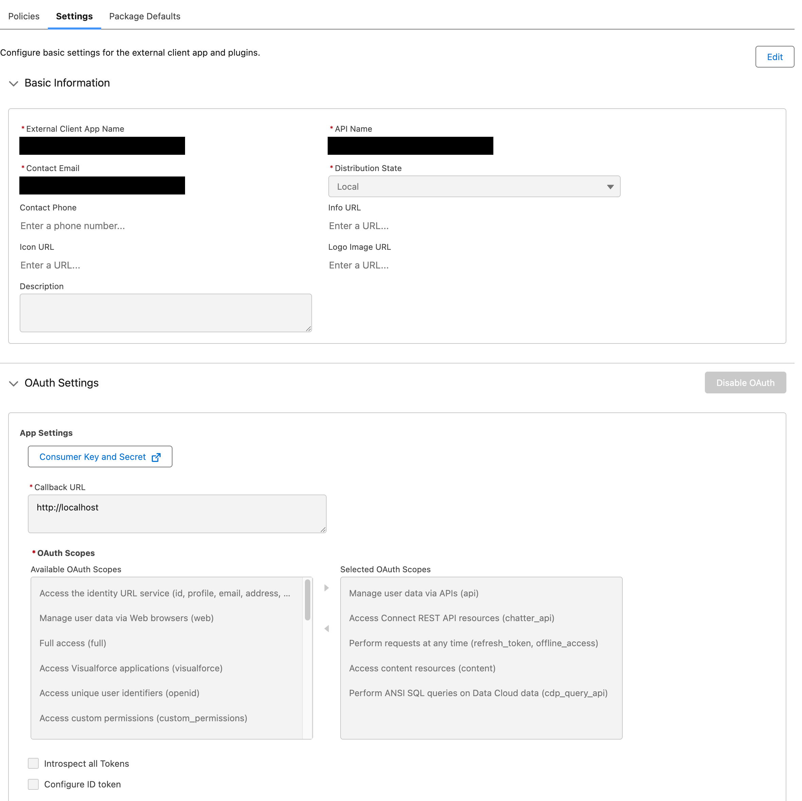

# Salesforce

## Examples

- [Example Rules](salesforce.yaml)
- Example Data : [original/accounts.json](example-api-responses/original/accounts.json) |
  [sanitized/accounts.json](example-api-responses/sanitized/accounts.json)

See more examples in the `docs/sources/salesforce/example-api-responses` folder
of the [Psoxy repository](https://github.com/Worklytics/psoxy).

## Steps to Connect

Before running the example, you have to populate the following variables in terraform:

- `salesforce_domain`. This is the [domain](https://help.salesforce.com/s/articleView?id=sf.faq_domain_name_what.htm&type=5) your instance is using.
- `salesforce_example_account_id`: An example of any account id; this is only applicable for example calls.

1. Create a [Salesforce external application](https://help.salesforce.com/s/articleView?id=xcloud.create_a_local_external_client_app.htm&type=5):
    - Ensure "Enable OAuth" is checked
    - "Callback URL" MUST be filled; can be anything as not required in this flow, but required to be set by Salesforce. Something dummy like `http://localhost` will work
    - Select following OAuth scopes:
    - Manage user data via APIs (`api`)
    - Access Connect REST API resources (`chatter_api`)
    - Perform requests at any time (`refresh_token`, `offline_access`)
    - Access content resources (`content`)
    - Perform ANSI SQL queries on Customer Data Platform data (`cdp_query_api`)

   Apart from Salesforce instructions above, please review the following:

    - Application MUST be marked with "Enable Client Credentials Flow"
    - You MUST assign a user for Client Credentials. A user with a valid `Salesforce License` should be enough. Also, user should have a [Permission Set](https://help.salesforce.com/s/articleView?id=platform.perm_sets_overview.htm&type=5) with following permissions:
        - `Access Activities`: For reading Tasks, Events, Calendar and Emails.
        - `View All Users`: For reading Users information.

    After finishing this, this how your application should look like:
    
2. Once created, edit the application.
    - In Policies tab, ensure "Enable Client Credentials Flow" is checked with the user assigned.
    
    - In Settings, go to `OAuth Settings` and click on `Consumer Key and Consumer Secret` link to get the values required for the next step.
    
3. Update the content of `PSOXY_SALESFORCE_CLIENT_ID` from Consumer Key and
   `PSOXY_SALESFORCE_CLIENT_SECRET` from Consumer Secret
4. Finally, we recommend to run `test-salesforce` script with all the queries in the example to ensure the expected information covered by rules can be obtained from Salesforce API. Some test calls may fail with a 400 (bad request) response. That is something expected if parameters requested on the query are not available (for example, running a SOQL query with fields that are NOT present in your model will force a 400 response from Salesforce API). If that is the case, a double check in the function logs can be done to ensure that this is the actual error happening, you should see an error like the following one:
```json
WARNING: Source API Error [{     "message": "\nLastModifiedById,NumberOfEmployees,OwnerId,Ownership,ParentId,Rating,Sic,Type\n                ^\nERROR at Row:1:Column:136\nNo such column 'Ownership' on entity 'Account'. If you are attempting to use a custom field, be sure to append the '__c' after the custom field name. Please reference your WSDL or the describe call for the appropriate names.",     "errorCode": "INVALID_FIELD"      }]
```
   In that case, removing from the query the fields `LastModifiedById,NumberOfEmployees,OwnerId, Ownership,ParentId,Rating,Sic,Type` will fix the issue`.

   However, if running any of the queries you receive a 401/403/500/512. A 401/403 it might be related to some misconfiguration in the Salesforce Application due lack of permissions; a 500/512 it could be related to missing parameter in the function configuration (for example, a missing value for `salesforce_domain` variable in your terraform vars)


NOTE: derived from [worklytics-connector-specs](../../../infra/modules/worklytics-connector-specs/main.tf); refer to that for definitive information.
