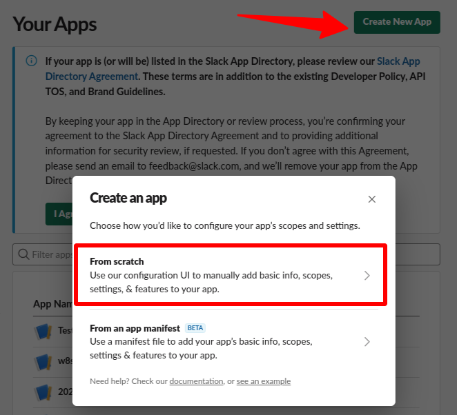
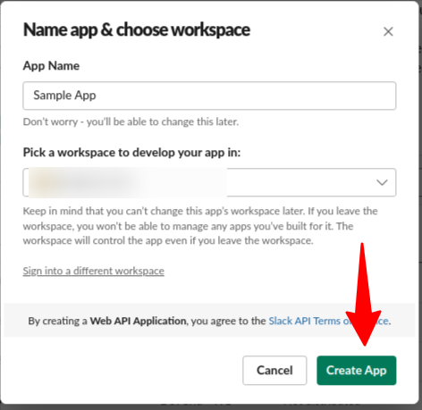
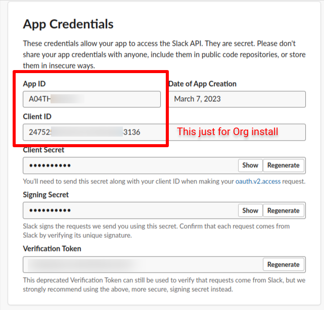
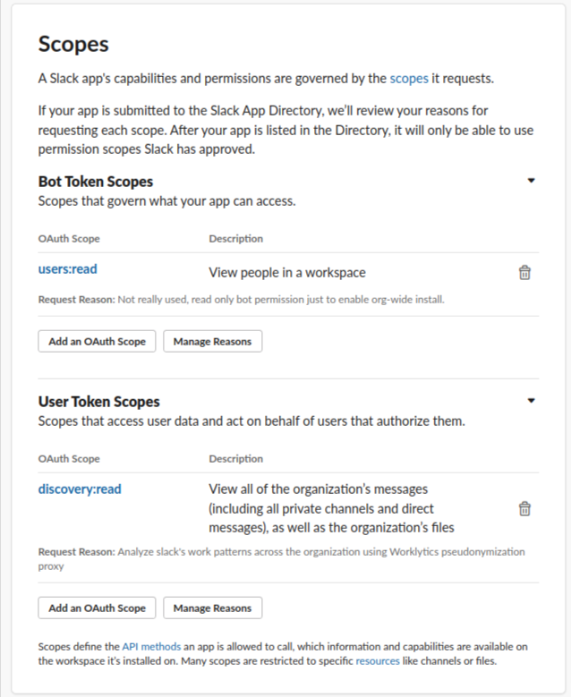
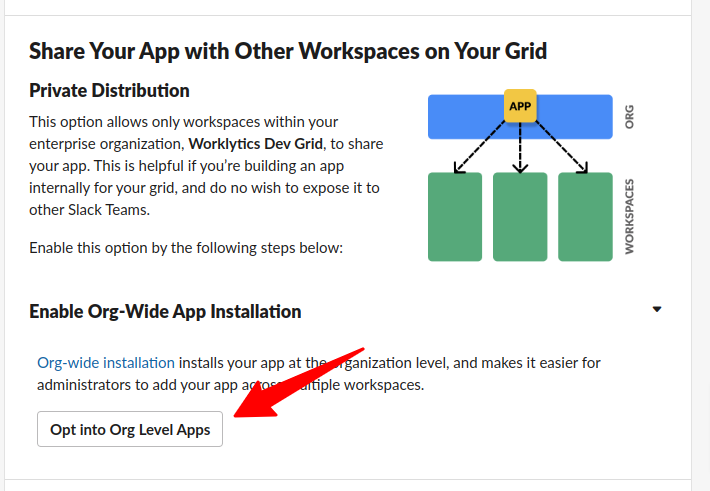
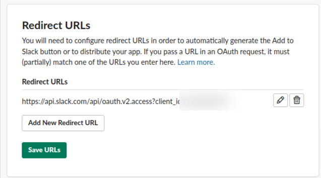
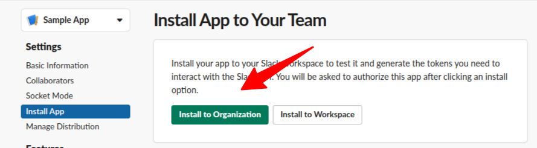

# Slack Discovery API

## Examples

- [Example Rules](discovery.yaml)
- [Example Rules: bulk](discovery-bulk.yaml)
- [Example Rules: bulk hierarchical](discovery-bulk-hierarchical.yaml)
- Example Data : [original/discovery-conversations-history.json](example-api-responses/original/discovery-conversations-history.json) |
  [sanitized/discovery-conversations-history.json](example-api-responses/sanitized/discovery-conversations-history.json)

See more examples in the `docs/sources/slack/example-api-responses` folder
of the [Psoxy repository](https://github.com/Worklytics/psoxy).

## Steps to Connect

For enabling Slack Discovery with the Psoxy you must first set up an app on your Slack Enterprise
instance.

1. Go to https://api.slack.com/apps and create an app.
   - Select "From scratch", choose a name (for example "Worklytics connector") and a development
     workspace





2. Take note of your App ID (listed in "App Credentials"), contact your Slack representative and ask
   them to enable `discovery:read` scope for that App ID. If they also enable `discovery:write` then
   delete it for safety, the app just needs read access.



The next step depends on your installation approach you might need to change slightly

#### Org wide install

Use this step if you want to install in the whole org, across multiple workspaces.

1. Add a bot scope (not really used, but Slack doesn't allow org-wide installations without a bot
   scope). The app won't use it at all. Just add for example the `users:read` scope, read-only.



2. Under "Settings > Manage Distribution > Enable Org-Wide App installation", click on "Opt into Org
   Level Apps", agree and continue. This allows to distribute the app internally on your
   organization, to be clear it has nothing to do with public distribution or Slack app directory.



3. Generate the following URL replacing the placeholder for _YOUR_CLIENT_ID_ and save it for

   `https://api.slack.com/api/oauth.v2.access?client_id=YOUR_CLIENT_ID`

4. Go to "OAuth & Permissions" and add the previous URL as "Redirect URLs"



5. Go to "Settings > Install App", and choose "Install to Organization". A Slack admin should grant
   the app the permissions and the app will be installed.



6. Copy the "User OAuth Token" (also listed under "OAuth & Permissions") and store as
   `PSOXY_SLACK_DISCOVERY_API_ACCESS_TOKEN` in the psoxy's Secret Manager. Otherwise, share the
   token with the AWS/GCP administrator completing the implementation.

#### Workspace install

Use this steps if you intend to install in just one workspace within your org.

1. Go to "Settings > Install App", click on "Install into _workspace_"
2. Copy the "User OAuth Token" (also listed under "OAuth & Permissions") and store as
   `PSOXY_SLACK_DISCOVERY_API_ACCESS_TOKEN` in the psoxy's Secret Manager. Otherwise, share the
   token with the AWS/GCP administrator completing the implementation.

## Bulk Data Flow

### Slack Discovery
**_beta_** As an alternative to connecting Worklytics to the Slack Discovery API via the proxy, it
is possible to use the bulk-mode of the proxy to sanitize an export of Slack Discovery data and
ingest the resulting sanitized data to Worklytics. Example data of this is given in the
[`example-bulk/`](example-bulk/) folder.

This data can be processing using custom multi-file type rules in the proxy, of which
[`discovery-bulk.yaml`](discovery-bulk.yaml) is an example.

For clarity, example files are NOT compressed, so don't have `.gz` extension; but rules expect
`.gz`.

### Slack AI Snapshot

Psoxy can pseudonymize Slack AI Snapshot data for ingestion into Worklytics.

See [https://docs.worklytics.co/knowledge-base/connectors/bulk-data/slack-ai-snapshot](https://docs.worklytics.co/knowledge-base/connectors/bulk-data/slack-ai-snapshot)

The default proxy rules for `slack-ai-snapshot` will pseudonymize `user_email`. If your data set does not match
the schema expected by Worklytics, you can adapt it by specifying some custom transforms within
the proxy itself:

```hcl
custom_bulk_connector_rules = {
   "slack-ai-bulk" = {
        source_kind               = "slack-ai",
        worklytics_connector_id   = "bulk-import-psoxy"
        worklytics_connector_name = "Bulk Import - Psoxy"
        display_name              = "Slack Bulk"
        rules = {
          columnsToPseudonymize = ["user_email"]
          }
        settings_to_provide = {
           "Parser" = "slack-ai-bulk"
          }
  }
}
```
