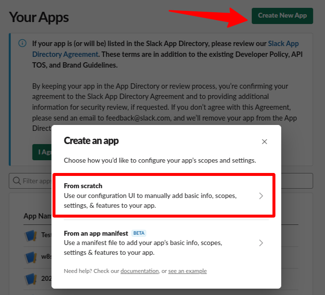
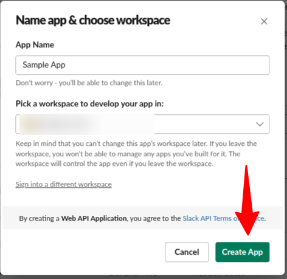
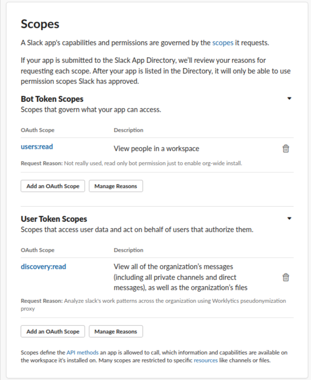
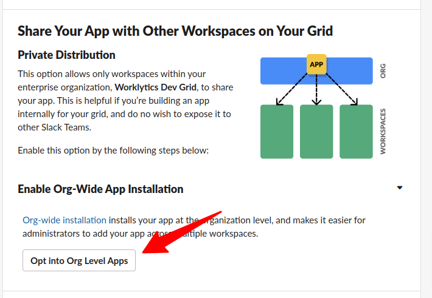
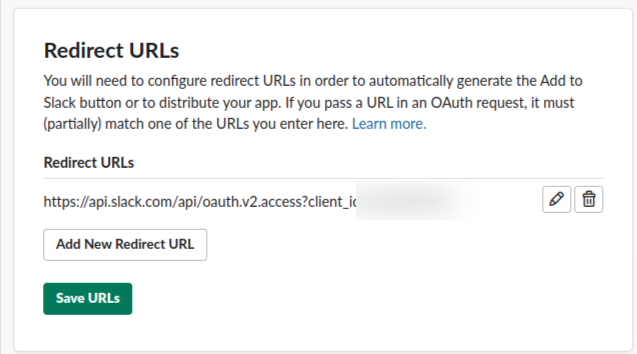
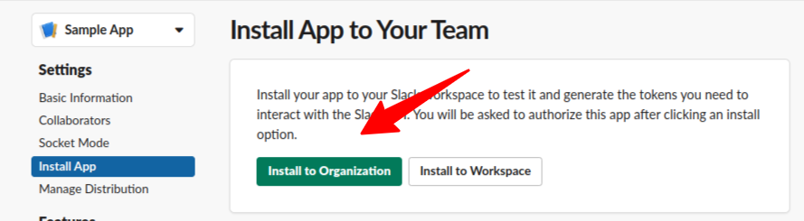

# Slack Analytics

**Connector ID:** `slack-analytics`

**Availability:** Alpha

The Slack Analytics connector provides access to Slack's [Admin Analytics API](https://docs.slack.dev/admins/analytics/). It complements the [`slack-discovery-api`](../slack-discovery-api/README.md) connector: Analytics covers member activity, public channels, and message metadata/engagement metrics without message body content, while Discovery API remains required for DMs and MPDMs (and other conversation types not exposed by Analytics).


This connector requires **Slack Enterprise Grid** and an org owner or admin to install the app and grant scopes. The `admin.analytics:read` scope is available in the standard OAuth scope picker for Enterprise Grid orgs on eligible plans.


## Required Scopes

### User token scopes (required)

These scopes must be added under **OAuth & Permissions → User Token Scopes** and are used by the connector at runtime:

| Scope | Purpose |
|-------|---------|
| [`admin.analytics:read`](https://docs.slack.dev/reference/scopes/admin.analytics.read) | Read member analytics, channel analytics, message metadata, and message activity metrics via all endpoints below |

### Bot token scopes (org-wide install only)

Slack requires at least one **Bot Token Scope** before you can install an app org-wide; the connector authenticates with the **user token** only at runtime and does not call the API with the bot token. Any minimal read-only bot scope is sufficient — for example, `users:read` (as used in the Steps to Connect below).

## API Endpoints

All requests are proxied to `https://www.slack.com/api/…` with a **User OAuth Token** bearing `admin.analytics:read`.

| Slack method | Proxy path | Typical use | Discovery API equivalent |
|--------------|------------|-------------|--------------------------|
| [`admin.analytics.getFile`](https://docs.slack.dev/reference/methods/admin.analytics.getFile) | `/api/admin.analytics.getFile?type=member&date=YYYY-MM-DD` | Daily per-member activity (gzip NDJSON) | Partial overlap with `discovery.users.list` (activity fields) |
| [`admin.analytics.getFile`](https://docs.slack.dev/reference/methods/admin.analytics.getFile) | `/api/admin.analytics.getFile?type=public_channel&date=YYYY-MM-DD` | Daily public-channel activity (gzip NDJSON) | Public channels only; `discovery.conversations.recent` covers broader channel types |
| [`admin.analytics.getFile`](https://docs.slack.dev/reference/methods/admin.analytics.getFile) | `/api/admin.analytics.getFile?type=public_channel&metadata_only=true` | Public channel metadata (gzip NDJSON; omit `date`) | Public channels only; use Discovery API for DMs/MPDMs/private channels |
| [`admin.analytics.messages.metadata`](https://docs.slack.dev/reference/methods/admin.analytics.messages.metadata) | `/api/admin.analytics.messages.metadata?channel={CHANNEL_ID}&limit=100` | Message metadata for a channel (no message text) | Metadata-only alternative to `discovery.conversations.history` for supported channel types |
| [`admin.analytics.messages.activity`](https://docs.slack.dev/reference/methods/admin.analytics.messages.activity) | `/api/admin.analytics.messages.activity?channel={CHANNEL_ID}&limit=50` | Per-message engagement metrics (views, reactions, shares, clicks) | _(no Discovery API equivalent)_ |

### Allowed query parameters

| Endpoint | Parameters |
|----------|------------|
| `admin.analytics.getFile` | `type` (required: `member` or `public_channel`), `date` (`YYYY-MM-DD`, required unless `metadata_only=true`), `metadata_only` (optional; only with `type=public_channel`) |
| `admin.analytics.messages.metadata` | `channel` (required), `oldest_ts`, `latest_ts`, `cursor`, `limit` |
| `admin.analytics.messages.activity` | `channel` (required), `oldest_ts`, `latest_ts`, `cursor`, `limit` |

## Steps to Connect

For enabling Slack Analytics with the Psoxy you must first create an app on your Slack Enterprise Grid organization.

1. Go to https://api.slack.com/apps and create an app.
   - Select "From scratch", choose a name (for example "Worklytics connector") and a development workspace.

2. Under **Features → OAuth & Permissions**, add the following scope under **User Token Scopes**:
   - `admin.analytics:read`

The next step depends on your installation approach.

#### Org-wide install

Use this if you want to install across the whole org, spanning multiple workspaces.

1. Add a bot scope (not used by the connector, but Slack requires one for org-wide installs). For example, add the read-only `users:read` scope under **Bot Token Scopes**.
2. Under **Settings → Manage Distribution → Enable Org-Wide App installation**, click **Opt into Org Level Apps**, agree, and continue. This enables internal distribution within your organization only; it does not publish the app to the Slack App Directory.

3. Generate the following URL, replacing `YOUR_CLIENT_ID` with your app's client ID, and save it for later:

   `https://api.slack.com/api/oauth.v2.access?client_id=YOUR_CLIENT_ID`

4. Go to **OAuth & Permissions** and add that URL as a **Redirect URL**.

5. Go to **Settings → Install App** and choose **Install to Organization**. A Slack admin should grant the app permissions.

6. Copy the **User OAuth Token** (also listed under **OAuth & Permissions**) and store it as `PSOXY_SLACK_ANALYTICS_ACCESS_TOKEN` in your secret manager. Otherwise, share the token with the AWS/GCP administrator completing the implementation.

#### Workspace install

Use this if you intend to install in just one workspace within your org.

1. Go to **Settings → Install App**, click **Install into _workspace_**.
2. Copy the **User OAuth Token** (also listed under **OAuth & Permissions**) and store it as `PSOXY_SLACK_ANALYTICS_ACCESS_TOKEN` in your secret manager. Otherwise, share the token with the AWS/GCP administrator completing the implementation.

After `terraform apply`, see the generated TODO file for connector-specific setup steps.

## Async Processing

`admin.analytics.getFile` returns large gzip-compressed NDJSON files. This connector has async processing enabled; send a `Prefer: respond-async` header on `getFile` requests to receive a `202 Accepted` response while the proxy fetches and sanitizes the file in the background. See [Async API Data Sanitization](../../configuration/async-api-data.md).

The `admin.analytics.messages.*` endpoints return standard JSON and are processed synchronously.

## Examples

| API call | Example response | Sanitized example |
|----------|------------------|-------------------|
| `admin.analytics.getFile?type=member&date=…` | [member_sample.json](example-api-responses/original/member_sample.json) | [sanitized/member_sample.json](example-api-responses/sanitized/member_sample.json) |
| `admin.analytics.messages.metadata?channel=…` | [messages-metadata.json](example-api-responses/original/messages-metadata.json) | [sanitized/messages-metadata.json](example-api-responses/sanitized/messages-metadata.json) |
| `admin.analytics.messages.activity?channel=…` | [messages-activity.json](example-api-responses/original/messages-activity.json) | [sanitized/messages-activity.json](example-api-responses/sanitized/messages-activity.json) |

- [Example Rules](slack-analytics.yaml)
- [Example API calls](example-api-calls.md) for validating proxy behavior

See more examples in the `docs/sources/slack/slack-analytics/example-api-responses` folder of the [Psoxy repository](https://github.com/Worklytics/psoxy).

NOTE: derived from [worklytics-connector-specs](../../../infra/modules/worklytics-connector-specs/main.tf); refer to that for definitive information.
