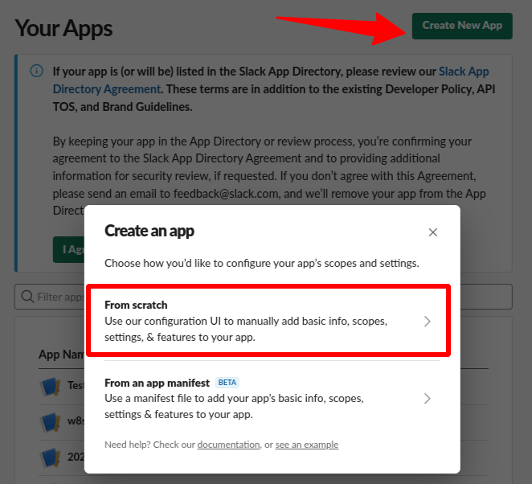
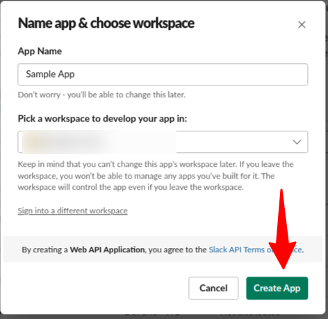
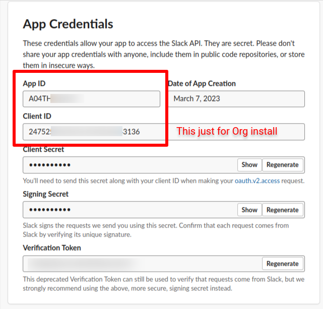
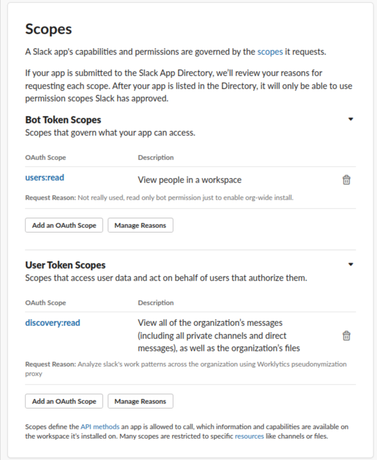
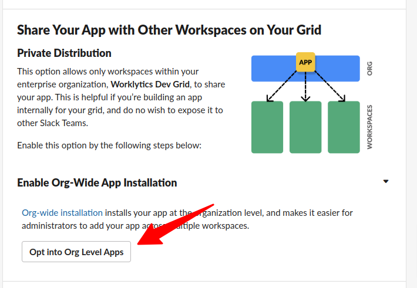
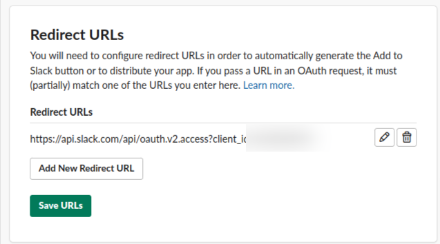
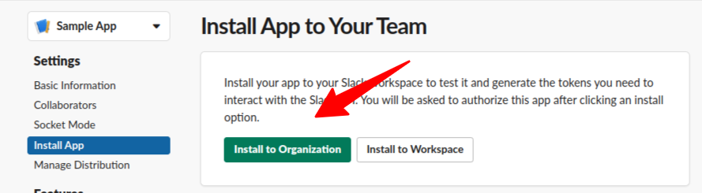

# Slack via Discovery API

**Connector ID:** `slack-discovery-api`

**Availability:** GA


**Access requirements:** The Slack Discovery API is intended for eDiscovery, compliance, and data-retention use cases. Using it to export organizational data for analytics is **not documented or officially supported by Slack** as a use case, though some organizations do so in practice.

Access depends on several factors outside Worklytics' or Psoxy's control:

- **Subscription/plan:** Your organization typically needs an eligible Slack plan (for example, Enterprise Grid with Discovery API entitlements). Slack does not make Discovery API available on all plans.
- **Slack account team approval:** The `discovery:read` scope is not self-service. You must contact your Slack account representative or account management team and ask them to enable it for your app's App ID (see Steps to Connect below). They may approve, deny, or impose conditions based on your contract and intended use.
- **Enterprise Grid:** Discovery API access is an Enterprise Grid feature. Your org must be on Grid (or equivalent enterprise deployment) with Discovery enabled.
- **Rate limits:** As of May 2025, Slack is by default imposing highly restrictive rate limits on new Discovery API clients. If you did not create your Discovery API client before May 2025, you may need to work with your Slack account representative to obtain viable rate limits for your use case.

Due to these limitations on the availability and terms of the Discovery API, **Worklytics cannot warrant or guarantee its availability, now or going forward.**


## Examples

- [Example Rules](discovery.yaml)
- Example Data : [original/discovery-conversations-history.json](example-api-responses/original/discovery-conversations-history.json) |
  [sanitized/discovery-conversations-history.json](example-api-responses/sanitized/discovery-conversations-history.json)

See more examples in the `docs/sources/slack/example-api-responses` folder
of the [Psoxy repository](https://github.com/Worklytics/psoxy).

## Example API calls

Example commands (\*) that you can use to validate proxy behavior against the Slack Discovery APIs. Follow the steps and change the values to match your configuration when needed.

Path / query parameters:

- `{WORKSPACE_ID}`: a workspace/team id from `GET /api/discovery.enterprise.info` (`.enterprise.teams[].id`).
- `{CHANNEL_ID}`: a channel id from `GET /api/discovery.conversations.list` (`.channels[].id`).
- `{USER_ID}`: a user id from `GET /api/discovery.users.list` (`.users[].id`); required by `discovery.user.conversations`.

`discovery.conversations.info` allows only `channel`, `team`, and `offset` — do not pass `limit`.

For AWS, use the `-r` flag to assume an IAM role that has permission to call the proxy. Example:

```shell
node tools/psoxy-test/cli-call.js -u [your_psoxy_url]/api/discovery.enterprise.info -r arn:aws:iam::PROJECT_ID:role/ROLE_NAME
```

If any call appears to fail, repeat it using the `-v` flag.

(\*) All commands assume that you are at the root path of the Psoxy project.

### Read workspaces

```shell
node tools/psoxy-test/cli-call.js -u [your_psoxy_url]/api/discovery.enterprise.info
```

### Read Users in Grid

```shell
node tools/psoxy-test/cli-call.js -u [your_psoxy_url]/api/discovery.users.list?include_deleted=true
```

### Read conversations for a user

```shell
node tools/psoxy-test/cli-call.js -u [your_psoxy_url]/api/discovery.user.conversations?user={USER_ID}&limit=10
```

### Read Conversations in Workspace (any kind, public and private)

1. Get a workspace ID (accessor path in response `.enterprise.teams[0].id`):

```shell
node tools/psoxy-test/cli-call.js -u [your_psoxy_url]/api/discovery.enterprise.info?limit=1
```

2. Get conversation details of that workspace (replace `{WORKSPACE_ID}` with the corresponding value):

```shell
node tools/psoxy-test/cli-call.js -u [your_psoxy_url]/api/discovery.conversations.list?team={WORKSPACE_ID}&limit=10
```

### Read Messages in Workspace Channel

1. Get a channel ID (accessor path in response `.channels[0].id`):

```shell
node tools/psoxy-test/cli-call.js -u [your_psoxy_url]/api/discovery.conversations.list?team={WORKSPACE_ID}&limit=10
```

2. Get DM information (no workspace):

```shell
node tools/psoxy-test/cli-call.js -u [your_psoxy_url]/api/discovery.conversations.list?limit=10
```

3. Read messages for a workspace channel:

```shell
node tools/psoxy-test/cli-call.js -u [your_psoxy_url]/api/discovery.conversations.history?reactions=1&team={WORKSPACE_ID}&channel={CHANNEL_ID}&limit=10
```

4. Omit the workspace ID if the channel is a DM:

```shell
node tools/psoxy-test/cli-call.js -u [your_psoxy_url]/api/discovery.conversations.history?channel={CHANNEL_ID}&limit=10
```

### Workspace Channel Info

```shell
node tools/psoxy-test/cli-call.js -u [your_psoxy_url]/api/discovery.conversations.info?team={WORKSPACE_ID}&channel={CHANNEL_ID}
```

Omit the workspace ID if the channel is a DM:

```shell
node tools/psoxy-test/cli-call.js -u [your_psoxy_url]/api/discovery.conversations.info?channel={CHANNEL_ID}
```

### Recent Workspace Conversations

```shell
node tools/psoxy-test/cli-call.js -u [your_psoxy_url]/api/discovery.conversations.recent
```

## Steps to Connect

For enabling Slack via Discovery API with the Psoxy you must first set up an app on your Slack Enterprise instance.

1. Go to [https://api.slack.com/apps](https://api.slack.com/apps) and create an app.
   - Select "From scratch", choose a name (for example "Worklytics connector") and a development workspace





2. Take note of your App ID (listed in "App Credentials"), contact your Slack representative and ask them to enable `discovery:read` scope for that App ID. If they also enable `discovery:write` then delete it for safety, the app just needs read access.



The next step depends on your installation approach you might need to change slightly

#### Org wide install

Use this step if you want to install in the whole org, across multiple workspaces.

1. Add a bot scope (not really used, but Slack doesn't allow org-wide installations without a bot
   scope). The app won't use it at all. Just add for example the `users:read` scope, read-only.



2. Under "Settings > Manage Distribution > Enable Org-Wide App installation", click on "Opt into Org Level Apps", agree and continue. This allows to distribute the app internally on your organization, to be clear it has nothing to do with public distribution or Slack app directory.



3. Generate the following URL replacing the placeholder for _YOUR_CLIENT_ID_ and save it for

   `https://api.slack.com/api/oauth.v2.access?client_id=YOUR_CLIENT_ID`

4. Go to "OAuth & Permissions" and add the previous URL as "Redirect URLs"



5. Go to "Settings > Install App", and choose "Install to Organization". A Slack admin should grant the app the permissions and the app will be installed.



6. Copy the "User OAuth Token" (also listed under "OAuth & Permissions") and store as `PSOXY_SLACK_DISCOVERY_API_ACCESS_TOKEN` in your secret manager. Otherwise, share the token with the AWS/GCP administrator completing the implementation.

#### Workspace install

Use this steps if you intend to install in just one workspace within your org.

1. Go to "Settings > Install App", click on "Install into _workspace_"
2. Copy the "User OAuth Token" (also listed under "OAuth & Permissions") and store as`PSOXY_SLACK_DISCOVERY_API_ACCESS_TOKEN` in your secret manager. Otherwise, share the token with the AWS/GCP administrator completing the implementation.
