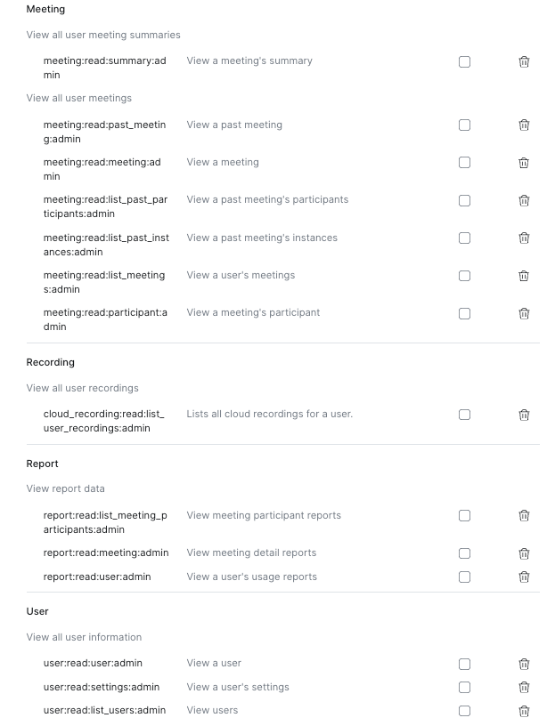

# Zoom

## Prerequisites

As of July 2023, pulling historical data (last 6 months) and all scheduled and instant meetings
requires a Zoom paid account on Pro or higher plan (Business, Business Plus). On other plans Zoom
data may be incomplete.

Accounts on unpaid plans do not have access to some methods Worklytics use like:

- [Zoom Reports API](https://developers.zoom.us/docs/api/rest/reference/zoom-api/methods/#tag/Reports) -required for historical data
- certain [Zoom Meeting API](https://developers.zoom.us/docs/api/rest/reference/zoom-api/methods/#tag/Meetings) methods such as retrieving [past meeting participants](https://developers.zoom.us/docs/api/rest/reference/zoom-api/methods/#operation/pastMeetingParticipants)

## Examples

- [Example Rules](zoom.yaml)
- Example Data : [original/meeting-details.json](example-api-responses/original/meeting-details.json) | [sanitized/meeting-details](example-api-responses/sanitized/meeting-details.json)

See more examples in the `docs/sources/zoom/example-api-responses` folder of the [Psoxy repository](https://github.com/Worklytics/psoxy).

## Steps to Connect

The Zoom connector through Psoxy requires a Custom Managed App on the Zoom Marketplace. This app may be left in development mode; it does not need to be published.

1. Go to https://marketplace.zoom.us/develop/create and create an app of type "Server to Server
OAuth" for creating a server-to-server app. (NOTE: if this option is disabled for you, the owner/super-admin for your account may need to edit permissions associated with your role via User Management > Roles > Role Settings > Advanced features in the Zoom web portal and select the View and Edit checkboxes for "Server-to-Server OAuth app.")

2. After creation, it will show the App Credentials.

   Copy the following values:

   - `Account ID`
   - `Client ID`
   - `Client Secret`

   

   Share them with the AWS/GCP administrator, who should fill them in your host platform's secret manager (AWS Systems Manager Parameter Store / GCP Secret Manager) for use by the proxy when authenticating with the Zoom API:

   - `Account ID` --> `PSOXY_ZOOM_ACCOUNT_ID`
   - `Client ID` --> `PSOXY_ZOOM_CLIENT_ID`
   - `Client Secret` --> `PSOXY_ZOOM_CLIENT_SECRET`

   NOTE: Anytime the _Client Secret_ is regenerated it needs to be updated in the Proxy too. NOTE: _Client Secret_ should be handled according to your organization's security policies for API keys/secrets as, in combination with the above, allows access to your organization's data.

3. Fill the 'Information' section. Zoom requires company name, developer name, and developer email to activate the app.

4. No changes are needed in the 'Features' section. Continue.

5. Fill the scopes section clicking on `+ Add Scopes` and adding the following:

* `meeting:read:past_meeting:admin`
* `meeting:read:meeting:admin`
* `meeting:read:list_past_participants:admin`
* `meeting:read:list_past_instances:admin`
* `meeting:read:list_meetings:admin`
* `meeting:read:participant:admin`
* `meeting:read:summary:admin`
* `cloud_recording:read:list_user_recordings:admin`
* `report:read:list_meeting_participants:admin`
* `report:read:meeting:admin`
* `report:read:user:admin`
* `user:read:user:admin`
* `user:read:list_users:admin`
* `user:read:settings:admin`

    

Once the scopes are added, click on `Done` and then `Continue`.

6. Activate the app

## Zoom AI Metric Snapshot Bulk

Psoxy can pseudonymize Zoom AI Metrics Snapshot CSV data.

The default proxy rules for `zoom-ai-metrics` will pseudonymize `User Name` and `Email`, redacting `Department`

```hcl
custom_bulk_connector_rules = {
    "zoom-ai-metrics" = {
        source_kind               = "zoom",
        worklytics_connector_id   = "bulk-import-psoxy"
        worklytics_connector_name = "Bulk Import - Psoxy"
        display_name              = "Zoom AI Metrics"
        rules = {
            columnsToPseudonymize = [
                "User Name",
                "Email"
            ],
            columnsToRedact = [
                "Department",
            ]
        }
        settings_to_provide = {
            "Parser" = "zoom-ai-metrics-bulk"
        }
    }
}
```

## Troubleshooting

### Zoom API Error : 400 invalid client

`{"reason":"Invalid client_id or client_secret","error":"invalid_client"}`

Causes:
   - extra chars in Client ID; or incorrect Client ID

Confirm that the `Client ID` and `Client Secret` are correctly set in your secret store solution (AWS Parameter Store, Secrets Manager, or GCP Secret Manager).

### Zoom API Error : 400 Bad Request

`{"reason":"Bad Request","error":"invalid_request"}`

Causes:
  - extra chars in Account ID; or incorrect Account ID