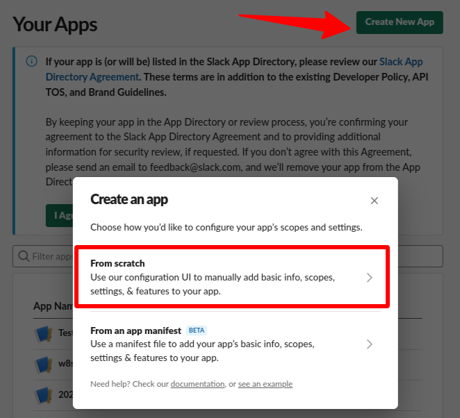

# infra/

Contains terraform module to setup psoxy instances in various cloud providers. As terraform
modules are NOT cloud agnostic, we follow the same pattern and provide distinct module per
provider, rather than a generic solution or something that takes the provider as a variable.

Please review the `README.md` within each provider's module for pre-reqs and usage details.

## Directory Structure

  - `examples/` - example configurations to be adapted by customers
  - `examples-dev/` - example configurations to be adapted by developers
  - `modules/` - modules to be re-used primarily by other modules or if customers need very custom
     configurations. We do NOT commit to maintaining backwards compatibility of these modules
     interfaces between minor or patch versions. (eg, `0.4.z` variants may break things)
  - `modules-examples/` - psoxy configurations that have been 'modularized', to enable use by
    customers via a minimal root configuration (see `examples/`) OR as part of their larger
    Terraform configuration (presumably covering infra beyond psoxy). If you need more control than
    what variables of these  modules expose, you can copy one of these modules, use it as a root
    terraform configuration, and directly modify how it invokes modules.  We DO commit to maintaining
    the interfaces of these modules between minor patch versions (eg, `0.4.z` variants should not
    break).


## Per Connector Setup

### Slack Discovery Setup

For enabling Slack Discovery with the Psoxy you must first set up an app on your Slack Enterprise
instance.

1. Go to https://api.slack.com/apps and create an app.
   - Select "From scratch", choose a name (for example "Worklytics connector") and a development workspace




2. Take note of your App ID (listed in "App Credentials"), contact your Slack representative and ask
   them to enable `discovery:read` scope for that App ID.
   If they also enable `discovery:write` then delete it for safety, the app just needs read access.


The next step depends on your installation approach you might need to change slightly

#### Org wide install

Use this step if you want to install in the whole org, across multiple workspaces.

1. Add a bot scope (not really used, but Slack doesn't allow org-wide installations without a bot scope).
   The app won't use it at all. Just add for example the `users:read` scope, read-only.


2. Under "Settings > Manage Distribution > Enable Org-Wide App installation",
   click on "Opt into Org Level Apps", agree and continue. This allows to distribute the app internally
   on your organization, to be clear it has nothing to do with public distribution or Slack app directory.


3. Generate the following URL replacing the placeholder for *YOUR_CLIENT_ID* and save it for
   later:

   `https://api.slack.com/api/oauth.v2.access?client_id=YOUR_CLIENT_ID`

4. Go to "OAuth & Permissions" and add the previous URL as "Redirect URLs"


5. Go to "Settings > Install App", and choose "Install to Organization". A Slack admin should grant
   the app the permissions and the app will be installed.


6. Copy the "User OAuth Token" (also listed under "OAuth & Permissions") and store as
   `PSOXY_SLACK_DISCOVERY_API_ACCESS_TOKEN` in the psoxy's Secret
   Manager. Or share it with the administrator installing the psoxy to do it.

#### Workspace install

Use this steps if you intend to install in just one workspace within your org.

1. Go to "Settings > Install App", click on "Install into *workspace*"
2. Copy the "User OAuth Token" (also listed under "OAuth & Permissions") and store as
   `PSOXY_SLACK_DISCOVERY_API_ACCESS_TOKEN` in the psoxy's Secret
   Manager. Or share it with the administrator installing the psoxy to do it.

### Zoom Setup

Zoom connector through Psoxy requires a custom managed app on the Zoom Marketplace (in development
mode, no need to publish).

1. Go to https://marketplace.zoom.us/develop/create and create an app of type "Server to Server OAuth"
2. After creation, it will show the App Credentials. Share them with the AWS/GCP administrator, the
   following secret values must be filled in the Secret Manager for the Proxy with the appropriate values:

    - `PSOXY_ZOOM_CLIENT_ID`
    - `PSOXY_ZOOM_ACCOUNT_ID`
    - `PSOXY_ZOOM_CLIENT_SECRET`
    - Note: Anytime the *client secret* is regenerated it needs to be updated in the Proxy too.

3. Fill the information section

4. Fill the scopes section, enabling the following:

   - Users / View all user information / `user:read:admin`
     - To be able to gather information about the zoom users
   - Meetings / View all user meetings / `meeting:read:admin`
     - Allows us to list all user meeting
   - Report / View report data / `report:read:admin`
     - Last 6 months view for user meetings

5. Activate the app

### Dropbox Setup

Dropbox connector through Psoxy requires a Dropbox Application created in Dropbox Console. The application
does not require to be public, and it needs to have the following scopes to support
all the operations for the connector:

- files.metadata.read: for file listing and revision
- members.read: member listing
- events.read: event listing
- groups.read: group listing

1. Go to https://www.dropbox.com/apps and Build an App
2. Then go https://www.dropbox.com/developers to enter in `App Console` to configure your app
3. Now you are in the app, go to `Permissions` and mark all the scopes described before. NOTE: Probably the UI will mark
   you more required permissions automatically (like *account_info_read*.) Just mark the ones
   described here and the UI will ask you to include any other required.
4. On settings, you could access to `App key` and `App secret`. You can create an access token here, but with limited
   expiration. We need to create a long-lived token, so edit the following URL with your `App key` and paste it into the
   browser:

   `https://www.dropbox.com/oauth2/authorize?client_id=<APP_KEY>&token_access_type=offline&response_type=code`

   That will return an `Authorization Code` that you have to paste.
   **NOTE** This `Authorization Code` if for a one single use; if expired or used you will need to get it again pasting
   the
   URL in the browser.
5. Now, replace the values in following URL and run it from command line in your terminal. Replace `Authorization Code`
   , `App key`
   and `App secret` in the placeholders:

   `curl https://api.dropbox.com/oauth2/token -d code=<AUTHORIZATION_CODE> -d grant_type=authorization_code -u <APP_KEY>:<APP_SECRET>`
6. After running that command, if successful you will see
   a [JSON response](https://www.dropbox.com/developers/documentation/http/documentation#oauth2-authorize) like this:

```json
{
  "access_token": "some short live access token",
  "token_type": "bearer",
  "expires_in": 14399,
  "refresh_token": "some long live token we are going to use",
  "scope": "account_info.read events.read files.metadata.read groups.read members.read team_data.governance.read team_data.governance.write team_data.member",
  "uid": "",
  "team_id": "some team id"
}
```

7. Finally set following variables in AWS System Manager parameters store / GCP Cloud Secrets (if default
   implementation):

- `PSOXY_dropbox_business_REFRESH_TOKEN` secret variable with value of `refresh_token` received in previous response
- `PSOXY_dropbox_business_CLIENT_ID` with `App key` value.
- `PSOXY_dropbox_business_CLIENT_SECRET` with `App secret` value.
