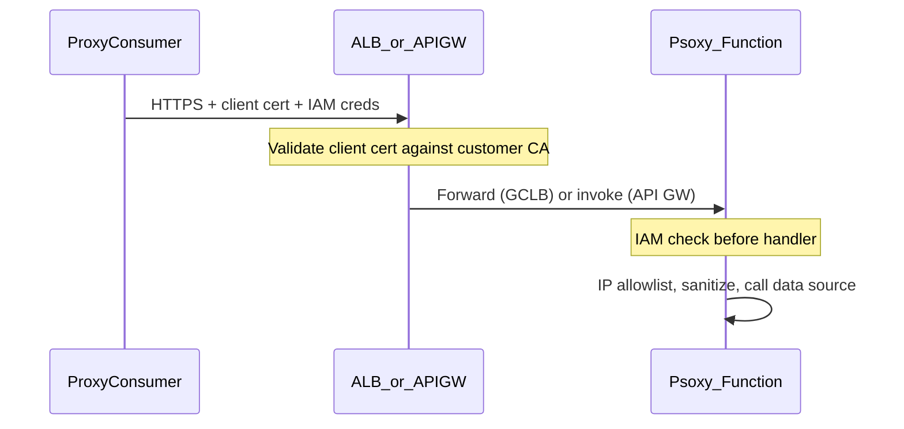
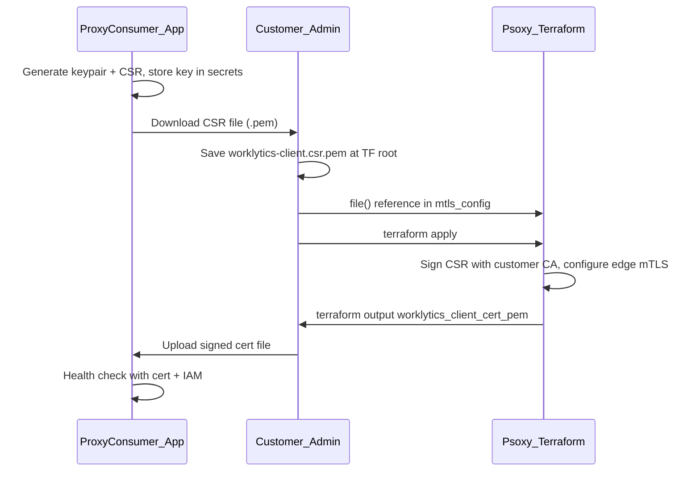
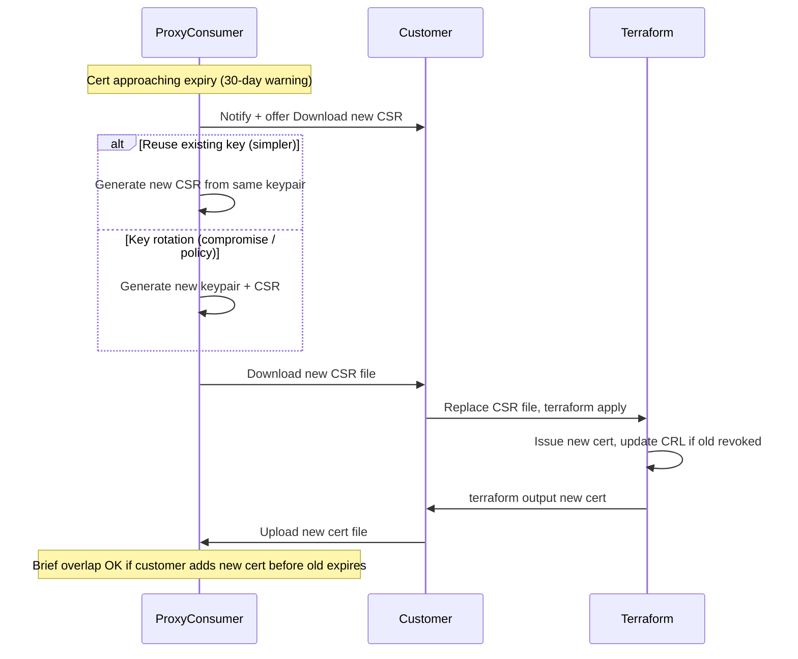

# mTLS Support for API Connectors

> **Status**: Draft / Internal Design Spec
> **Last Updated**: 2026-07-23

Cross-team implementation spec for mutual TLS (mTLS) between a **proxy consumer** (Worklytics as the reference client) and customer-hosted **Psoxy** API connector deployments.

**Public companions:**
- [GCP connectivity options (mTLS sketch)](../docs/development/gcp-private-service-connect.md)
- [GCP External ALB (ALB foundation)](../docs/development/gcp-external-alb.md)
- [Authentication & authorization](../docs/authentication-authorization.md)

---

## Scope

| In scope | Out of scope |
|---|---|
| Worklytics → Psoxy **API connector** HTTPS calls (sync and async REST) | Bulk GCS/S3 bucket reads (IAM only) |
| GCP and AWS proxy deployments | Webhook collector **inbound** (external data sources) |
| CSR-based client cert onboarding | Per-request HMAC/JWT signing |
| Defense-in-depth on top of existing IAM | Automated cert exchange API between TF and client app |

**Platforms:** GCP + AWS

**Cert model:** CSR-only. The client generates the keypair and CSR; the customer signs the CSR via Terraform; only the signed certificate returns to the client. **Terraform never generates or handles private keys.**

---

## Problem and goals

Today, a proxy consumer connects to Psoxy API connectors over HTTPS with cloud IAM only:

- **GCP:** Bearer identity token; `roles/run.invoker` on Cloud Functions
- **AWS:** SigV4 with an assumed `{deployment}Caller` IAM role

mTLS adds **transport-layer client authentication** at the customer's load balancer / API Gateway. Even if IAM credentials were compromised, requests would fail without a valid client certificate signed by the customer's CA.

**What stays the same:**

- IAM is still required on every request — mTLS is additive, not a replacement
- Java proxy code is unchanged — cert validation terminates at the edge (ALB / API Gateway)
- Bulk/async bucket access uses GCS/S3 IAM, not mTLS



**mTLS is not request signing.** The client certificate authenticates the TLS session at connection time. IAM still authenticates each HTTP request separately. Both layers must pass.

---

## Roles

**The proxy consumer is the TLS client.** The customer's Psoxy edge is the TLS server.

| Party | Role | What they hold |
|---|---|---|
| **Proxy consumer** (e.g. Worklytics) | TLS **client** | Private key (generated internally) + signed client cert (uploaded after Terraform) |
| **Customer (Psoxy operator)** | TLS **server** + **CA** | Server cert, CA, TrustConfig/truststore; signs consumer CSR |
| **Both** | App auth (unchanged) | GCP: Bearer identity token + `roles/run.invoker`. AWS: SigV4 |

---

## Cert model — CSR-only onboarding

### Onboarding flow



**Steps:**

1. **Client app:** Enable mTLS on connection → generate keypair + CSR, store key in secrets, offer **Download CSR** as `worklytics-client.csr.pem`
2. **Customer:** Save CSR at the **root of their Terraform config** (alongside `main.tf` / `terraform.tfvars`) as `worklytics-client.csr.pem`; reference via `file()` in `mtls_config.worklytics_client_csr_pem` (or load from secret manager)
3. **Customer:** `terraform apply` — provisions CA, ALB/API GW mTLS, signs CSR
4. **Customer:** Retrieve signed cert via `terraform output -raw worklytics_client_cert_pem` (redirect to file or clipboard)
5. **Client app:** Upload signed cert file → connection becomes active
6. **Client app:** Presents cert + key on every API connector HTTPS call; IAM unchanged

**Hard rule:** Terraform only accepts a CSR and outputs a signed cert. No `tls_private_key` resources, no key outputs, no optional key-generation paths.

### CSR scope — per connection, not global

**One CSR (and cert) per proxy data connection** — i.e., per customer Psoxy deployment the client connects to. Not one global CSR for all tenants.

| Scope | Recommendation |
|---|---|
| **Per proxy connection** (one Psoxy instance) | **Yes — default.** One keypair + CSR + cert per `PROXY_ENDPOINT`. If a customer has two Psoxy deployments, each gets its own CSR. |
| **Per connector** (gcal, gdirectory, etc.) | **No.** All API connectors on the same proxy share one mTLS edge and one client cert. |
| **Global across all client tenants** | **No.** Compromise of one cert would affect every customer. |

CSR subject should identify the relationship, e.g. `CN=worklytics-<tenant-id>` or `CN=worklytics-<connection-id>`, so the customer can audit which client org the cert belongs to.

### CSR sensitivity — safe as a file

A CSR contains only the **public key** and subject metadata. It does **not** contain the private key. It is safe to:

- Download as a `.pem` file from the client app
- Save at the root of the customer's Terraform working directory and reference with `file()`
- Store in a secret manager (optional, not required for security)
- Commit to a private git repo (acceptable; some customers may still prefer not to)

**Do not** treat the CSR like a secret. The private key stays in the client app only.

### Delivering the CSR to Terraform — file, not copy-paste

Avoid pasting multi-line PEM into tfvars (encoding/transcription errors).

**Option A — file at Terraform config root (recommended):**

```hcl
# tfvars or locals — CSR file sits alongside main.tf / terraform.tfvars
mtls_config = {
  domain                    = "proxy.acme-corp.com"
  worklytics_client_csr_pem = file("worklytics-client.csr.pem")
}
```

Customer saves the downloaded file as `worklytics-client.csr.pem` at the root of their Terraform working directory (where they run `terraform apply`). Use `file("${path.root}/worklytics-client.csr.pem")` only if the reference lives in a child module and needs to point back to the root.

**Option B — secret manager (optional):**

```hcl
# GCP example
data "google_secret_manager_secret_version" "worklytics_csr" {
  secret = "worklytics-mtls-csr"
}
mtls_config = {
  domain                    = "proxy.acme-corp.com"
  worklytics_client_csr_pem = data.google_secret_manager_secret_version.worklytics_csr.secret_data
}
```

```hcl
# AWS example
data "aws_secretsmanager_secret_version" "worklytics_csr" {
  secret_id = "worklytics-mtls-csr"
}
```

Client app UI: **Download CSR** as `worklytics-client.csr.pem` (file download, not a text box).

### Delivering the signed cert back — terraform output

Do **not** use `local_file` resources for the signed cert. Prefer a **terraform output** only:

```hcl
output "worklytics_client_cert_pem" {
  value     = google_privateca_certificate.worklytics_client.pem_certificate
  sensitive = true
}
```

Customer retrieves after apply:

```bash
terraform output -raw worklytics_client_cert_pem > worklytics-client.crt.pem
# or
terraform output -raw worklytics_client_cert_pem | pbcopy
```

Client app UI: **Upload signed certificate** (file picker). Validate PEM on upload (parse, check dates, verify public key matches stored keypair).

### Certificate rotation



| Event | Action |
|---|---|
| **Scheduled renewal** (~30 days before expiry) | Client warns → customer downloads new CSR (same key) → TF re-signs → upload new cert. No key change on client side. |
| **Key compromise** | Client regenerates keypair + CSR → customer re-applies TF → old cert revoked (CRL / CA rotation). |
| **CSR never signed** | CSR has no expiry, but customer should sign promptly. Client shows `pending_cert` state. |
| **Customer CA rotation** | Customer updates TrustConfig/truststore + re-signs existing or new CSR. |

Changing `worklytics_client_csr_pem` should trigger a new `google_privateca_certificate` / `aws_acmpca_certificate` resource. Use `create_before_destroy` or equivalent lifecycle so re-signing replaces the cert cleanly.

---

## Architecture comparison (GCP vs AWS)

| | GCP | AWS |
|---|---|---|
| **Edge** | Global external ALB + `ServerTlsPolicy` | API Gateway HTTP API custom domain |
| **mTLS config** | `google_certificate_manager_trust_config` + `google_network_security_server_tls_policy` | `aws_apigatewayv2_domain_name.mutual_tls_authentication` + S3 truststore |
| **Server TLS** | Certificate Manager managed cert on customer domain | ACM cert on custom domain |
| **Backend** | Serverless NEG → Cloud Function (`ALLOW_INTERNAL_AND_GCLB`) | API Gateway → Lambda (`use_api_gateway_v2 = true`) |
| **Prerequisite** | External ALB composition ([`external-api-alb.tf`](../infra/examples-dev/gcp/external-api-alb.tf)) | API Gateway v2 (required for VPC; also required for mTLS — Lambda Function URLs cannot do mTLS) |
| **URL shape** | `https://proxy.customer.com/<function-name>/...` | `https://proxy.customer.com/<function-name>/...` (API mapping) |

---

## Proxy Terraform — GCP

Build on the existing external ALB beta pattern ([`gcp-external-alb.md`](../docs/development/gcp-external-alb.md)); mTLS is an extension, not a replacement.

### Resource stack

Promote/extend [`infra/examples-dev/gcp/external-api-alb.tf`](../infra/examples-dev/gcp/external-api-alb.tf) with resources from [`gcp-private-service-connect.md`](../docs/development/gcp-private-service-connect.md):

| Resource | Purpose |
|---|---|
| `google_privateca_ca_pool` + `google_privateca_certificate_authority` | Customer CA |
| `google_privateca_certificate` | Sign consumer CSR |
| `google_certificate_manager_trust_config` | ALB trusts customer CA for client cert validation |
| `google_network_security_server_tls_policy` | `client_validation_mode = "REJECT_INVALID"` |
| `google_compute_target_https_proxy` | Attach `server_tls_policy` |
| Reuse from ALB example | NEGs, backend services, URL map, forwarding rule, optional Cloud Armor |

### `gcp-host` variable

```hcl
variable "mtls_config" {
  type = object({
    domain                    = string  # e.g. proxy.acme-corp.com
    worklytics_client_csr_pem = string  # CSR downloaded from client app
  })
  description = <<-EOT
    mTLS for API connectors. Customer downloads CSR from the proxy consumer's
    connection settings, passes it here. Module signs CSR and outputs the client
    cert PEM for upload back to the consumer. Private key never enters Terraform.
  EOT
  default = null
}
```

### Signing resource

```hcl
resource "google_privateca_certificate" "worklytics_client" {
  name     = "${var.environment_id_prefix}worklytics-client"
  location = var.region
  pool     = google_privateca_ca_pool.this.id
  lifetime = "31536000s"  # 1 year; document rotation

  config {
    subject_config {
      subject {
        organization = "Worklytics"
        common_name  = "worklytics-client"
      }
    }
    x509_config {
      key_usage {
        base_key_usage { digital_signature = true }
        extended_key_usage { client_auth = true }
      }
    }
    public_key {
      format = "PEM"
      key    = var.mtls_config.worklytics_client_csr_pem
    }
  }

  lifecycle {
    create_before_destroy = true
  }
}

output "worklytics_client_cert_pem" {
  value     = google_privateca_certificate.worklytics_client.pem_certificate
  sensitive = true
}
```

### Wiring into existing modules

When `mtls_config` is set:

- `api_connector_external_lb_host = mtls_config.domain`
- `ingress_settings = "ALLOW_INTERNAL_AND_GCLB"` (already done when external LB host is set — see [`gcp-host/main.tf`](../infra/modules/gcp-host/main.tf))
- Override `endpoint_url` to `https://<domain>/<function-name>/`

### Customer onboarding outputs / TODO content

- DNS A record for ALB IP
- **`worklytics_client_cert_pem` output** (sensitive) — `terraform output -raw worklytics_client_cert_pem > worklytics-client.crt.pem`
- No `local_file` for cert output
- Existing settings unchanged: `worklytics_sa_emails`, `allowed_data_access_ip_blocks` (optional Cloud Armor)

**Example TODO snippet** (for [`worklytics-proxy-connection-generic`](../infra/modules/worklytics-proxy-connection-generic/main.tf)):

```
mTLS setup:
1. In the proxy consumer connection settings, enable mTLS and download worklytics-client.csr.pem
2. Save the file as worklytics-client.csr.pem at the root of this Terraform directory
3. Set mtls_config.worklytics_client_csr_pem = file("worklytics-client.csr.pem")
4. terraform apply
5. Run: terraform output -raw worklytics_client_cert_pem > worklytics-client.crt.pem
6. Upload worklytics-client.crt.pem back to the proxy consumer connection settings
```

### Optional hardening (defer)

- Disable direct `*.run.app` URLs when mTLS-only access is required ([`gcp-proxy-api/main.tf`](../infra/modules/gcp-proxy-api/main.tf) has a TODO)
- Cloud Armor IP allowlist (orthogonal to mTLS)

---

## Proxy Terraform — AWS

Greenfield approach mirroring GCP.

### Prerequisites

- `use_api_gateway_v2 = true` in [`aws-host`](../infra/modules/aws-host/main.tf) (already mandatory with VPC)
- Custom domain — extend commented [`api-gateway-advanced.tf`](../infra/examples-dev/aws/api-gateway-advanced.tf)

### Composition resources

```hcl
# S3 truststore: customer CA bundle (from PCA that signed the CSR)
resource "aws_s3_object" "mtls_truststore" {
  bucket  = aws_s3_bucket.mtls_truststore.id
  key     = "truststore.pem"
  content = aws_acmpca_certificate_authority.this.certificate
}

resource "aws_apigatewayv2_domain_name" "mtls" {
  domain_name = var.mtls_config.domain
  domain_name_configuration {
    certificate_arn = aws_acm_certificate.server.arn
    endpoint_type   = "REGIONAL"
    security_policy = "TLS_1_2"
  }
  mutual_tls_authentication {
    truststore_uri     = "s3://${aws_s3_bucket.mtls_truststore.bucket}/${aws_s3_object.mtls_truststore.key}"
    truststore_version = aws_s3_object.mtls_truststore.version_id
  }
}
```

### `aws-host` variable

```hcl
variable "mtls_config" {
  type = object({
    domain                    = string
    worklytics_client_csr_pem = string  # CSR from client app
  })
  default = null
}
```

### CSR signing

- Customer downloads CSR from client app
- Passes CSR via `file("worklytics-client.csr.pem")` or secret manager
- ACM Private CA signs CSR via `aws_acmpca_certificate`
- Output signed cert PEM: `terraform output -raw worklytics_client_cert_pem`
- CA certificate in S3 truststore for API Gateway mTLS validation

### Endpoint URL override

Today AWS has no `api_connector_external_lb_host` equivalent. When `mtls_config` is set:

- `proxy_endpoint_url = "https://${domain}"` (path routing via API Gateway stage + function name, same as GCP path-prefix model)
- Pass custom base URL into test scripts and connection module

---

## Proxy consumer — per-connection configuration (Worklytics example)

### Changed settings

| Setting | Today | With mTLS |
|---|---|---|
| `PROXY_ENDPOINT` / "Psoxy Base URL" | `https://<fn>.run.app` or Lambda URL | `https://proxy.customer.com/<function-name>` |
| `PROXY_DEPLOYMENT_KIND` | `GCP` or `AWS` | unchanged |
| `PROXY_AWS_ROLE_ARN`, `PROXY_AWS_REGION` | AWS only | unchanged — SigV4 still required |
| `PROXY_BUCKET_NAME` | bulk/async | unchanged — GCS/S3 IAM, not mTLS |

### Connection secrets (internal — not Terraform outputs)

| Key | Origin | Description |
|---|---|---|
| `PROXY_MTLS_PRIVATE_KEY` | Client generates | Created with CSR; never exported or shown after generation |
| `PROXY_MTLS_CLIENT_CERT` | Customer uploads | Signed cert from `terraform output` |
| `PROXY_MTLS_SERVER_CA` | optional | Only if server cert is not publicly trusted (self-signed PoC ALB) |

### Connection UI (mTLS section)

| UI element | Action |
|---|---|
| **Enable mTLS** toggle | Generates keypair + CSR on first enable; stores key in secrets |
| **Download CSR** button | File download (`worklytics-client.csr.pem`) — not a copy-paste text field |
| **Upload signed certificate** | File picker (`.pem` / `.crt`) — validates PEM, dates, public key match |
| **Certificate status** | Shows expiry, pending/signed state, last health check result |
| **Regenerate CSR** | New CSR from same key (renewal) or new keypair (compromise) |

**Onboarding flow:**

1. Configure connection (endpoint, IAM settings as today)
2. Enable mTLS → download CSR file
3. Save CSR to Terraform root, reference via `file()`, apply
4. Upload signed cert file from `terraform output`
5. Health check: mTLS handshake + IAM + proxy health endpoint

Deep links cannot pre-fill CSR or cert — manual steps. Psoxy TODO files should reference the CSR download step.

---

## Proxy consumer — platform changes (Worklytics example)

Largest workstream; lives outside the Psoxy repo.

### Key generation and CSR

- **One keypair per proxy data connection** (per customer Psoxy deployment), shared across all API connectors on that proxy
- Generate EC P-256 (preferred) or RSA 2048 keypair; CSR subject `CN=worklytics-<tenant-id>` (or connection id)
- Store private key in tenant-scoped secret store immediately; never export
- Offer CSR as **file download only**

### HTTP client layer

- Attach private key + uploaded signed cert to TLS `SSLContext` / `KeyManager`
- GCP: after mTLS handshake, attach `Authorization: Bearer <identity_token>`
- AWS: after mTLS handshake, SigV4-sign with assumed `Caller` role
- Bulk/async bucket reads do **not** use mTLS
- Thread-safe: use immutable snapshots when reloading cert

### Secret management and rotation

- Private key: stays in client app; rotated only on compromise or explicit key rotation
- Signed cert: uploaded as file; monitor expiry, prompt renewal ~30 days before
- **Renewal (default):** regenerate CSR from same key → customer re-signs → upload new cert file
- **Key rotation:** regenerate keypair + CSR → customer re-signs → revoke old cert

### Connection status states

`pending_csr` → `pending_cert` → `active` → `expiring_soon` → `expired` (or `cert_mismatch` on validation failure)

### Operational runbook

- **Scheduled renewal:** warn at 30 days → download new CSR file (same key) → TF re-signs → upload new cert
- **Key compromise:** regenerate keypair → new CSR → customer re-applies TF → revoke old cert via CRL
- **CA rotation:** customer updates TrustConfig/truststore + re-signs CSR

### Out of scope for v1

- Per-request HMAC/JWT signing
- Automated cert provisioning API between Psoxy TF and client app
- mTLS for GCS/S3 bulk reads
- Webhook collector inbound
- Client-brings-own-CA model

---

## Security and operations

| Concern | Mitigation |
|---|---|
| mTLS replaces IAM? | **No.** Both required. mTLS is network-layer; IAM is application/platform-layer. |
| Private key in Terraform? | **Never.** CSR flow is a hard requirement. |
| Client cert compromise | Revoke via CRL; regenerate keypair in client app. |
| Cert lifecycle | Recommend ≤1 year validity; rotate via CSR re-sign. |
| CSR in git | Not sensitive (public key only). Customer may add to `.gitignore` by preference. |
| IP allowlisting | Optional Cloud Armor / `allowed_data_access_ip_blocks` — complementary to mTLS. |
| Direct `*.run.app` bypass | Defer: disable default URLs when mTLS-only (GCP TODO in `gcp-proxy-api`). |

---

## Testing plan

### Psoxy repo

- Extend [`tools/psoxy-test/cli-call.js`](../tools/psoxy-test/cli-call.js) with `--client-cert` / `--client-key` flags
- Local test flow: generate keypair + CSR via `openssl` → sign CSR via TF → use cert+key with cli-call
- Integration test: health check through mTLS ALB using CSR-signed cert

### Proxy consumer (Worklytics)

- E2E test against dev mTLS deployment
- Negative tests: missing cert, expired cert, valid cert + wrong IAM, cert/key mismatch

---

## Implementation phasing

| Phase | Work |
|---|---|
| **1 — Doc + GCP** | This doc; GCP `mtls_config` with CSR input + cert output; connection TODO templates |
| **2 — AWS** | Same CSR input pattern with ACM PCA signing |
| **3 — Client platform** | Use LLM prompt below; keypair/CSR, cert upload UI, HTTP client mTLS, health checks |
| **4 — Public docs** | Promote CSR onboarding to `docs/development/` when stable |

---

## Reference files

| File | Role |
|---|---|
| [`docs/development/gcp-private-service-connect.md`](../docs/development/gcp-private-service-connect.md) | mTLS Terraform sketch, auth layering |
| [`docs/development/gcp-external-alb.md`](../docs/development/gcp-external-alb.md) | ALB foundation, `api_connector_external_lb_host` |
| [`infra/examples-dev/gcp/external-api-alb.tf`](../infra/examples-dev/gcp/external-api-alb.tf) | Base ALB resources to extend |
| [`infra/modules/gcp-host/main.tf`](../infra/modules/gcp-host/main.tf) | External LB host wiring |
| [`infra/examples-dev/aws/api-gateway-advanced.tf`](../infra/examples-dev/aws/api-gateway-advanced.tf) | Custom domain starting point for AWS |
| [`infra/modules/worklytics-proxy-connection-generic/main.tf`](../infra/modules/worklytics-proxy-connection-generic/main.tf) | Connection settings / TODO generation |
| [`docs/authentication-authorization.md`](../docs/authentication-authorization.md) | IAM model (unchanged) |

---

## Appendix: LLM prompt — build the mTLS client (Worklytics example)

Paste the following into an LLM session in the **client codebase** (e.g. Worklytics). Architecture should be client-agnostic; Worklytics is the reference implementation.

---

### Prompt

You are implementing **mutual TLS (mTLS) client support** for outbound HTTPS calls from our platform to customer-hosted **Psoxy proxy** deployments (API connectors only).

**Context:** Today we connect to Psoxy over HTTPS with cloud IAM only (GCP: Bearer identity token + `roles/run.invoker`; AWS: SigV4 with an assumed IAM role). We are adding an optional **transport-layer** client certificate, configured per data connection. The customer's proxy edge (GCP External ALB or AWS API Gateway) validates our client cert; IAM auth is unchanged and still required on every request.

**Design principles:**

- **Client-agnostic:** Model this as a generic "mTLS-enabled outbound HTTP client for a managed proxy connection" abstraction. Worklytics-specific naming is fine for UI copy, but core types/services should not assume Worklytics-only concepts beyond a `tenantId` / `connectionId`.
- **CSR-only onboarding:** We (the client) generate the keypair and CSR. The customer (proxy operator) signs the CSR via their Terraform; they never generate or receive our private key. We only ever receive the signed certificate back.
- **One keypair per proxy connection** (per customer Psoxy deployment), not global across all tenants. All API connectors sharing the same `PROXY_ENDPOINT` use the same mTLS credentials.
- **File-based artifact exchange:** CSR is offered as a **file download** (`worklytics-client.csr.pem`). Signed cert is accepted via **file upload**. No multi-line PEM copy-paste text areas (encoding/transcription errors).
- **mTLS is additive:** Do not remove or replace existing IAM auth (GCP OIDC token, AWS SigV4).

**Onboarding flow to implement:**

1. Admin enables mTLS on a proxy data connection.
2. System generates EC P-256 (preferred) or RSA-2048 keypair; stores private key in tenant-scoped secret store immediately; never exports private key.
3. System builds CSR with subject like `CN=<client>-<tenantId>` (e.g. `CN=worklytics-acme-corp`) and offers **Download CSR** as a `.pem` file.
4. Customer saves CSR at root of their Terraform config and passes it to their Psoxy module (`file("worklytics-client.csr.pem")`). Customer runs `terraform apply`; signs CSR with their CA.
5. Customer retrieves signed cert: `terraform output -raw worklytics_client_cert_pem > worklytics-client.crt.pem` (or clipboard).
6. Admin **uploads signed cert file** in connection settings. Validate: PEM parseable, not expired, public key matches stored CSR/keypair, extended key usage includes client auth.
7. Connection health check uses mTLS + existing IAM; surface distinct errors for cert vs IAM failures.

**Certificate rotation:**

- **Scheduled renewal (~30 days before expiry):** Regenerate CSR from **same private key** (default). Customer re-signs via Terraform; admin uploads new cert file. No key change on our side.
- **Key compromise:** Regenerate keypair + CSR ("Rotate key" action). Customer re-applies Terraform with new CSR; old cert should be revoked on customer side.
- Show connection status: `pending_csr`, `pending_cert`, `active`, `expiring_soon`, `expired`, `cert_mismatch`.

**Data model / secrets (per proxy connection):**

| Field | Storage | Notes |
|---|---|---|
| `mtlsEnabled` | connection settings | boolean |
| `mtlsPrivateKeyPem` | secret store | generated locally, never logged |
| `mtlsClientCertPem` | secret store | uploaded by admin after customer signs CSR |
| `mtlsServerCaPem` | secret store, optional | only if server uses non-public CA (PoC/self-signed) |
| `mtlsCertExpiresAt` | derived from cert | for expiry warnings |
| `mtlsCsrGeneratedAt` | metadata | audit |

Do **not** store CSR in long-term storage beyond what's needed to validate uploaded cert matches key; CSR is not secret but treat as ephemeral onboarding artifact.

**HTTP client changes:**

- Extend the existing per-connection HTTP client factory (or equivalent) used for Psoxy API calls.
- When `mtlsEnabled` and cert loaded: configure TLS with client cert + private key (`SSLContext` / `KeyManager` in Java, or platform equivalent).
- After TLS handshake, attach existing auth unchanged:
  - GCP deployments: `Authorization: Bearer <google_identity_token>`
  - AWS deployments: SigV4 signing with assumed `PROXY_AWS_ROLE_ARN`
- Bulk/async bucket reads (GCS/S3) do **not** use mTLS — only sync/async REST calls to `PROXY_ENDPOINT`.
- Thread-safe: connection config may be read concurrently; use immutable snapshots or volatile references when reloading cert.

**UI (admin-facing connection settings):**

- mTLS section on Psoxy proxy connection form
- Toggle: Enable mTLS
- Button: Download CSR (`worklytics-client.csr.pem`) — disabled until keypair generated
- File input: Upload signed certificate
- Status panel: expiry date, days remaining, last health check, error detail
- Actions: "Regenerate CSR" (same key, for renewal), "Rotate key" (new keypair, for compromise)
- Help text explaining customer steps (save CSR to TF root, `terraform apply`, `terraform output -raw ...`)

**Health checks:**

- Extend existing post-connect Psoxy health check to present mTLS credentials.
- Failures to distinguish:
  - No cert uploaded yet
  - Cert expired / not yet valid
  - Cert public key mismatch with stored private key
  - mTLS handshake failed (customer edge rejected cert)
  - mTLS OK but IAM failed (401/403)
  - mTLS OK, IAM OK, proxy health endpoint failed

**Security requirements:**

- Private key never appears in logs, API responses, or admin UI after generation
- Cert upload endpoint must validate file type/size; reject malformed PEM
- CSR download is not sensitive but rate-limit if needed
- Follow existing tenant isolation: one tenant cannot access another's mTLS secrets

**Out of scope for this task:**

- Building customer-side Terraform (that's the Psoxy repo)
- mTLS for GCS/S3 bulk bucket access
- Automated cert exchange API with customer Terraform
- Per-request HMAC/JWT signing

**Deliverables:**

1. Domain model + secret storage for mTLS credentials per proxy connection
2. Keypair/CSR generation service (standard Java `KeyPairGenerator` + PKCS#10 CSR, or platform equivalent)
3. Cert upload validation service (PEM parse, expiry, key match)
4. HTTP client integration for mTLS + existing IAM
5. Admin UI: enable, download CSR, upload cert, status, rotation actions
6. Extended health check with clear error messages
7. Unit tests: CSR generation, cert validation (valid/expired/wrong-key), client factory with mTLS enabled/disabled
8. Integration test stub or documented manual E2E against a dev Psoxy mTLS deployment

**Reference:** See Psoxy `internal-docs/mtls-support.md` for producer-side Terraform contract (`worklytics_client_csr_pem` input, `worklytics_client_cert_pem` output).

Start by locating the existing proxy connection model, secret storage, HTTP client factory, and health check code. Propose a minimal diff plan before implementing.

---
